# Spring notes

[>> https://docs.spring.io/spring/docs/5.0.3.RELEASE](https://docs.spring.io/spring/docs/5.0.3.RELEASE/spring-framework-reference/index.html)

# Spring Configuration

## XML Spring Configuration

```
In order to tell the Spring Container to create these objects and how to link them together, a configuration must be provided. 
This configuration can be provided using XML files or XML + annotations or Java Configuration classes.
```

In Spring, there are two types of dependency injection specific to XML: via **constructor** and via **setters**

For XML, the class **org.springframework.context.support.ClassPathXmlApplicationContext** is used.

### Constructor Injection

Constructor injection can be used to define beans when the bean type is a class that has a constructor with arguments defined.

```xml
<beans>
  <bean id="complexBean" class="com.ps.beans.ctr.ComplexBeanImpl">
        <constructor-arg ref=" simpleBean"/>
  </bean>
  
  <bean id= "simpleBean" class="com.ps.beans.SimpleBeanImpl"/>
</beans>
```

```java
public class ComplexBeanImpl implements ComplexBean {
    private SimpleBean simpleBean;

    public ComplexBeanImpl(SimpleBean simpleBean) {
        this.simpleBean = simpleBean;
    }

}
```

- `ref` is used to tell the container that the value of this attribute is a reference to another bean.

```xml
<bean id="..." class="...">
        <constructor-arg ref="..."/>
</bean>
```

- `value` is used when the value to inject is a primitive types or their wrappers

```xml
<beans>
  <bean id="complexBean" class="com.ps.beans.ctr.ComplexBeanImpl">
        <constructor-arg ref="simpleBean"/>
        <constructor-arg value="true"/>
  </bean>
</beans>
```

```java
public class ComplexBeanImpl {
      public ComplexBeanImpl(SimpleBean simpleBean, boolean complex) {
         this.simpleBean = simpleBean;
         this.complex = isComplex;
      }
}
```

- `index` attribute, which should be used when the constructor has more parameters of the same type.

```xml
<beans>
    <bean id="simpleBean0" class="com.ps.beans.SimpleBeanImpl"/>
    <bean id="simpleBean1" class="com.ps.beans.SimpleBeanImpl"/>
    
    <bean id="complexBean2" class="com.ps.beans.ctr.ComplexBean2Impl">
        <constructor-arg ref="simpleBean0" index="0"/>
        <constructor-arg ref="simpleBean1" index="1"/>
    </bean>
</beans>
```

```java
public class ComplexBean2Impl {
    public ComplexBean2Impl(SimpleBean simpleBean1, SimpleBean simpleBean2) {
            this.simpleBean1 = simpleBean1;
            this.simpleBean2 = simpleBean2;
     }
 }
```

- Another way to handle constructors with more parameters of the same type is to use the `name` attribute

```xml
<beans>
    <bean id="simpleBean0" class="com.ps.beans.SimpleBeanImpl"/>
    <bean id="simpleBean1" class="com.ps.beans.SimpleBeanImpl"/>
    
    <bean id="complexBean2" class="com.ps.beans.ctr.ComplexBean2Impl">
        <constructor-arg ref="simpleBean0" name="simpleBean1"/>
        <constructor-arg ref="simpleBean1" name="simpleBean2"/>
    </bean>
</beans>
```

- `c-namespace` for reducing parameters injection via constructors

```xml
<beans>
    <bean id="simpleBean0" class="com.ps.beans.SimpleBeanImpl"/>
    <bean id="simpleBean1" class="com.ps.beans.SimpleBeanImpl"/>
    
    <!-- usage for reference to dependency -->
    <bean id="complexBean0" class="com.ps.beans.ctr.ComplexBeanImpl"
           c:simpleBean-ref="simpleBean0"/>
           
    <!-- usage for primitive type dependency -->
    <bean id="complexBean1" class="com.ps.beans.ctr.ComplexBeanImpl"
          c:simpleBean-ref="simpleBean0" c:complex="true"/>
          
    <!-- usage for index specified references -->
    <bean id="complexBean2" class="com.ps.beans.ctr.ComplexBean2Impl"
     c:_0-ref="simpleBean0" c:_1-ref="simpleBean1" />
     
</beans>
```

``` 
If you are using the name of the constructor parameter to inject the dependency, 
then the attribute definition with c: should match the pattern c:nameConstructorParameter[-ref], 
while if you are using indexes, the attribute definition should match c:_{index}[-ref].
```

### Setter Injection
      
- When creating a bean using setter injection, the bean is first `instantiated` by calling the constructor and then `initialized` by injecting the dependencies using setters.
- `<property />` element defines the property to be set and the value to be set with and does so using a pair of attributes: **[name, ref]** or **[name,value]**.

```xml
<bean id="..." class="...">
        <property name="..." ref="..." />
</bean>
```

- The `name` is mandatory, because its value is the `name of the bean property` to be set.
- The `ref` is used to tell the container that the value of this attribute is a `reference to another bean`.
- The `value`, is used to tell the container `that the value is not a bean`, but a scalar value.

```xml
<beans>
    <bean id="simpleBean0" class="com.ps.beans.SimpleBeanImpl"/>
    <bean id="complexBean" class="com.ps.beans.set.ComplexBeanImpl">
         <property name="simpleBean" ref="simpleBean"/>
    </bean>
</beans>
```

```java
public class ComplexBeanImpl implements ComplexBean {
    private SimpleBean simpleBean;
    
    public ComplexBeanImpl() {}
    
    public void setSimpleBean(SimpleBean simpleBean) {
        this.simpleBean = simpleBean;
    }
}
```

- `p-namespace` for reducing parameters injection via setters

```xml
<beans>
    <bean id="simpleBean" class="com.ps.beans.SimpleBeanImpl"/>
    <bean id="complexBean" class="com.ps.beans.set.ComplexBeanImpl"
           p:simpleBean-ref="simpleBean" p:complex="true"/>
</beans>
```

- Constructor and setter injection can be used together in creating the same bean

```xml
<beans>
    <bean id="simpleBean" class="com.ps.beans.SimpleBeanImpl"/>
    <bean id="complexBean2" class="com.ps.beans.set.ComplexBean2Impl">
        <constructor-arg ref="simpleBean"/>
        <property name="complex" value="true"/>
    </bean>
    
    <!-- configuration optimized using p-namespace and c-namespace -->
    <bean id="complexBean2" class="com.ps.beans.set.ComplexBean2Impl"
               c:simpleBean-ref="simpleBean" p:complex="true"/>
</beans>
```

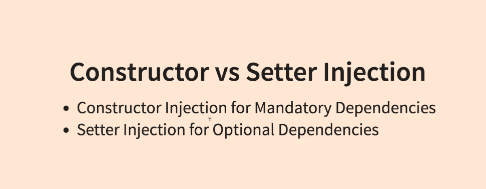

### Collections

#### List

```xml
<bean id="simpleBean" class="com.ps.beans.SimpleBeanImpl"/>
<bean id="collectionHolder" class="com.ps.beans.others.CollectionHolder">
        <property name="simpleBeanList">
            <list>
                 <ref bean="simpleBean"/>
                 <bean class="com.ps.beans.SimpleBeanImpl"/>
                <null/>
            </list>
        </property>
</bean>
```

#### Set

```xml
<bean id="simpleBean" class="com.ps.beans.SimpleBeanImpl"/>
<bean id="collectionHolder" class="com.ps.beans.others.CollectionHolder">
        <property name="simpleBeanSet">
            <set>
                <ref bean="simpleBean"/>
            </set>
        </property>
</bean>
```
#### Map

```xml
<bean id="simpleBean" class="com.ps.beans.SimpleBeanImpl"/>
<bean id="collectionHolder" class="com.ps.beans.others.CollectionHolder">
      <property name="simpleBeanMap">
            <map>
                 <entry key="one" value-ref="simpleBean"/>
            </map>
        </property>
 </bean>
```

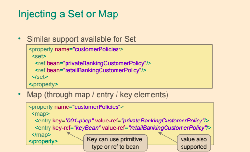

#### util namespace to deal with collections

- util namespace for reducing code working with collections

```xml
<beans>
    <bean id="simpleBean" class="com.ps.beans.SimpleBeanImpl"/>

    <util:list id=" simpleList" list-class="java.util.LinkedList">
        <ref bean="simpleBean"/>
        <bean class="com.ps.beans.SimpleBeanImpl"/>
        <null/>
    </util:list>
    
    <util:set id=" simpleSet" set-class="java.util.TreeSet">
        <ref bean="simpleBean"/>
    </util:set>
    
    <util:map id=" simpleMap" map-class="java.util.TreeMap">
        <entry key="one" value-ref="simpleBean"/>
    </util:map>

	<!--Injection collections-->
	<bean id="collectionHolder" class="com.ps.beans.others.CollectionHolder">
        <property name="simpleBeanList" ref="simpleList"/>
        <property name="simpleBeanSet" ref="simpleSet"/>
        <property name="simpleBeanMap" ref="simpleMap"/>
    </bean>
</beans>
```

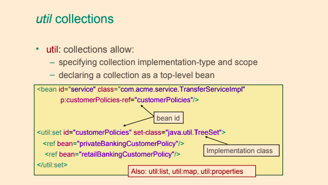

## Using Bean Factories

### factory-method

- To use a singleton class to create a bean, the `factory-method` attribute is used, and its value will be the static method name that returns the bean instance

```xml
<beans>
    <bean id="simpleSingleton" class="com.ps.beans.others.SimpleSingleton"
          factory-method="getInstance" />
</beans>
```

```java
public class SimpleSingleton {
    private static SimpleSingleton instance = new SimpleSingleton();
    private SimpleSingleton() { }
    
    public static SimpleSingleton getInstance(){
        return instance;
    }
}
```

### factory-bean

- To use a factory object to create a bean, the `factory-bean` and `factory-method` attributes are used.

```xml
<beans>
    <bean id=" simpleBeanFactory" class="com.ps.beans.others.SimpleFactoryBean"/>
    <bean id="simpleFB" factory-bean="simpleBeanFactory" factory-method="getSimpleBean" />
</beans>
```

```java
public class SimpleFactoryBean {
	
    public SimpleBean getSimpleBean() {
        return new SimpleBeanImpl();
    }
}
```

### FactoryBean

By implementing this interface, the factory beans will be automatically picked up by the Spring container, 
and the desired bean will be created by automatically calling the `getObject` method

```xml
<beans>
    <bean id="smartBean" class=" com.ps.beans.others.SpringFactoryBean"/>
</beans>
```

```java
public class SpringFactoryBean implements FactoryBean<SimpleBean> {
    
    private SimpleBean simpleBean = new SimpleBeanImpl();
    
    public SimpleBean getObject() {
        return this.simpleBean;
    }
	
    public Class<?> getObjectType() {
		return SimpleBean.class;
	}

	public boolean isSingleton() {
		return true;
	}
}    
```

### FactoryBean

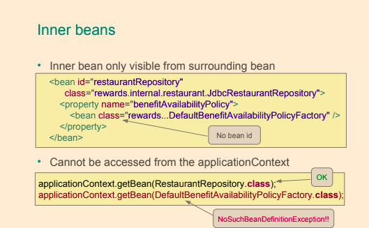

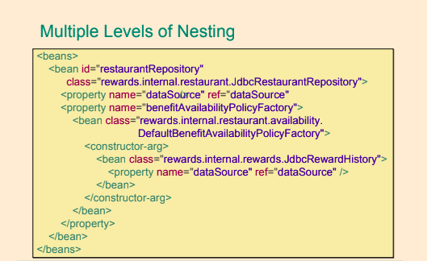

### Bean Definition Inheritance

- Sometimes several beans need to be configured in the same way
- Use bean definition inheritance to define the common configuration once
    - Inherit it where needed
    
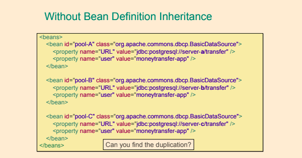

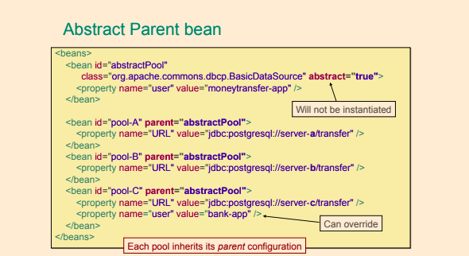

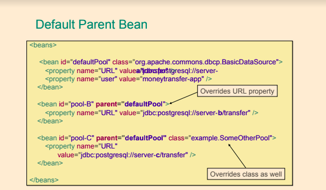

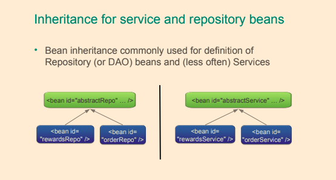

## Import configuration files


```xml
<beans>
    <!-- using relative path, no prefix-->
    <import resource="ctr/sample-config-01.xml"/>
    <import resource="ctr/sample-config-02.xml"/>
    
    <!-- using classpath-->
    <import resource="classpath: spring/ctr/sample-config-01.xml"/>
    <import resource="classpath: spring/ctr/sample-config-02.xml"/>
    
    <!-- using classpath and wildcards-->
     <import resource="classpath: spring/others/sample-config-*.xml"/>
</beans>
```

## Application Context 

The application context in a Spring application is a Java object that implements the `ApplicationContext` interface and is responsible for:
- Instantiating beans in the application context.
- Configuring the beans in the application context.
- Assembling the beans in the application context.
- Managing the life-cycle of Spring beans.

Some commonly used implementations of the `ApplicationContext` interface are:
- **AnnotationConfigApplicationContext** - Standalone application context used with configuration in the form of annotated classes.
- **AnnotationConfigWebApplicationContext** - Same as `AnnotationConfigApplicationContext` but for web applications.
- **ClassPathXmlApplicationContext** - Standalone application context used with XML configuration located on the `classpath` of the application.
- **FileSystemXmlApplicationContext** - Standalone application context used with XML configuration located as one or more files in the `file system`.
- **XmlWebApplicationContext** - Web application context used with XML configuration.

## The lifecycle of a Spring bean

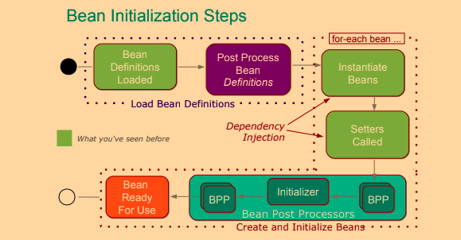

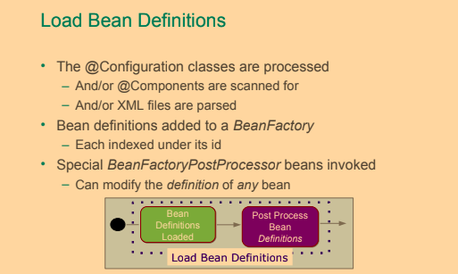

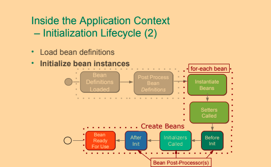

The lifecycle of a Spring bean looks like this:
- Spring bean configuration is read and metadata in the form of a BeanDefinition object is created for each bean.
- All instances of `BeanFactoryPostProcessor` are invoked in sequence and are allowed an opportunity to alter the bean metadata.
- For each bean in the container:
	- An instance of the bean is created using the bean metadata.
	- Properties and dependencies of the bean are set.
	- `BeanPostProcessor`'s `postProcessBeforeInitialization` are given a chance to process the new bean instance `before initialization`.
    - Any methods in the bean implementation class annotated with `@PostConstruct` are invoked.
    - Any `afterPropertiesSet` method in a bean implementation class implementing the `InitializingBean` interface is invoked (this method is not recommended by the Spring). 
    - Any custom bean initialization method is invoked. Bean initialization methods can be specified either in the value of the `init-method` attribute in the corresponding <bean> element in a Spring XML configuration or in the `initMethod` property of the `@Bean` annotation. 
	- `BeanPostProcessor`'s `postProcessAfterInitialization` are given a chance to process the new bean instance `after initialization`.	
	- The bean is ready for use.
- When the Spring application context is to shut down, the beans in it will receive destruction callbacks in this order:
	- Any methods in the bean implementation class annotated with `@PreDestroy` are invoked.
	- Any destroy method in a bean implementation class implementing the `DisposableBean` interface is invoked. If the same destruction method has already been invoked, it will not be invoked	again. (this method is not recommended by the Spring)
	- Any custom bean destruction method is invoked.
      Bean destruction methods can be specified either in the value of the `destroy-method` attribute in the corresponding <bean> element in a Spring XML configuration or in the `destroyMethod` property of the `@Bean` annotation.
      If the same destruction method has already been invoked, it will not be invoked again.

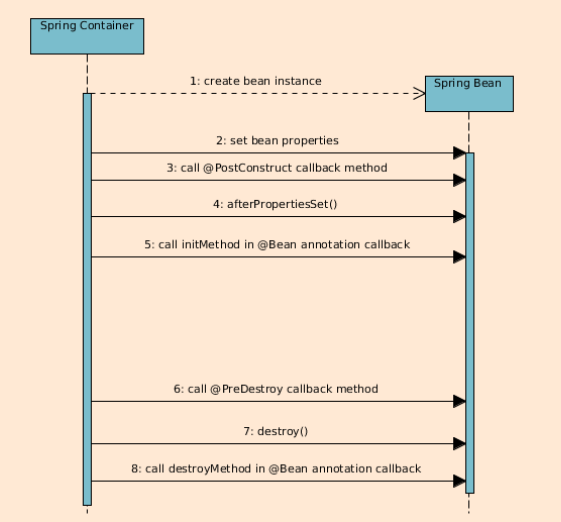

### BeanFactoryPostProcessor

- Configures bean definitions before beans are created.
    - Could change BeanDefinitions
- `BeanFactoryPostProcessor` is an interface that defines the property (a single method) of a type of
container extension point that is allowed to modify Spring bean meta-data prior to instantiation of
the beans in a container. A bean factory post processor may not create instances of beans, only
modify bean meta-data. A bean factory post processor is only applied to the meta-data of the beans
in the same container in which it is defined in.
     - Example:
          - `PropertySourcesPlaceholderConfigurer` - allows for injection of values from the current Spring environment the property sources of this environment.
          - `DeprecatedBeanWarner` - logs warnings about beans which implementation class is annotated with the `@Deprecated` annotation.
          - `PropertySourcesPlaceholderConfigurer` - is a `BeanFactoryPostProcessor` that resolves property
             placeholders, on the ${PROPERTY_NAME} format, in Spring bean properties and Spring bean
             properties annotated with the `@Value` annotation.
    - Example how to define own BPFP

```java
public class DeprecationHandlerBeanFactoryPostProcessor implements BeanFactoryPostProcessor {

	@Override
	public void postProcessBeanFactory(ConfigurableListableBeanFactory beanFactory) throws BeansException {
		final String[] beanDefinitionNames = beanFactory.getBeanDefinitionNames();
		for (String name : beanDefinitionNames) {
			final BeanDefinition beanDefinition = beanFactory.getBeanDefinition(name);
			final String beanClassName = beanDefinition.getBeanClassName();
			try {
				final Class<?> beanClass = Class.forName(beanClassName);
				final DeprecatedClass annotation = beanClass.getAnnotation(DeprecatedClass.class);
				if (annotation != null) {
					beanDefinition.setBeanClassName(annotation.newImpl().getName());
				}
			}
			catch (Exception e) {
				e.printStackTrace();
			}
		}
	}
}
```

- `BeanFactoryPostProcessor` returning by `@Bean` methods this is a
a special consideration must be taken for `@Bean` methods that return Spring `BeanFactoryPostProcessor` (BFPP) types. 
Because BFPP objects must be instantiated very early in the container lifecycle, they can interfere with processing 
of annotations such as `@Autowired`, `@Value`, and `@PostConstruct` within `@Configuration` classes. 
To avoid these lifecycle issues, mark BFPP-returning `@Bean` methods as static. 
   
```java
@Bean
public static PropertySourcesPlaceholderConfigurer pspc() {
  // instantiate, configure and return pspc ...
}
```
	
### BeanPostProcessor

- `BeanPostProcessor` is an interface that defines callback methods that allow for modification of bean instances. 
`BeanPostProcessor` tells spring there some processing that spring have to do after initialising a bean. 
Spring execute these method for each bean. BeanPostProcessor used to extend spring's functionality.
A `BeanPostProcessor` may even replace a bean instance with, for instance, an AOP proxy.
    - Examples
        - `AutowiredAnnotationBeanPostProcessor` - implements support for dependency injection with the `@Autowired` annotation.
        - `PersistenceExceptionTranslationPostProcessor` - applies exception translation to Spring beans annotated with the `@Repository` annotation.
    - Example how to define own BPP    

```java
public class DisplayNameBeanPostProcessor implements BeanPostProcessor {

	@Override
	public Object postProcessBeforeInitialization(Object bean, String beanName) throws BeansException {
		System.out.println("Called postProcessBeforeInitialization " + beanName);
		return bean;
	}

	@Override
	public Object postProcessAfterInitialization(Object bean, String beanName) throws BeansException {
		System.out.println("Called postProcessAfterInitialization " + beanName);
		return bean;
	}
}
```

- When defining a `BeanPostProcessor` using an `@Bean` annotated method, 
 it is recommended that the method is static, in order for the post-processor to be  instantiated early in the Spring context creation process.
	
## Initializing beans priority	

```java
public class TriangleLifecycle implements InitializingBean {

	//  Calls #1
	@PostConstruct
	public void postConstruct(){
		System.out.println("TriangleLifecycle postConstruct : " + toString());
	}

	// Calls #2
	@Override
	public void afterPropertiesSet() throws Exception {
		System.out.println("TriangleLifecycle afterPropertiesSet : " + toString());
	}

	// Calls #3
	public void initMethod(){
		System.out.println("TriangleLifecycle initMethod : " + toString());
	}

}
```

## @javax.annotation.PostConstruct

- The `@PostConstruct` annotation is part of the JSR-250 and is used on a method that needs to be executed **after dependency injection** is done to perform initialization
- The bean that registers `@PostConstruct` is `org.springframework.context.annotation.CommonAnnotationBeanPostProcessor`
- The methods that can be annotated with `@PostConstruct` must respect the rules: 
 	- they must have no arguments 
 	- return void
 	- they can have any access right
- Transactions don't configured/exists when `@PostConstruct` handled, that is why must not call data source in `@PostConstruct` method
    - Because `@PostConstruct` works before every proxy are configured
        - They configure in `postProcessAfterInitialization` stage in BPP, but `@PostConstruct` handles before `postProcessAfterInitialization` stage in BPP,

## context namespace

- `<context:annotation-config />` 
	- Enables scanning of all the classes in the project for annotations, so using it on large applications might make them slow
	- Activates various annotations to be detected in bean classes: Spring's @Required and
      @Autowired, as well as JSR 250's `@PostConstruct`, `@PreDestroy` and `@Resource`
    - JPA's `@PersistenceContext` and `@PersistenceUnit` (if available).
    - Register post-processors:
     	- `AutowiredAnnotationBeanPostProcessor`
     	- `CommonAnnotationBeanPostProcessor` - is automatically registered in the application context and no additional configuration is necessary to enable `@PostConstruct` and `@PreDestroy`.
     	- `PersistenceAnnotationBeanPostProcessor`
     	- `RequiredAnnotationBeanPostProcessor`
- `<context:component-scan />` 
	- Scans the classpath for annotated components that will be auto-registered as Spring beans. 
    - By default, the Spring-provided `@Component`, `@Repository`, `@Service`, `@Controller`, `@RestController`, `@ControllerAdvice`, and `@Configuration` stereotypes  will be detected.                                                               
    - Reduce the number of classes to be scanned  
    
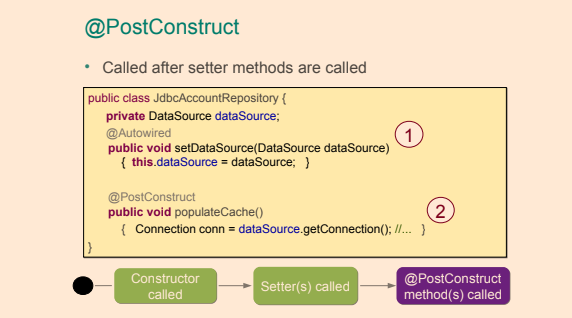

[Context name space configuration example](/IOC/Courses/src/main/resources/jb/_3_annotation_event/spring.xml)

## Destroying beans priority

- When you close a context the destruction phase completes: `applicationContext.close();`
- Called also when JVM exit normally
- Not called for `prototype` beans
- Destroying ways
	- Annotate a method with `@PreDestroy`, also part of JSR 250 and one of the first supported annotations in Spring.
	- Modify the bean to implement the `org.springframework.beans.factory.DisposableBean` interface and provide an implementation for the `destroy()` method (not recommended, since it couples the application code with Spring infrastructure).
	- Set a method to be called before destruction using the `destroy-method` attribute of the <bean /> element.
		- The equivalent of `destroy-method` for Java Configuration `@Bean(destroyMethod="...")`.

```java
public class TriangleLifecycle implements DisposableBean {

	// Calls #1
	@PreDestroy
	public void preDestroy(){
		System.out.println("TriangleLifecycle preDestroy : " + toString());
	}

	// Calls #2
	@Override
	public void destroy() throws Exception {
		System.out.println("TriangleLifecycle destroy : " + toString());
	}

	// Calls #3
	public void destroyMethod(){
		System.out.println("TriangleLifecycle destroyMethod : " + toString());
	}
	
}
```

- Set the `destroyMethod` element of the `@Bean` annotation

```java
@Bean(destroyMethod = "destroyMethod")
public MyBeanClass myBeanWithACloseMethodNotToBeInvokedAsLifecycleCallback() {
	final MyBeanClass theBean = new MyBeanClass();
	return theBean;
}
```

- Destroy method's rules
	- The destroy method may be called only once during the bean lifecycle.
	- The destroy method can have any accessor; some developers even recommend to make it `private`, so that only Spring can call it via reflection.
	- The destroy method must not have any parameters.
	- The destroy method must return `void`. 

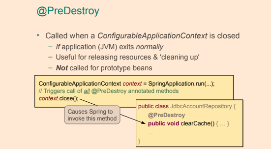

## Bean Scopes

- Default scope for a bean is `singleton`
    - One per IOC Container

| **Scope**           |**Description** |
| --------------------|-------------|
| **singleton**       | [Default] The Spring IoC creates a single instance of this bean, and any request for beans with an id or ids matching this bean definition results in this instance being returned.|
| **prototype**       | Each time a bean is requested, a new instance is created. Every time a request is made for this specific bean, the Spring IoC creates a new instance.      |
| **request**         | Single bean instance per HTTP `request`. Only in web-aware Spring application contexts. |
| **session**         | Single bean instance per HTTP `session`. Only in web-aware Spring application contexts. |
| **application**     | Single bean instance per `ServletContext`. Only in web-aware Spring application contexts.|
| **websocket**       | Single bean instance per `WebSocket`. Only in web-aware Spring application contexts.|
| _custom_            | Developers are provided the possibility to define their own scopes with their own rules.|

```xml
<bean id="complexBean" class="com.ps.sample.ComplexBean" scope="prototype"/>
```

### @Scope

- **proxyMode**
    - Define bean with scope `request`
    
    ```java
    @Bean
    @Scope(value = WebApplicationContext.SCOPE_REQUEST, proxyMode = ScopedProxyMode.TARGET_CLASS)
    public HelloMessageGenerator requestScopedBean() {
        return new HelloMessageGenerator();
    }
    
    ```
    
    - Define controller in which autowire bean  with scope `request`
    
    ```java
    @Controller
    public class ScopesController {
        
        @Autowire
        private HelloMessageGenerator requestScopedBean;
     
        @RequestMapping("/scopes/request")
        public String getRequestScopeMessage(final Model model) {
            model.addAttribute("previousMessage", requestScopedBean.getMessage());
            requestScopedBean.setMessage("Good morning!");
            model.addAttribute("currentMessage", requestScopedBean.getMessage());
            return "scopesExample";
        }
    }
    ```

In case if we don't specify scope for `HelloMessageGenerator` we will get error while instantiation `ScopesController`.
`proxyMode` will fix this problem, this attribute is necessary because, at the moment of the instantiation of the web application context, 
there is no active request. Spring will create a proxy to be injected as a dependency, and instantiate 
the target bean when it is needed in a request.

```java
public enum ScopedProxyMode {

	/**
	 * Default typically equals {@link #NO}, unless a different default
	 * has been configured at the component-scan instruction level.
	 */
	DEFAULT,

	/**
	 * Do not create a scoped proxy.
	 * <p>This proxy-mode is not typically useful when used with a
	 * non-singleton scoped instance, which should favor the use of the
	 * {@link #INTERFACES} or {@link #TARGET_CLASS} proxy-modes instead if it
	 * is to be used as a dependency.
	 */
	NO,

	/**
	 * Create a JDK dynamic proxy implementing <i>all</i> interfaces exposed by
	 * the class of the target object.
	 */
	INTERFACES,

	/**
	 * Create a class-based proxy (uses CGLIB).
	 */
	TARGET_CLASS;

}

```

#### Lazy and eager beans

- **Singleton** Spring beans in an application context are `eagerly` initialized by default, as the application context is created.
- **Prototype** scoped bean is typically created `lazily` when requested. 
    - An exception is when a prototype scoped bean is a dependency of a singleton scoped bean, 
      in which case the prototype scoped bean will be `eagerly` initialized.

#### Additional ways to create app context

```java
- new AnnotationConfigApplicationContext(AppConfig.class);
- new ClassPathXmlApplicationContext(“com/example/app-config.xml”);
- new FileSystemXmlApplicationContext(“C:/Users/vojtech/app-config.xml”);
- new FileSystemXmlApplicationContext(“./app-config.xml”);
```

#### Depends-on


- Initialization of Bean `monitoring` will be after initialization of bean `app`

#### Accessing a Bean

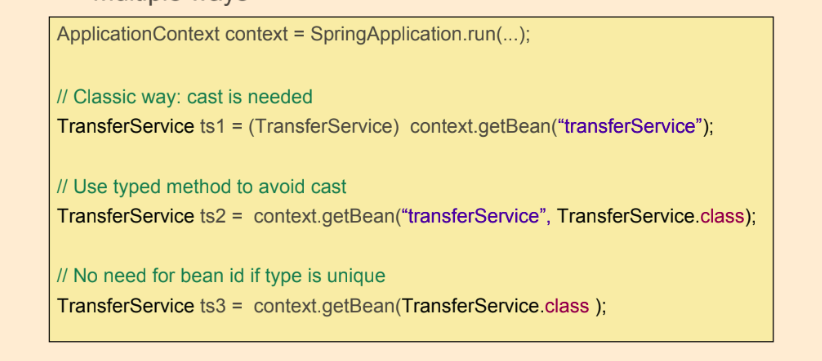

--- 

## Java Spring Configuration and Annotations


#### @Configuration
    
- Classes annotated with `@Configuration` contain bean definitions.  
- Not allowed to annotate a final class with `@Configuration`
    - The Spring container will create a subclass of each class annotated with `@Configuration` when
      creating an application context using `CGLIB`. Final classes cannot be subclassed, thus classes
      annotated with `@Configuration` cannot be declared as final.
- Singleton beans are supported by the Spring container by subclassing classes annotated with
  `@Configuration` and overriding the `@Bean` annotated methods in the class. Invocations to the
  `@Bean` annotated methods are intercepted and, if a bean is a singleton bean and no instance of the
  singleton bean exists, the call is allowed to continue to the `@Bean` annotated method, in order to
  create an instance of the bean. If an instance of the singleton bean already exists, the existing
  instance is returned

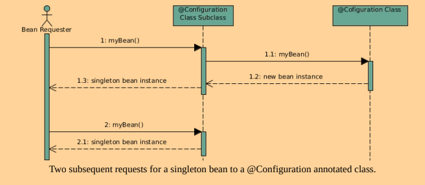

#### Annotations

- Spring manages lifecycle of beans, each bean has its scope
- Default scope is `singleton` - one instance per application context
- Scope can be defined by `@Scope`(eg. `@Scope(BeanDefinition.SCOPE_SINGLETON)`) annotation on the class-level of bean class
- Stereotypes annotations are used to mark classes according to their purpose:
    - `@Component`: template for any Spring-managed component(bean).
    - `@Repository`: indicates that a class is a repository (persistence). template for a component used to provide data access, specialization of the `@Component` annotation for the the `Dao layer`.
    - `@Service`: template for a component that provides service execution, specialization of the `@Component` annotation for the `Service layer`.
    - `@Controller`: indicates that a class is a web controller. Template for a web component, specialization of the `@Component` annotation for the `Web layer`.
    - `@RestController`: indicates that a class is a specialized web controller for a REST service. Combines the `@Controller` and `@ResponseBody` annotations.
    - `@Configuration`: configuration class containing bean definitions (methods annotated with `@Bean`).
 
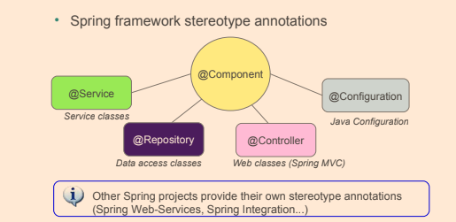      
    
- Autowiring and initialization annotations are used to define which dependency is injected and what the bean looks like. For example:
    - `@Autowired`: core annotation for this group; is used on dependencies to instruct Spring IoC to take care of injecting them.
     	- Can be used on fields, constructors, setters and methods. 
     	- Use with `@Qualifier` from Spring to specify name of the bean to inject.
     	- If a bean class contains one single constructor, then annotating it with `@Autowired` is not required
          in order for the Spring container to be able to autowire dependencies. If a bean class contains more
          than one constructor and autowiring is desired, at least one of the constructors need to be annotated
          with `@Autowired` in order to give the container a hint on which constructor to use.
        - Autowire by type then by name  
    - `@Inject`: equivalent annotation to `@Autowired` from javax.inject package. Use with `@Qualifier` from javax.inject to specify name of the bean to inject. 
    - `@Resource`: equivalent annotation to `@Autowired` from javax.annotation package.
        - Autowire by name then by type
    - `@Required`: Spring annotation that marks a dependency as mandatory, used on setters.
    - `@Lazy`: dependency will be injected the first time it is used.    
 
```java
@Configuration
@PropertySource("classpath:db/datasource.properties")
@ImportResource("classpath:spring/user-repo-config.xml")
@Import({DataSourceConfig.class,  UserRepoDSConfig.class})
@ComponentScan(basePackages = "com.ps")
public class DataSourceConfig {
    
    @Value("${driverClassName}")
    private String driverClassName;
    
    @Bean
    public static PropertySourcesPlaceholderConfigurer
           propertySourcesPlaceholderConfigurer() {
        return new PropertySourcesPlaceholderConfigurer();
    }
    @Bean
    public DataSource dataSource() throws SQLException {
        DriverManagerDataSource ds = new DriverManagerDataSource();
        ds.setDriverClassName(driverClassName);
        ds.setUrl(url);
        ds.setUsername(username);
        ds.setPassword(password);
        return ds;
    }
}
```

- `@Bean` annotation is used to tell Spring that the result of the annotated method will be a bean that has to be managed by it. 
- `@Bean` annotation together with the method are treated as a `bean definition`, and the method name becomes the bean `id`.
- `@Bean ( initMethod = "init", destroyMethod = "destroy")` - for declare init and destroy methods
- `@PropertySource` annotation will be used to read property values from a property file set as argument
    - The annotation is applied to classes annotated with `@Configuration`.

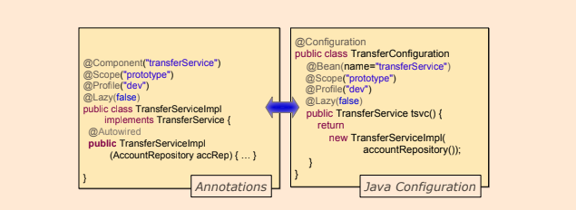 

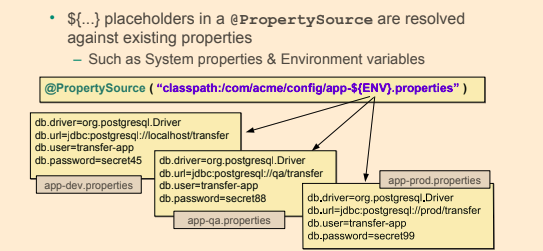   
    
- `@ImportResource` for importing another configurations
- `@Import` annotation to import the bean definition in one class into the other.
- `@ComponentScan` works the same way as `<context:component-scan />` for XML

- `@ComponentScan` - The default component scanning behavior is to detect classes annotated with `@Component` or an annotation that itself is annotated with `@Component`. 
	Note that the `@Configuration` annotation is annotated with the `@Component` annotation and thus are Spring Java configuration classes also candidates for auto-detection using component scanning.

```java
@ComponentScan(
	basePackages = "comlearnig",
	basePackageClasses = CalculatorService.class,
	excludeFilters = @ComponentScan.Filter(type = FilterType.REGEX, pattern = ".*Repository"),
	includeFilters = @ComponentScan.Filter(type = FilterType.ANNOTATION, classes = MyService.class)
)
public class SpringApplication {

}
```

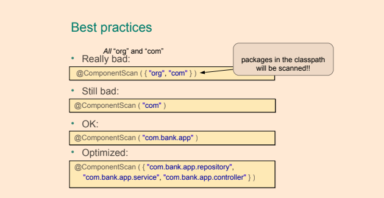 

### @Qualifier

- `@Qualifier` annotation can aid in selecting one single bean to be dependency-injected into a field or parameter annotated with `@Autowired` when there are multiple candidates.
- The most basic use of the `@Qualifier` annotation is to specify the name of the Spring bean to be selected the bean to be dependency-injected.
- The `@Qualifier` annotation can be used at three different locations:
	- At injection points.
	- At bean definitions.
	- At annotation definitions. This creates a custom qualifier annotation.
	
```java
@Autowired
@Qualifier("userServiceImpl")
private UserService userService;
```

#### @Qualifier at Bean Definitions

- Qualifiers can also be applied on bean definitions by annotating a method annotated with `@Bean` in a configuration class with `@Qualifier` and supplying a value in the `@Qualifier` annotation.

```java
@Component
public class FactoryMethodComponent {

    @Bean
    @Qualifier("public")
    public TestBean publicInstance() {
        return new TestBean("publicInstance");
    }
    
    @Bean
    protected TestBean protectedInstance( @Qualifier("public") TestBean spouse) {
        //...
    }
}
```

### @Bean

- `@Bean` annotation tells the Spring container that the method annotated with the `@Bean` annotation will instantiate, configure and initialize an object that is to be managed by the Spring container.
	- Configure autowiring of dependencies; whether by name or type.
	- Configure a method to be called during bean initialization - `initMethod` - this method will be called after all the properties have been set on the bean but before the bean is taken in use.
	- Configure a method to be called on the bean before it is discarded - `destroyMethod`
	- The default bean name is the name of the method annotated with the `@Bean` annotation and it will be used if there are no other name specified for the bean.
		- This functionality can be overridden, however, with the `name` attribute
	- To add a description to a `@Bean` the `@Description` annotation can be used
- Why `@Bean` method cannot be final?
    - Spring container subclass classes `@Configuration` classes and overrides the methods
      annotated with the `@Bean` annotation, in order to intercept requests for the beans. If the bean is a
      singleton bean, subsequent requests for the bean will not yield new instances, but the existing
      instance of the bean.	
	
```java
@Bean(name = "myFoo", initMethod = "init", destroyMethod = "cleanup")
@Description("Provides a basic example of a bean")
public Foo foo() {
	return new Foo();
}

```

### Lookup method injection

- Lookup method injection is an advanced feature that you should use rarely. It is useful in cases where a `singleton`-scoped bean has a dependency on a `prototype`-scoped bean
- Configuration example

```java
@Configuration
public class LMIConfiguration {

	@Bean
	@Qualifier("myCommand")
	@Scope("prototype")
	public Command command() {
		return new Command();
	}

	@Bean
	public CommandManager commandManager() {
		return new CommandManager() {
			
			@Override
			Command createCommand() {
				return command();
			}
		};
	}
}
```

- Beans example

```java
public class Command {

	public void execute() {
		System.out.println("Command: " + this.hashCode());
	}

}

public abstract class CommandManager {

	@Lookup
	abstract Command createCommand();

	public void process() {
		System.out.println("CommandManager: " + this.hashCode());
		final Command command = createCommand();
		command.execute();
	}

}

```

- Application example. `Prototype` beans is different every time, but `Singleton` is unique

```java
public class App {

	public static void main(String[] args) {
		ApplicationContext context = new AnnotationConfigApplicationContext(LMIConfiguration.class);
		final CommandManager commandManager = context.getBean(CommandManager.class);
		
		commandManager.process();
		// CommandManager: 81412691
		// Command: 717176949
		
		commandManager.process();
		// CommandManager: 81412691
		// Command: 1997353766
		
		commandManager.process();
		// CommandManager: 81412691
		// Command: 1288235781
	}
}
```
      
## Bean Naming

- When the name is not defined for a bean declared with `@Bean`, the Spring IoC names the bean with the annotated `method name`.

```java
// bean name = dataSource
@Bean
public DataSource dataSource() throws SQLException {

}

//bean name = one
@Bean(name="one")
public DataSource dataSource() throws SQLException {

}

//bean name =  one, alias = two
@Bean(name={"one", "two"})
public DataSource dataSource() throws SQLException {

}
```
- When the name is not defined for a bean declared with Component, the Spring IoC creates the name of the bean from the name of the bean type, by lowercasing the first letter.

```java
// bean name = jdbcRequestRepo
@Repository
public class JdbcRequestRepo extends JdbcAbstractRepo<Request> implements RequestRepo{
       
}

// bean name = requestRepo
@Repository("requestRepo")
public class JdbcRequestRepo extends JdbcAbstractRepo<Request> implements RequestRepo{
         
}
// or
@Repository(value="requestRepo")
public class JdbcRequestRepo extends JdbcAbstractRepo<Request> implements RequestRepo{
         
}
//  or
// bean name = requestRepo
@Component("requestRepo")
public class JdbcRequestRepo extends JdbcAbstractRepo<Request> implements RequestRepo{
         
}
```

- `@Description` annotation, which was added in Spring 4.x is used to add a description to a bean

```java
@Repository
@Description("This is not the bean you are looking for")
public class JdbcRequestRepo extends JdbcAbstractRepo<Request> implements RequestRepo {

}
```

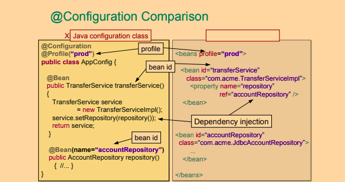 

## Field Injection

- Dependency injection, regardless of whether on fields, constructors or methods, is performed by the `AutowiredAnnotationBeanPostProcessor`.
- `@Autowire` can be used on fields, constructors, setters, and even methods.
- In using `@Autowired` on constructors, it makes not sense to have more than one constructor annotated with it, and Spring will complain about it because it will not know what constructor to use to instantiate the bean.
- Out of the box, Spring will try to **autowire by type**
- If there are multiple matching bean candidates and one of them is annotated with `@Primary`,
  then this bean is selected and injected into the field or parameter.
- If there is no other resolution mechanism, such as the `@Primary` or `@Qualifier` annotations, and there are multiple matching beans, the Spring container will try to resolve the
  appropriate bean by trying to match the bean name to the name of the field or parameter. This is the default bean resolution mechanism used when autowiring dependencies.
- If still no unique match for the field or parameter can be determined, an exception will be thrown.  
- If Spring cannot decide which bean to autowire based on type (because there are more beans of the same type in the application), it defaults to `autowiring by name`.
- `@Qualifier` - in case Spring finds more than candidate for autowiring to qualify which bean to inject
- `@Autowired` annotation by default requires the dependency to be mandatory, but this behavior can be changed, by setting the required attribute to true (`@Autowired(required=false)`)
- If the type that is autowired is an array-type, then the Spring container will collect all beans matching the value-type of the array in an array and inject the array.
- If the type that is autowired is a map with the key type being String, then the Spring container will collect all beans matching the value type of the map and 
  insert these into the map with the bean name as key and inject the map.

```java
   @Qualifier("requestRepo")
   @Autowired
   RequestRepo reqRepo;
```
## Constructor Injection

- Constructors in Spring bean classes can be annotated with the `@Autowired` annotation in order for
  the Spring container to look up Spring beans with the same types as the parameters of the
  constructor and supply these beans (as parameters) when creating an instance of the bean with the `@Autowired` - annotated constructor.
- If there is only one single constructor with parameters in a Spring bean class, then there is no need
  to annotate this constructor with `@Autowired` – the Spring container will perform dependence injection anyway.
- If there are multiple constructors in a Spring bean class and autowiring is desired, `@Autowired` may
  be applied to one of the constructors in the class. 
	- Only one single constructor may be annotated with `@Autowired`.  
- Constructors annotated with `@Autowired` does not have to be public in order for Spring to be able
  to create a bean instance of the class in question, but can have any visibility.  
- If a constructor is annotated with `@Autowired`, then all the parameters of the constructor are required. Individual parameters of such constructors can be declared using the Java 8 `Optional`
  container object, annotated with the `@Nullable` annotation or annotated with `@Autowired(required=false)` to indicate that the parameter is not required. Such parameters will be
  set to null, or `Optional.EMPTY` if the parameter is of the type Optional.  

```java
@Repository("requestRepo")
public class JdbcRequestRepo  extends JdbcAbstractRepo<Request> implements RequestRepo{
	
    @Autowired
    public JdbcRequestRepo(DataSource dataSource) {
        super(dataSource);
    }
 }
```

## Setter Injection

- Methods with any visibility. <br />
  Example: Setter-methods annotated with `@Autowired` can be private – the Spring container will still detect and invoke them.
- If a method annotated with `@Autowired`, regardless of whether required is true or false, has parameters wrapped by the Java 8 Optional, then this method will always be invoked with the
  parameters for which dependencies can be resolved having a value wrapped in an `Optional` object. All parameters for which no dependencies can be resolved will have the value `Optional.EMPTY`.  

```java
public class JdbcUserRepo extends JdbcAbstractRepo<User> implements UserRepo {
	
	private DataSource dataSource;
    
	@Autowired
	public void setDataSource(DataSource dataSource) {
		this.dataSource = dataSource;
	}
    
    //or by name
     @Autowired
    public void setDataSource( @Qualifier("oracleDataSource") DataSource dataSource) {
        this.dataSource = dataSource;
    }
}
```

## Method Injection

- Methods with more than one parameter.
- Methods with any visibility. <br />
  Example: Setter-methods annotated with `@Autowired` can be private – the Spring container will still detect and invoke them.
- If a method annotated with `@Autowired`, regardless of whether required is true or false, has parameters wrapped by the Java 8 Optional, then this method will always be invoked with the
  parameters for which dependencies can be resolved having a value wrapped in an `Optional` object. All parameters for which no dependencies can be resolved will have the value `Optional.EMPTY`.  
 

```java
@Configuration
public class MethodSecurityConfig {

  @Autowired
  public void registerGlobal(AuthenticationManagerBuilder auth) {
    // some business logic 
  }

}
```

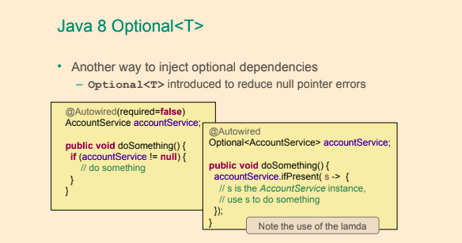 


## Generic Injection

- This is useful when you have classes that are organized in a hierarchy and they all inherit a certain class that is generic, 
  like the repositories in the project attached to the book, all of which extend `JdbcAbstractRepo<T>`

```java
@ContextConfiguration(classes = {AllRepoConfig.class})
public class GenericQualifierTest {
	
    @Autowired
    JdbcAbstractRepo<Review> reviewRepo;
    
    @Autowired
    JdbcAbstractRepo<Response> responseRepo;

}
```
```java
public class JdbcAbstractRepo<T extends AbstractEntity> implements AbstractRepo<T> {
	...
}
```

## @Value annotation

- `@Value` - can be used to insert scalar values or can be used together with placeholders and `SpEL` in order to provide flexibility in configuring a bean
	- Such values can originate from environment variables, property files, Spring beans etc.
- Is used to inject value 
	- system properties **using ${}** - these expressions are evaluated by the `PropertySourcesPlaceholderConfigurer` Spring bean prior
      to bean creation and can only be used in @Value annnotations.
	- SpEL **using #{}** - Spring Expression Language expressions parsed by a SpEL expression parser and evaluated by a SpEL expression instance.
- Can be on fields, constructor parameters or setter parameters
- On constructors and setters must be combined with `@Autowired` on method level, for fields `@Value` alone is enough
- Can specify default values
	- `${minAmount:100}"`
	- `${personservice.retry-count:${services.default.retry-count}}`
- `@Value` injection using SpEL
	- `#{environment['minAmount'] ?: 100}`
	- `#{T(java.lang.Math).random() * 50.0 }`
	- `#{@systemProperties['os.name']}`
	- `path` equivalent to `PATH`
	- `java.home` equivalent to `JAVA_HOME`
- The `@Value`a annotation can be applied to:
    - Fields
  	- Methods. Typically setter methods
    - Method parameters. Including constructor parameters. Note that when annotating a parameter in a method other
	  than a constructor, automatic dependency injection will not occur. If automatic injection of
	  the value is desired, the `@Value` annotation should be moved to the method instead.
  	- Definition of annotations. In order to create a custom annotation.	


```java 
	 @Value("${driverClassName}") private String driverClassName;
	 @Value("${url}") private String url;
	
	 @Value("#{dbProps.driverClassName}") String driverClassName,
	 @Value("#{dbProps.url}")String url,
	 @Value("#{dbProps.username}")String username,
	 @Value("#{dbProps.password}")String password
```

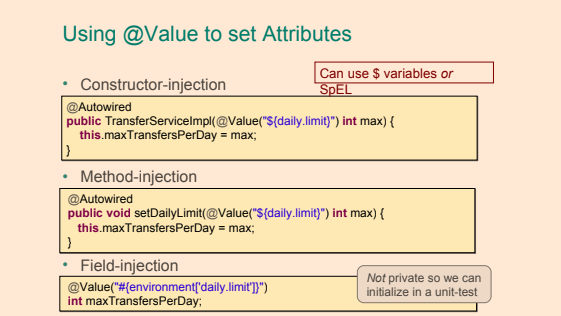 

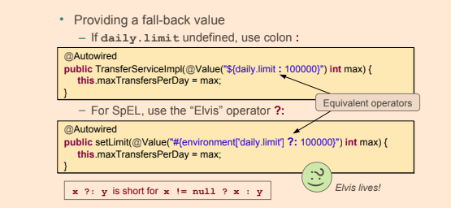 

## Spring Expression language (SpEL)

- Acronym `SpEL`
- can be used in @Value annotation values
- enclosed in #{}
- ${} is for properties, #{} is for `SpEL`
- Access property of bean #{beanName.property}
- Can reference systemProperties and systemEnvironment
- Used in other spring projects such as Security, Integration, Batch, WebFlow,...
- SpEL has support for:
	- Literal expressions.
		- Example string: 'Hello World'
	- Properties, arrays, lists and maps.	
	- Example create a list of integers: `{1, 2, 3, 4, 5}`
		- Example create a map: `{1 : "one", 2 : "two", 3 : "three", 4 : "four"}`
		- Example retrieve third item in list referenced by variable theList: `#theList[3]`
		- Example retrieve value from map in variable personsMap that has key “ivan”: `#personsMap['ivan']`
	- Method invocation.	
		- Example invoke a method on a Java object stored in variable javaObject: `#javaObject.firstAndLastName()`
	- Operators.
		- Creating Java objects using new operator.
		- Ternary operator: <condition> ? <true-expression> : <false-expression>
        - The Elvis operator: <variable-to-test-for-null> ?: <value-to-assign-if-variable-is-null>
        - Safe navigation operator: <object-reference-that-may-be-null>?.<field-in-object>
        - Regular expression “matches” operator: '168' matches '\\d+'
    - User defined functions..
    	- Implemented as static methods.
    - Referencing Spring beans in a bean factory (application context).	 
    	- @mySuperComponent.injectedValue
    - Collection selection expressions.
    	- Creates a new collection by selecting a subset of elements from a collection.	Syntax: .?[<selection-expression>]
    - Collection projection.	
    	- Creates a new collection by applying an expression to each element in a collection. Syntax: .![<expression>]
- The following entities can be referenced from Spring Expression Language (SpEL) expressions.
	- Static methods and static properties/fields.
		- `T(se.ivankrizsan.spring.MyBeanClass).myStaticMethod()`
		- `T(se.ivankrizsan.spring.MyBeanClass).myClassVariable`
	- Properties and methods in Spring beans. A Spring bean is references using its name prefixed with **@** in SpEL.
		- Example accessing property on Spring bean: `@mySuperComponent.injectedValue`
		- Example invoking method on Spring bean: `@mySuperComponent.toString()`
	- Properties and methods in Java objects with references stored in SpEL variables. 
	  References and values stored in variables are referenced using the variable name prefixed with **#** in SpEL.
	  	- Example accessing property on Java object: `#javaObject.firstName`
	  	- Example invoking method on Java object: `#javaObject.firstAndLastName()`
	- (JVM) System properties. Available through the systemProperties reference, which is available by default.
		- Example retrieving OS name property: `@systemProperties['os.name']`
	- System environment properties.	
		- Example KOTLIN_HOME environment variable: `@systemEnvironment['KOTLIN_HOME']`
	- Spring application environment. Available through the environment reference, also available by default.
		- Example retrieve name of first default profile: `@environment['defaultProfiles'][0]`
    	

## Environment

- The Environment is a part of the application container. The Environment contains profiles and properties, two important parts of the application environment.
  
  
  
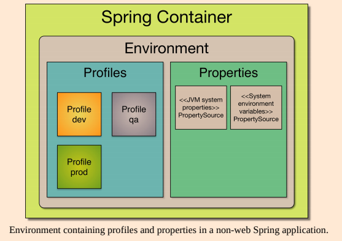  

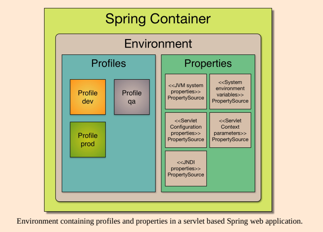  

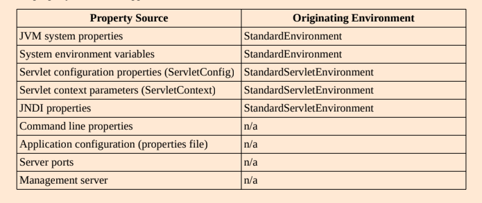  
  
## Bean Lifecycle 

- For a configuration using Java Configuration annotations, the classpath is scanned by a bean of type `org.springframework.context.annotation.ClassPathBeanDefinitionScanner`, and the bean definitions are registered by a bean of type `org.springframework.context.annotation.ConfigurationClassBeanDefinitionReader`.
- Java Configuration and all other annotations: a `org.springframework.beans.factory.annotation.AutowiredAnnotationBeanPostProcessor` bean is used to autowire dependencies

## @Lazy

- This annotation can be used to postpone the creation of a bean until it is first accessed, by adding this annotation to the bean definition

```java
@Component
@Lazy
public class SimpleBean { 
	
}

// or on a @Bean
@Configuration
public class RequestRepoConfig {
	
	@Lazy
	@Bean
	public RequestRepo anotherRepo(){
		return new JdbcRequestRepo();
}
}

// on injection point
@Repository
public class JdbcPetRepo extends JdbcAbstractRepo<Pet>
implements PetRepo {
    
    @Lazy
    @Autowired(required=false)
    public void setDataSource(DataSource dataSource) {
        this.dataSource = dataSource;
    }
}
```

### @Profile

- Bean definition profiles is a mechanism that allows for registering different beans depending on different conditions. 
    - Testing and development. <br />
       Certain beans are only to be created when running tests. When developing, an in-memory
       database is to be used, but when deploying a regular database is to be used.
    - Performance monitoring.
    - Application customization for different markets, customers 
- One or more beans can be configured to be registered when one or more profiles are active using the `@Profile` annotation.
- The beans in the below configuration class will be registered if the “dev” or “qa” profile is active.

```java
@Profile({"dev", "qa"})
@Configuration
public class ConfigurationClass {
    
}
```

- Profile names in the `@Profile` annotation can be prefixed with **!**, indicating that the bean(s) are to be registered when the the profile with specified name is not active.

```java
@Profile("!prod")
@Configuration
public class ConfigurationClass {
    
}
```

- The `@Profile` annotation can be applied at the following locations:
    - At class level in `@Configuration` classes.
    - On methods annotated with the `@Bean` annotation.
- Activating Profile(s)
   - Programmatic registration of active profiles when the Spring application context is created.
    ```java
    applicationContext.getEnvironment().setActiveProfiles("dev1", "dev2");
    ```
   - Using the spring.profiles.active property
   ```
   java -Dspring.profiles.active=dev1,dev2 -jar myApp.jar
   ```
   - In tests, the `@ActiveProfiles` annotation may be applied at class level to the test class
     specifying which the profile(s) that are to be activated when the tests in the class are run.

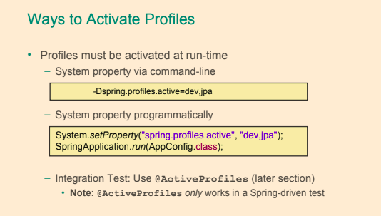  

# Testing Spring Applications

- Unit Testing
	- Tests one unit of functionality
	- Keeps dependencies minimal
	- Isolated from the environment (including Spring)
- Integration Testing
	- Tests the interaction of multiple units working together
	– Integrates infrastructure
- `TDD` - This approach puts the design under question: if tests are difficult to write, the design should be reconsidered
- Trying to write at least two tests for each method: one positive and one negative, for methods that can be tested

- In order to define a test class for running in a Spring context, the following have to be done:
    - annotate the test class with `@RunWith(SpringJUnit4ClassRunner.class)`
    - annotate the class with `@ContextConfiguration` in order to tell the runner class where the bean definitions come from
    - use `@Autowired` to inject beans to be tested.
  
- Distributed as separate artifact - `spring-test.jar`
- Test class needs to be annotated with `@RunWith(SpringJUnit4ClassRunner.class)`
- Spring configuration classes to be loaded are specified in `@ContextConfiguration` annotation
  - If no value is provided `@ContextConfiguration`, config file `${classname}-context.xml` in the same package is imported
  - XML config files are loaded by providing string value to annotation - `@ContextConfiguration("classpath:com/example/test-config.xml")`
  - Java @Configuration files are loaded from classes attribute - `@ContextConfiguration(classes={TestConfig.class, OtherConfig.class})`
  
- To customize property values in a test, the `@TestPropertySource` annotation allows using either a test-specific property file or customizing individual property values.  
- `ReflectionTestUtils` make it possible to access private properties,

#### JUnit 4 Example 
 
```java
@RunWith(SpringJUnit4ClassRunner.class)
@ContextConfiguration(classes={TestConfig.class, OtherConfig.class})
public final class FooTest  {
 
    @Autowired
    private MyService myService;
    
    @Test
    public void test() {
    	
    }
}
```

#### JUnit 5 Example

```java
@SpringJUnitConfig(classes={TestConfig.class, OtherConfig.class})
public final class FooTest  {
 
    @Autowired
    private MyService myService;
    
    @Test
    public void test() {
    	
    }
}
```

#### Testing Web Application Context 

- Spring Unit test with `@WebAppConfiguration`
	- Creates a `WebApplicationContext`
	- Can test code that uses web features
		- ServletContext, Session and Request bean scopes
- Configures the location of resources
	- Defaults to `src/main/webapp`
	- For classpath resources use classpath: prefix
	
```java
@SpringJUnitConfig(classes={TestConfig.class, OtherConfig.class})
@WebAppConfiguration
public final class FooTest  {
 
    @Autowired
    private MyService myService;
    
    @Autowired
    private WebApplicationContext mWebApplicationContext;
    
    @Test
    public void test() {
    	
    }
}
```

- The ApplicationContext is **instantiated only once** for all tests that use the same set of config files (even across test classes)
- Annotate test method with `@DirtiesContext` to force recreation of the cached ApplicationContext if method changes the contained beans

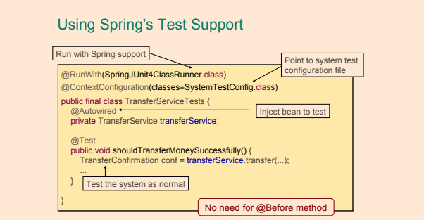  

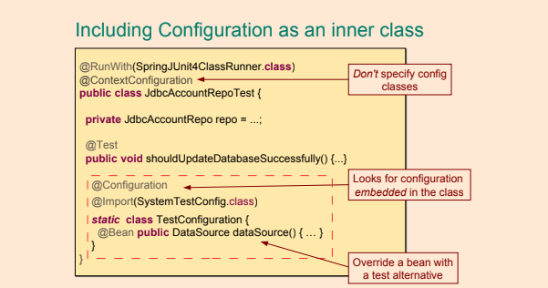  

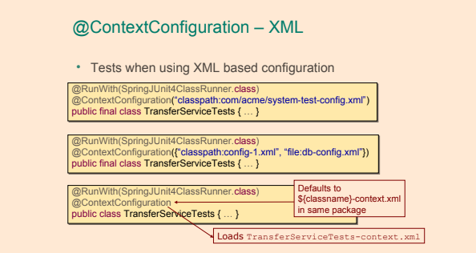  

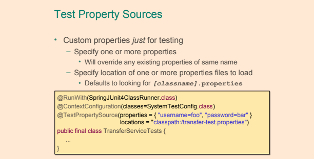  


#### AnnotationConfigContextLoader

- `@Configuration` inner classes (must be static) are automatically detected and loaded in tests
  with help of `AnnotationConfigContextLoader`

```java
@RunWith(SpringJUnit4ClassRunner.class)
@ContextConfiguration(loader = AnnotationConfigContextLoader.class)
public class SpringPetServiceTest3 {

     @Configuration
     public static class TestCtxConfig {
        @Bean
        StubPetRepo petRepo(){
            return new StubPetRepo();
        }
        @Bean
        PetService simplePetService(){
            SimplePetService petService = new SimplePetService();
            petService.setRepo(petRepo());
            return petService;
        }
    }
}
```

#### Testing with spring profiles

- `@ActiveProfiles` annotation of test class activates profiles listed
- `@ActiveProfiles( { "foo", "bar" } )`

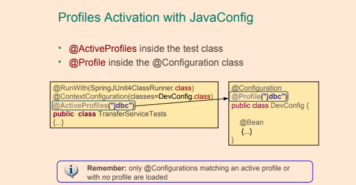 
 
  

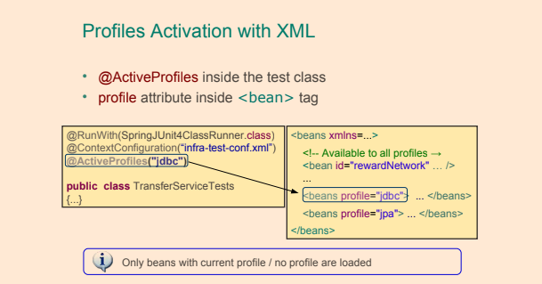  

#### Inject mocks using Mockito

- The `@InjectMock` has a behavior similar to the Spring IoC, because its role is to instantiate testing object instances and 
  to try to inject fields annotated with `@Mock` or `@Spy` into private fields of the testing object.

```java
public class MockPetServiceTest {
    
    @InjectMocks
    private SimplePetService simplePetService;
    
    @Mock
    private PetRepo petRepo;
    
    @Before
    public void initMocks() {
        MockitoAnnotations.initMocks(this);
    }
}
```

- With `@RunWith(MockitoJUnitRunner.class)` no need to `MockitoAnnotations.initMocks(this)`

```java
@RunWith(MockitoJUnitRunner.class)
public class MockPetServiceTest {

    @InjectMocks
    private SimplePetService simplePetService;

    @Mock
    private PetRepo petRepo;

}
```

- `PowerMock` was born because sometimes code is not testable, perhaps because of bad design or because of some necessity. Below you can find a list of untestable elements:
    - static methods
    - classes with static initializers
    - final classes and final methods; sometimes there is need for an insurance that the code will not be misused or to make sure that an object is constructed correctly
    - private methods and fields
    
## Testing Rest with Spring boot

- Can use `SpringRunner` as an alternative to the `SpringJUnit4ClassRunner`
  
```java
@RunWith(SpringRunner.class)
@WebMvcTest(controllers = CustomerController.class, secure=false)
public class TestCustomerController {

	@MockBean
	private CustomerService service;

	@Autowired
	private MockMvc mockMvc;

	@Test
	public void testSuccessfulFindAllCustomers() throws Exception {
		when(service.findAllCustomers()).thenReturn(Arrays.asList(new Customer(), new Customer()));

		mockMvc.perform(get("/customers"))
            .andExpect(status().isOk())
            .andExpect(content().contentType(MediaType.APPLICATION_JSON_UTF8))
            .andExpect(jsonPath("$", hasSize(2)));
	}
	//..
}	
```

```java
@RestController
@RequestMapping("/customers")
public class CustomerController {

	private CustomerService service;

	public CustomerController(CustomerService service) {
		this.service = service;
	}
	
	@GetMapping
	public ResponseEntity<Iterable<Customer>> findAllCustomers(){
		return ResponseEntity.ok(service.findAllCustomers());
	}
    //..
 }   
		
```
    
## Testing JPA with Spring boot    

```java
@RunWith(SpringRunner.class)
@DataJpaTest
public class TestCustomerRepo {

	@Autowired
	private TestEntityManager entityManager;

	@Autowired
	private CustomerRepo repo;
	
	private Customer bojack;

	public TestCustomerRepo() {
		bojack = new Customer.CustomerBuilder().firstName("BoJack").middleName("Horse").lastName("Horseman")
				.suffix("Sr.").build();
	}

	@Test
	public void testFindAllCustomers() {
		this.entityManager.persist(bojack);
		Iterable<Customer> customers = repo.findAll();

		int count = 0;
		for (Customer repoCustomer : customers) {
			assertEquals("BoJack", repoCustomer.getFirstName());
			assertEquals("Horseman", repoCustomer.getLastName());
			assertEquals("Horse", repoCustomer.getMiddleName());
			assertEquals("Sr.", repoCustomer.getSuffix());
			assertTrue(repoCustomer.getId() > 0L);
			assertNull(repoCustomer.getDateOfLastStay());
			count++;
		}
		assertEquals(1, count);
	}
	//..
}	
```

# Aspect Oriented Programming
    
```
AOP is a type of programming paradigm that aims to help with separation of cross-cutting concerns 
to increase modularity; it implies declaring an aspect class that will alter the behavior of 
base code, by applying advices to specific join points, specified by pointcuts.
```    

- Examples of cross-cutting concerns:
	- Caching
	- Internationalization
	- Error detection and correction
	- Memory management
	- Performance monitoring
	- Synchronization
	- Logging
	- Transaction management
	- Security

- The original library that provided components for creating aspects is named **AspectJ.**

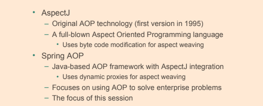


## AOP Terminology
    
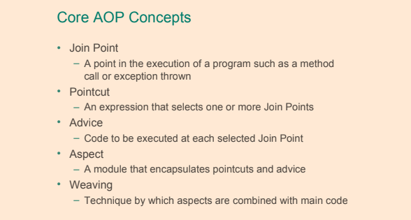

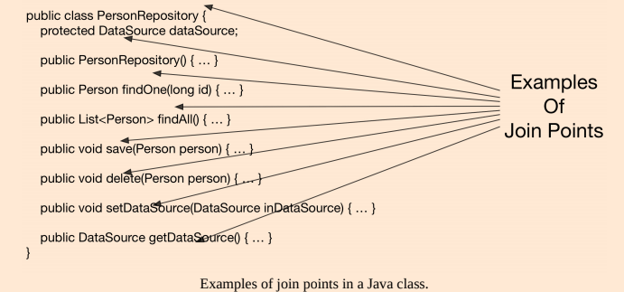
  
- **Target object** - object to which the aspect applies.
- **Target method** - the advised method.
- **Advice** - action taken by an aspect at a join point. In Spring AOP there are multiple advice types:
	- **Before advice** - methods annotated with `@Before` that will execute before the join point
	- **After returning advice** - methods annotated with `@AfterReturning` that will execute after a join point completes normally,
	  meaning that the target method returns normally without throwing an exception.
	- **After throwing advice** - methods annotated with `@AfterThrowing` that will execute after a join point execution ends by throwing an exception.  
	- **After (finally) advice** - methods annotated with `@After` that will execute after a join point execution, no matter how the execution ended.
	- **Around advice** - methods annotated with `@Around` intercept the target method and surround the join point. 
	  This is the most powerful type of advice, since it can perform custom behavior before and after the invocation
- **Pointcut** - a pointcut selects one or more join points out of the set of all join points in an application.
    Pointcut expressions can be defined as arguments for Advice annotations or as arguments for the `@Pointcut` annotation. 
- **Introduction** - declaring additional methods, fields, interfaces being implemented, annotations on behalf of another type.
- **AOP proxy** - the object created by AOP to implement the aspect contracts.    
- **Weaving** -  linking aspects with other application types or objects to create an advised object. 
    This can be done at compile time (using the AspectJ compiler, for example), load time, or at runtime. 
    Spring AOP, like other pure Java AOP frameworks, performs weaving at runtime.
    
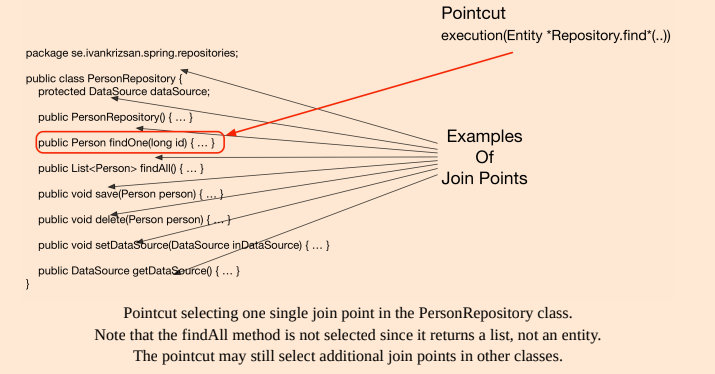    

```java
@Aspect
@Component
public class LoggingAspect {
	
	/**
	* Pointcut that selects join points being method executions in the se package
	* and sub-packages in classes which name ends with "Service" having arbitrary
	* number of parameters.
	*/
	@Pointcut("execution(* se..*.*Service.*(..))")
	public void applicationServiceMethodPointcut() {}
	
	/**
	* Pointcut that selects join points being public method executions.
	*/
	@Pointcut("execution(public * *(..))")
	public void publicMethodPointcut() {}
	
	/**
	* Pointcut that selects join points within the package se.ivankrizsan.spring
	* and sub-packages.
	*/
	@Pointcut("within(se.ivankrizsan.spring..*)")
	public void inSpringPackagePointcut() {}
	
	/**
	* Pointcut that selects join points on the Spring bean with the
	* name "mySuperService".
	*/
	@Pointcut("bean(mySuperService)")
	public void mySuperServiceSpringBeanPointcut() {}
	
	/**
	* Pointcut that combines all the above pointcuts to select join points
	* that match all the pointcuts.
	*/
	@Pointcut("publicMethodPointcut() && inSpringPackagePointcut() && applicationServiceMethodPointcut() && mySuperServiceSpringBeanPointcut()")
	public void publicServiceMethodInSpringPackagePointcut() {}
	
	/**
	* Around advice that prints a string before and after execution of a
	* join point (typically a method).
	*
	* @param inProceedingJoinPoint Join point advised by around advice.
	* @return Result from the join point invocation.
	* @throws Throwable If exception thrown when executing join point.
	*/
	@Around("publicServiceMethodInSpringPackagePointcut()")
	public Object loggingAdvice(final ProceedingJoinPoint inProceedingJoinPoint) throws Throwable {
		System.out.printf("* Before service method '%s' invocation.%n", inProceedingJoinPoint.getSignature().toShortString());
		
		/* Invoke the join point. */
		final Object theResult = inProceedingJoinPoint.proceed();
		System.out.printf("* After service method '%s' invocation.%n", inProceedingJoinPoint.getSignature().toShortString());
		
		return theResult;
	}
}
```

## Proxies

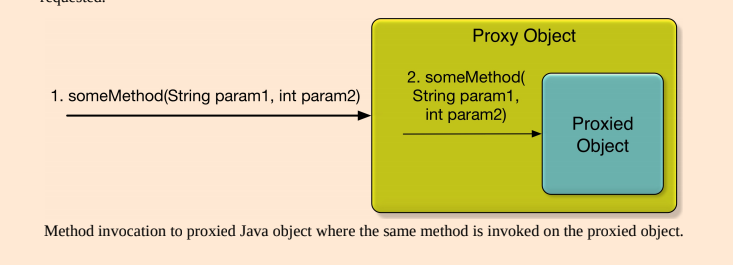

- Proxy classes are created in the init phase by dedicated BeanPostProcessors
- Two types of proxies
- `JDK dynamic proxies` - creates a proxy object that implements all the interfaces implemented by the object to be proxied.
	- Can only proxy by interface
	- Proxied bean must implement java interface
	- Part of JDK
	- All interfaces implemented by the class are proxied
	- Based on proxy implementing interfaces
	
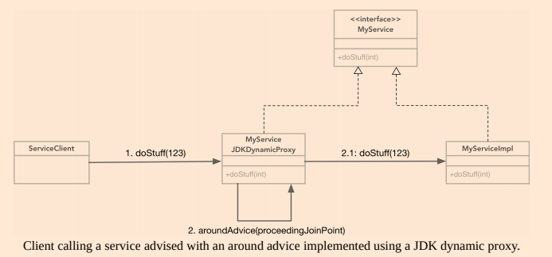
	
- `CGLib proxies` - creates a subclass of the class of the object to be proxied. 
	- third-party library
	- The CGLIB proxy mechanism will be used by Spring AOP when the Spring bean for which to create a proxy does not implement any interfaces.
	- Can create a proxy by subclassing. In this scenario the proxy becomes a subclass of the target class. No need for interfaces.
	- Is not part of JDK, included in spring
	- Used when class implements no interface
	- Cannot be applied to final classes or methods
	- Based on proxy inheriting the base class
	
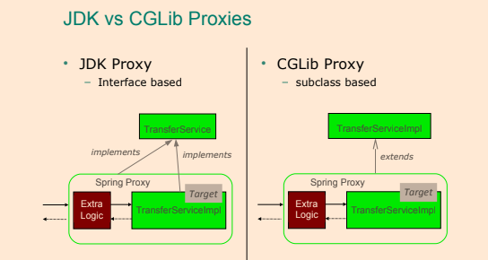	

	
- The default type of proxy used by the Spring framework is the `JDK dynamic proxy`.
- Proxies limitations:
	- `JDK Dynamic Proxies`
		- Invocation of advised methods on self.
		- Class for which a proxy is to be created must implement an interface.
		- Only public methods in implemented interfaces will be proxied.
	- `CGLIB Proxies`
		- Invocation of advised methods on self.
		- Class for which a proxy is to be created must not be final.
		- Method(s) in class for which a proxy is to be created must not be final.
		- Only public and protected methods will be proxied.

- To enable detection of Spring beans implementing advice which implementation classes are annotated with the `@Aspect` annotation, 
  the `@EnableAspectJAutoProxy` annotation should be 
  applied to a `@Configuration` class and aspects must be annotated with `@Component` 
  similar to functionality found in Spring's <aop:aspectj-autoproxy> XML element.
  
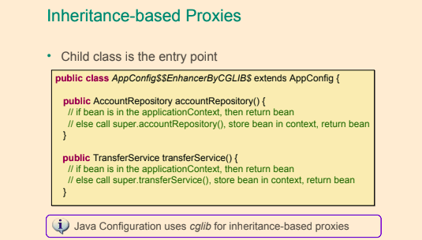	
  
- When using proxies, suppose method a() calls method b()
  on the same class/interface, advice will never be executed for method b()  
  
```java
@Aspect
@Component
public class UserRepoMonitor {
    
    @Before("execution(public com.ps.repos.˙JdbcTemplateUserRepo+.findById(..))")
    public void beforeFindById(JoinPoint joinPoint) {
        String methodName = joinPoint.getSigTestJdbcTemplateUserReponature().getName();
        System.out.println(" ---> Method " + methodName + " is about to be called");
    }
}
```

- The `@Before` annotation is used with a parameter that is called a pointcut expression. <br/> 
  This is used to identify the method execution on which the behavior will be applied.
  
```java
@Configuration
@ComponentScan(basePackages = {"com.ps.repos.impl","com.ps.aspects"})
@EnableAspectJAutoProxy
public class AppConfig {
	
}
```  

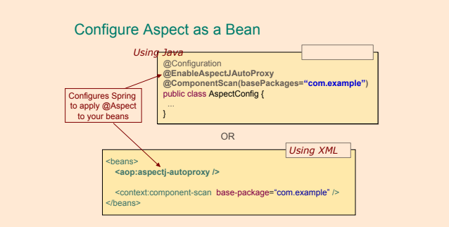

- `@EnableAspectJAutoProxy`- to enable aspect support, the configuration class must be annotated, default **JDK dynamic proxy**.
- `@EnableAspectJAutoProxy(proxyTargetClass = true)` - if the **CGLIB** library is to be added to the application classpath, Spring must be told that we want subclass-based proxies by modifying the aspect enabling annotation
	- This approach is suitable when the target class does not implement any interface, so Spring will create a new class on the fly that is a subclass of the target class
	- CGLIB is suitable for that because it is a bytecode generation library.

- It is obvious that the before advice was executed, but how does it actually work? Spring IoC creates the userTemplateRepo bean. 
  Then the aspect definition with an advice that has to be executed before the findById method tells Spring that this bean has to be wrapped up in a proxy object that will add additional behavior, 
  and this object will be injected instead of the original everywhere needed. 
  And because we are using JDK dynamic proxies, the proxy will implement the UserRepo interface


- In order to use aspects in a Spring application you need the following:
	- spring-aop as a dependency
	- declare an `@Aspect` class and declare it as a bean as well (using `@Component` or `@Bean` or XML typical bean declaration element)
	- declare an advice method annotated with a typical advice annotation (`@Before`, `@After`, etc.) and associate it to a pointcut expression
	- enable aspects support by annotating a configuration class with `@EnableAspectJAutoProxy`
	- (optional) add CGLIB as a dependency and enable aspects support using subclassed proxies by annotating a configuration class with `@EnableAspectJAutoProxy(proxyTargetClass = true)`
	
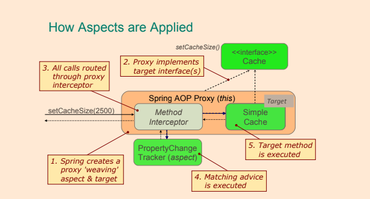
	
## Defining Pointcuts	

- The template that a pointcut expression follows can be defined as follows:

```java
execution( [Modifiers] [ReturnType] [FullClassName].[MethodName] ([Arguments]) throws [ExceptionType])
```

- The expression can contain wildcards like + and * and can be made of multiple expressions concatenated by boolean operators such as &&(and), ||(or), !(not) etc. 
	- The * wildcard replaces any group of characters
	- The + wildcard is used to specify that the method to advise can also be found in subclasses identified by [FullClassName] criteria. 
	- `!within(se.ivankrizsan.spring..*)` - will result in join points that are NOT within the package se.ivankrizsan.spring or any of its subpackages being selected.

- There is also a list of designators that can be used to define the reach of the pointcut; for example, the `within(...)` designator can be used to limit the pointcut to a package	

```java
public * com.ps.repos.*.JdbcTemplateUserRepo+.findById(..)) && +underlinewithin(com.ps.*)
```

- Pointcut expression can identify only methods defined in a class annotated with a specific annotation:

```java
execution(@org.springframework.transaction.annotation.Transactional public * com.ps.repos.*.*Repo+.findById(..)))
```

- Pointcut expression can even identify methods that return values with a specific annotation:
	
```java
execution(public (@org.springframework.stereotype.Service *) *(..)) 
```

- by using the `@annotation()` designator, only methods annotated with a specific annotation can be taken into consideration:

```java
execution(public (public * com.ps.service.*.*Service+.*(..) && @annotation(org.springframework.security.access.annotation.Secured))
```

### Pointcut Designators

- Pointcut designator: **execution**
    - The **execution** pointcut designator matches method execution join points.
        - `Method visibility` <br/>
         Can be one of private, protected, public. Can be negated using !. May be omitted, in which
         case all method visibilities will match.
        - `Return type` <br/>
          Object or primitive type. Can be negated with !. Wildcard * can be used, in which case all
          return types will be matched.     
        - `Package` <br/>
          Package in which class(es) is/are located. May be omitted. Wildcard “..” may be used last in
          package name to include all sub-packages. Wildcard * may be used in package name.  
        - `Class` <br/>
          Class in which method(s) to be selected is/are located. May be omitted. Includes subclasses
          of the specified class. Wildcard * may be used.  
        - `Method` <br/>
          Name of method(s) in which join points to be selected are located. Whole or partial method
          name. Wildcard * may be used, for example “gree*” will match a method named greet and
          any other methods which names start with “gree”.  
        - `Parameters` <br/>
          Object or primitive types of parameters. A parameter-type can be negated with !, that is !int
          will match any type except for int. The wildcard “..” can be used to match zero or more
          subsequent parameters.  
        - `Exceptions` <br/>
          Type(s) of exception(s) that matching method(s) throws. An exception type can be negated using !.     
          
```java
execution(public String se.ivankrizsan.spring.aopexamples.MySuperServiceImpl.*(String))

Pattern 
[method visibility] [return type] [package].[class].[method]([parameters] [throws exceptions])
```

- Pointcut designator: **within**
    - The **within** pointcut designator matches join points located in one or more classes, optionally
      specifying the package(s) in which the class(es) is/are located.
        - `Package` <br/>
          Package in which class(es) to be selected is/are located. May be omitted. Wildcard “..” may
          be used last in package name to include all sub-packages. Wildcard * may be used in
          package name.
        - `Class` <br/>
          Class(es) in which join points are to be selected. Wildcard * may be used. Join points in
          subclasses of the specified class will also be matched.


```java
within(se..MySuperServiceImpl)

Pattern
[package].[class]
```

- Pointcut designator: **this**
	- The **this** pointcut designator matches all join points where the currently executing object is of specified type (class or interface).
	- The pattern specifying which join points to select only consists of a single type. Wildcards can not be used in type names.

```java
this(MySuperService)
```

- Pointcut designator: **target**
	- The target pointcut designator matches all join point where the target object, for instance the object on which a method call is being made, is of specified type (class or interface).

```java
target(MySuperServiceImpl)
```

- Pointcut designator: **args**
	- The **args** pointcut designator matches join points, in Spring AOP method execution, where the argument(s) are of the specified type(s).
		- The .. wildcard may be used to specify zero or more parameters of arbitrary type.
        - The * wildcard can be used to specify one parameter of any type.
        - Package information may be included in the pattern specifying which join points to select.
        
```java
args(long, long)

args(java.util.*)
```

- Pointcut designator: **@target**
	- The **@target** pointcut designator matches join points in classes annotated with the specified annotation(s).

```java
@target(org.springframework.stereotype.Service)
```

- Pointcut designator: **@args**
	- The @args pointcut designator matches join points where an argument type (class) is annotated with
      the specified annotation. Note that it is not the argument that is to be annotated, but the class.

```java
@args(se.ivankrizsan.spring.aopexamples.CleanData)
```

- Pointcut designator: **@within**
	- The **@within** pointcut designator matches join points in classes annotated with specified annotation.

```java
@within(org.springframework.stereotype.Service)
```

- Pointcut designator: **@annotation**
	- The **@annotation** pointcut designator matches join points in methods annotated with specified annotation.

```java
@annotation(se.ivankrizsan.spring.aopexamples.MySuperSecurityAnnotation)
```
	
- Pointcut designator: **bean**
	- This pointcut designator selects all join points within a Spring bean.
		- The wildcard * may be used in the pattern, making it possible to match a set of Spring beans with one pointcut expression.
	
```java
bean(mySuperService)
```

## Implementing Advice

**Aspect** = **PointCut**(Where the Aspect is applied) + **Advice**(What code is executed)


#### Before

- Executed before a join point. Cannot prevent proceeding to the join point unless the advice throws an exception.
	- Examples: 
		- Access control (security) <br/>
		  Authorization can be implemented using before advice, throwing an exception if the current user is not authorized.
		- Statistics  <br/>
		  Counting the number of invocations of a join point.  


```java
@Before("com.ps.aspects.PointcutContainer.serviceUpdate(id, pass)")
public void beforeServiceUpdate (Long id, String pass) throws Throwable {
	//..
}
```


1. The proxy object receives the call destined for the target bean and calls first the advice method
2. If the advice method returns successfully, it then forwards the initial call to the target bean and forwards the result back to the caller.
3. If the advice method throws an exception, the exception gets propagated to the caller, and the target method is no longer executed

#### After Returning

- This type of advice is executed only if the target method executed successfully and does not end by throwing an exception.
	- Examples: 
		- Statistics <br/>
		  Counting the number of successful invocations of a join point.
		- Data validation <br/>
		  Validating the data produced by the advised method.


```java
@AfterReturning(value="execution (* com.ps.services.*Service+.update*(..))", returning = "result")
public void afterServiceUpdate(JoinPoint joinPoint, int result) throws Throwable {
	//..
}
```


#### After Throwing

- Executed after execution of a join point that resulted in an exception being thrown.
	- Examples:
		- Error handling
		- Statistics


```java
@AfterThrowing(value="execution(* com.ps.services.*Service+.updateUsername(..))", throwing = "e")
public void afterBadUpdate(JoinPoint joinPoint, Exception e) throws Throwable {
	//..
}
```


#### After

- The after advice is executed after the target method regardless of how its execution ended, whether successfully or with an exception, and because of this,
  it is most suitable to use for auditing or logging.
   - Examples:
  		- Releasing resources. <br/>
  		As with finally-blocks in try-finally, the after (finally) advice is always executed after the
        completion of the join point and can thus ensure that resources are always released.


```java
@After("execution(public * com.ps.repos.*.JdbcTemplateUserRepo+.updateUsername(..))")
public void afterFindById(JoinPoint joinPoint) throws Throwable {
	//..
}
```


#### Around

- Executed before and after (around) a join point.
- The around advice is the most powerful type of advice, because it encapsulates the target method and has control over its execution, 
  meaning that the advice decides whether the target method is called, and if so, when.
- The type `ProceedingJoinPoint` inherits from JoinPoint and adds the `proceed()` method that is used to call the target method


```java
@Around("execution(public * com.ps.repos.*.*Repo+.find*(..))")
public Object monitorFind( ProceedingJoinPoint joinPoint) throws Throwable {
	long t1 = System.currentTimeMillis();
	Thread.sleep(1000L);
	return joinPoint.proceed();
	long t2 = System.currentTimeMillis();
	logger.info(" ---> Execution of " + methodName + " took: "   + (t2 - t1) / 1000 + " ms.");
}
```

### JoinPoint

- JoinPoint can be added to methods implementing the following types of advice:
	- Before
    - After returning
    - After throwing
    - After 
- The parameter must, if present, be the first parameter of the advice method.
- When the advice is invoked, the parameter will hold a reference to an object that holds static information about the join point as well as state information.
- Examples of static information:
	- Kind (type) of join point
	- Signature at the join point
- Examples of dynamic information available from the JoinPoint object:	
	- Target object - `JoinPoint.getTarget`
	- Currently executing object

### ProceedingJoinPoint

- `ProceedingJoinPoint` class as a parameter to an around advice.
- `ProceedingJoinPoint` parameter, it will be impossible to invoke the next advice method or target method in such a case.
- `ProceedingJoinPoint` class is a subclass of the JoinPoint class it contains all the information described in the above section on the JoinPoint class.
- `ProceedingJoinPoint` class contains these two additional methods:
	- **proceed()** <br/>
      Proceed to invoke the next advice method or the target method without passing any
      parameters. Will return an Object. May throw a Throwable exception.
    - **proceed(Object[] args)** <br/>
      Proceed to invoke the next advice method or the target method passing an array of objects as
      argument to the method to be invoked.  

```java
@Around("publicServiceMethodInSpringPackagePointcut()")
public Object loggingAdvice(
	final ProceedingJoinPoint inProceedingJoinPoint) throws Throwable {
	System.out.printf("* Before service method '%s' invocation.%n", inProceedingJoinPoint.getSignature().toShortString());
	
	/* Invoke the join point. */
	final Object theResult = inProceedingJoinPoint.proceed();
	System.out.printf("* After service method '%s' invocation.%n", inProceedingJoinPoint.getSignature().toShortString());
	return theResult;
}
```


## PointCuts 


#### Wildcards


#### Parameter Wildcards


#### Packages and Classes


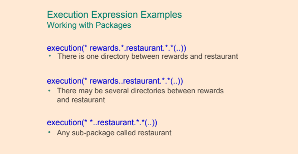

#### Annotation


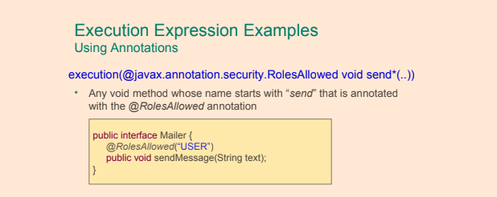

#### Spring beans names as PointCut


#### Boolean expressions in PointCut


## @PointCut


#### PointCuts XML

```xml
<aop:config>
    <aop:pointcut id="pointcut" expression="execution(void set*(*))"/> 
    
    <aop:aspect ref="myAspect">
        <aop:after-returning pointcut-ref="pointcut" method="logChange"/> 
    </aop:aspect> 
    
    <bean id="myAspect" class="com.example.MyAspect" />
</aop:config>
```

#### PointCuts Java

```java
//Pointcut is referenced here by its ID
@Before("setters()") 
public void logChange() {
    //...
}

//Method name is pointcut id, it is not executed
@Pointcut("execution(void set*(*))") 
public void setters() {
    //...
}
```

#### Context Selection 

```java
public interface Server {
	public void start(Map input);
	public void stop();
}
```

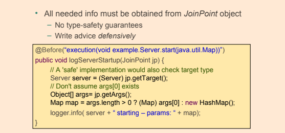

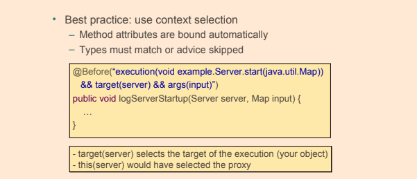

# Data Access

- **DML** stands for `Data Manipulation Language`, and the database operations presented so far are part of it, 
the commands `SELECT`, `INSERT`, `UPDATE`, and `DELETE` are database statements used to create, update, or delete data from existing tables.
- **DDL** stands for `Data Definition Language`, and database operations that are part of it are used to manipulate database objects: 
tables, views, cursors, etc. The commands `CREATE`, `ALTER`, `DROP`
- **DataAccessException** class and all of its subclasses in the Spring Framework. All the exceptions in this exception hierarchy are unchecked.
- The javax.sql.DataSource interface is the interface from which all data-source classes related to SQL stem.
	- DelegatingDataSource
    - AbstractDataSource
    - SmartDataSource
    - EmbeddedDatabase
    

    
- `DataSource` in a standalone application    

```java
@Bean
public DataSource dataSource() {
	final BasicDataSource theDataSource = new BasicDataSource();
	theDataSource.setDriverClassName("org.hsqldb.jdbcDriver");
	theDataSource.setUrl("jdbc:hsqldb:hsql://localhost:1234/mydatabase");
	theDataSource.setUsername("ivan");
	theDataSource.setPassword("secret");
	return theDataSource;
}
```

- If the application uses Spring Boot, then it is not necessary to create a DataSource bean. Setting the values of a few properties are sufficient:
```xml
spring.datasource.url= jdbc:hsqldb:hsql://localhost:1234/mydatabase
spring.datasource.username=ivan
spring.datasource.password=secret
```

- DataSource in an application deployed to a server
	- If the application is deployed to an application server then a way to obtain a data-source is by performing a JNDI lookup

```java
@Bean
public DataSource dataSource() {
	final JndiDataSourceLookup theDataSourceLookup = new JndiDataSourceLookup();
	final DataSource theDataSource =
	theDataSourceLookup.getDataSource("java:comp/env/jdbc/MyDatabase");
	return theDataSource;
}
```

- Spring Boot applications need only to rely on setting one single property:

```xml
spring.datasource.jndi-name=java:comp/env/jdbc/MyDatabase
```

- **JdbcTemplate** class is a Spring class that simplifies the use of JDBC by implementing common workflows for querying, updating, statement execution
	- Instances of `JdbcTemplate` are thread-safe after they have been created and configured.
	- **JdbcTemplate** acquire and release a database connection for every method called.
	- **JdbcTemplate** callback	
		- `ResultSetExtractor` - allows for processing of an entire result set, possibly consisting multiple rows of data, at once.
			- Note that the `extractData` method in this interface returns a Java object.
		- `RowCallbackHandler` - allows for processing rows in a result set one by one typically accumulating some type of result.
			- Note that the `processRow` method in this interface has a void return type.
		- `RowMapper` - allows for processing rows in a result set one by one and creating a Java object for each row.
			- Note that the `mapRow` method in this interface returns a Java object.
	- **JdbcTemplate** methods
		- batchUpdate
		- execute
		- query
		- queryForList
		- queryForMap
		- queryForObject
		- queryForRowSet
		- update
		- ...

## Java Config of DataSource and populating db

```java
@Configuration
@Profile("dev")
@PropertySource("classpath:db/db.properties")
public class TestDataConfig {
	
	@Value("${driverClassName}")
	private String driverClassName;
	
	@Value("${url}")
	private String url;
	
	@Value("${username}")
	private String username;
	
	@Value("${password}")
	private String password;
	
	@Value("classpath:db/schema.sql")
	private Resource schemaScript;
	
	@Value("classpath:db/test-data.sql")
	private Resource dataScript;
        
    @Bean
    public static PropertySourcesPlaceholderConfigurer propertySourcesPlaceholderConfigurer() {
      return new PropertySourcesPlaceholderConfigurer();
    }
    
    @Lazy
    @Bean
    public DataSource dataSource() {
        try {
            SimpleDriverDataSource dataSource = new SimpleDriverDataSource();
            Class<? extends Driver> driver = (Class<? extends Driver>) Class.forName(driverClassName);
            dataSource.setDriverClass(driver);
            dataSource.setUrl(url);
            dataSource.setUsername(username);
            dataSource.setPassword(password);
            DatabasePopulatorUtils.execute(databasePopulator(), dataSource);
            return dataSource;
        } catch (Exception e) {
            return null;
        }
    }
    
    @Bean
    public DataSourceInitializer dataSourceInitializer (final DataSource dataSource) {
        final DataSourceInitializer initializer = new DataSourceInitializer();
        initializer.setDataSource(dataSource);
        initializer.setDatabasePopulator(databasePopulator());
        return initializer;
    }
    
    private DatabasePopulator databasePopulator() {
        final ResourceDatabasePopulator populator = new ResourceDatabasePopulator();
        populator.addScript(schemaScript);
        populator.addScript(dataScript);
        return populator;
    }
    
    @Bean
    public JdbcTemplate userJdbcTemplate() {
        return new JdbcTemplate(dataSource());
    }
}
```

#### Embedded DataSource Java Configuration

- Especially useful for testing
- Supports H2, HSQL and Derby

```java

@Configuration
@Profile("dev")
public class TestDataConfig {

    @Bean
    public DataSource dataSource() {
        return new EmbeddedDatabaseBuilder()
                .setType(EmbeddedDatabaseType.H2)
                .addScript("classpath:db/schema.sql")
                .addScript("classpath:db/test-data.sql")
                .build();
    }

}
```

#### Embedded DataSource XML Configuration

- Especially useful for testing
- Supports H2, HSQL and Derby

```xml
<jdbc:embedded-database id="dataSource">
	 <jdbc:script location="classpath:db/schema.sql"/>
	 <jdbc:script location="classpath:db/test-data.sql"/>
</jdbc:embedded-database>
```

## Spring Cache

- The `@Cacheable` annotation is one of the most important and common annotation for caching the requests. 
  If developers annotate a method with `@Cacheable` annotation and multiple requests are received by the application,
  then this annotation will not execute the method multiple times, instead, it will send the result from the cached storage  
- The `@CachePut` annotation helps for updating the cache with the latest execution without stopping the method execution. 
  The primary difference between the `@Cacheable` and the `@CachePut` annotation is that `@Cacheable` will skip running the method whereas 
  `@CachePut` will actually run the method and then put its results in the cache
- Must specify a cache-manager
  
```java
@Configuration
@ComponentScan("com.learning.linnyk")
@EnableCaching
public class AppConfig {

	@Bean
	public CacheManager cacheManager() {
		final SimpleCacheManager cacheManager = new SimpleCacheManager();
		cacheManager.setCaches(Arrays.asList(new ConcurrentMapCache("cities")));
		return cacheManager;
	}

}
```

- For each cache name, it creates a `ConcurrentHashMap`
- Third-party alternatives
	- Terracotta's EhCache
	- Google's Guava and Caffeine
	- Pivotal's Gemfire
	
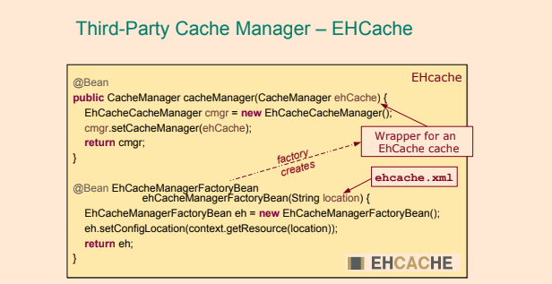 
 
```java
@Service
public class CitiesService {

	private CitiesRepository citiesRepository;

	@Autowired
	public CitiesService(CitiesRepository citiesRepository) {
		this.citiesRepository = citiesRepository;
	}

	@Cacheable(value = "cities") 
	public City getCityByIdCacheable(long id) {
		return citiesRepository.getCityById(id);
	}

	@CachePut(value = "cities")
	public City getCityByIdCachePut(long id) {
		return citiesRepository.getCityById(id);
	}
}
```


### ACID

- **Atomicity** The changes within a transaction are either all applied or none applied. “All or nothing”
- **Consistency** Any integrity constraints, for instance of a database, are not violated.
- **Isolation** Transactions are isolated from each other and do not affect each other.
- **Durability** is the property of a transaction that should persist even in cases of power off, crashes, and other errors on the underlying system

### Transactional Environment

- A transaction is an operation that consists of a number of tasks that takes place as a single unit – either all tasks are performed or no tasks are performed.
  If a task that is part of a transaction do not complete successfully, the other tasks in the transaction will either not be performed or, 
  for tasks that have already been performed, be reverted.
  	
- In a transactional environment, transactions have to be managed. <br/>
  In Spring, this is done by an infrastructure bean called the `transaction manager`.
  
- Configuring transactional behavior is done declaratively by annotating methods with `@Transactional` 
- It is mandatory to use `@Transactional`  on repository classes, too, in order to ensure transactional behavior
- Methods that need to be executed in a transactional context are annotated with `@Transactional` Spring annotation
- This annotation must be used only on public methods; otherwise, the transactional proxy won’t be able to apply the transactional behavior


## Configure Transactions Support

- Configure transaction management support
	- add a declaration of a bean of type `org.springframework.jdbc.datasource.DataSourceTransactionManager`
	- `<tx:annotation-driven ../>`

```xml
<bean id="transactionManager"
         class="org.springframework.jdbc.datasource.DataSourceTransactionManager">
         <property name="dataSource" ref="dataSource"/>
</bean>

<tx:annotation-driven transaction-manager="transactionManager"/>
```

```java
public class TestDataConfig {

    @Bean
    public PlatformTransactionManager txManager(){
        return new DataSourceTransactionManager(dataSource());
    }
}
```

- Apply the `@EnableTransactionManagement` annotation to exactly one `@Configuration` class in the application.
  
```java
@Configuration
@EnableTransactionManagement
@ComponentScan(basePackages = {"com.ps.repos.impl", "com.ps.services.impl"})
public class AppConfig {
    
}
```

- Declare transactional methods
	- Method that is to be executed in a transaction must be annotated with the Spring `@Transaction` annotation.

```java
@Transactional
@Override
public User findById(Long id) {
	return userRepo.findById(id);
}
```

- The `@Transactional` annotation can be used at the class level too. 
  In this case, all the methods in the class become transactional, and all properties defined for the transaction are inherited from the 1@Transactional1 class level definition,

- Both `@EnableTransactionManagement` and `<tx:annotation-driven ../>` enable all infrastructure beans necessary for supporting transactional execution. 
But there is a minor difference between them. The XML configuration element can be used like this: `<tx:annotation-driven />` without the transaction-manager attribute. 
In this case, Spring will look for a bean named transactionManager by default, and if it is not found, the application won’t start. 
The `@EnableTransactionManagement` is more flexible; it looks for a bean of any type that implements the `org.springframework.transaction.PlatformTransactionManager`, so the name is not important.


## @Transactional

- **@Transactional** annotation is used for `declarative transaction management` and can be used on class and method level both in classes and interfaces.
- When using Spring AOP proxies, only `@Transactional` annotations on public methods will have any effect – 
  applying the `@Transactional` annotation to protected or private methods or
  methods with package visibility will not cause errors but will not give the desired transaction management,

- Parameters:
    - `transactionManager` - the transaction manager used to manage the transaction in the context of which the annotated method is executed.
    - `readOnly` - should be used for transactions that involve operations that do not modify the database (example: searching, counting records)
    	- Allows Spring to optimize the transactional resource for read-only data access
    	- Read-only transaction prevents Hibernate from flushing its session. Hibernate does not apply dirty checking thus it increases its performance
    	- When JDBC transaction is marked as read-only, Oracle only accepts SELECT SQL statements.
    - `propagation` - transaction propagation. `org.springframework.transaction.annotation.Propagation`
    - `isolation` - the transaction isolation level. `org.springframework.transaction.annotation.Isolation`
    - `timeout` - value represents the number of milliseconds after which a transaction is considered failed,
    - `rollbackFor` - when this type of exception is thrown during the execution of a transactional method, the transaction is rolled back
    - `rollbackForClassName` - name of exception class(es) that are to cause a transaction rollback.
    - `noRollbackFor` - exception class(es) that never are to cause a transaction rollback.
    - `noRollbackForClassName` - names of exception class(es) that never are to cause a transaction rollback.
    


- Spring allows for using the JPA `javax.transaction.Transactional` annotation as a replacement for the <br/>
  Spring `@Transactional` annotation, though it does not have as many configuration options.
- If one `@Transactional` method call another `@Transactional` method,  <br/>
  the method will execute in the same transaction context as the first.
- Declarative transaction management
    - This is accomplished using annotations or Spring XML configuration.
- Rollback police
    - The default rollback policy of Spring transaction management is that automatic rollback only takes
      place in the case of an unchecked exception being thrown.
    - The types of exceptions that are to cause a rollback can be configured using the `rollbackFor`
      element of the `@Transactional` annotation. In addition, the types of exceptions that not are to cause
      rollbacks can also be configured using the `noRollbackFor` element.  
- Target object wrapped in a proxy
	- Uses an **Around** advice              
- Proxy implements the following behavior
	- Transaction started before entering the method
	- Commit at the end of the method
	- Rollback if method throws a **RuntimeException**
- By default, a transaction is rolled back if a `RuntimeException` has been thrown	
- `@Transactional("myOtherTransactionManager")` - runs a transaction with specific transaction managers


### PlatformTransactionManager

- `PlatformTransactionManager` is the base interface for all transaction managers that can be used in
  the Spring framework’s transaction infrastructure.
    - PlatformTransactionManager interface contain the following methods:
        - void commit(TransactionStatus)
        - void rollback(TransactionStatus)
        - TransactionStatus getTransaction(TransactionDefinition)

### Programmatic Transactions

- **Example 1**


- **Example 2**

```java
@Service
public class ProgramaticUserService implements UserService {

    private UserRepo userRepo;

    private TransactionTemplate txTemplate;

    @Autowired
    public ProgramaticUserService(UserRepo userRepo, PlatformTransactionManager txManager) {
        this.userRepo = userRepo;
        this.txTemplate = new TransactionTemplate(txManager);
    }

    @Override
    public int updatePassword(Long userId, String newPass) throws MailSendingException {
        return txTemplate.execute(status -> {
            try {
                int result = userRepo.updatePassword(userId, newPass);
                User user = userRepo.findById(userId);
                String email = user.getEmail();
                sendEmail(email);
                return result;
            } catch (MailSendingException e) {
                status.setRollbackOnly();
            }
            return 0;
        });
    }
}
```

### @EnableTransactionManagement

- `@EnableTransactionManagement` annotation is to annotate exactly one configuration class in
  an application in order to enable annotation-driven transaction management using the `@Transactional` annotation.
    - Components registered when the `@EnableTransactionManagement` annotation is used are:
        - `TransactionInterceptor`. <br/>
          Intercepts calls to `@Transactional` methods creating new transactions as necessary etc.
        - A JDK Proxy or AspectJ advice. <br/>
          This advice intercepts methods annotated with `@Transactional` (or methods that are located in a class annotated with `@Transactional`).  
    - `@EnableTransactionManagement` annotation have the following three optional elements:      
        - mode <br/>
          Allows for selecting the type of advice that should be used with transactions. Possible values
          are `AdviceMode.ASPECTJ` and `AdviceMode.PROXY` with the latter being the default.
        - order <br/>  
          Precedence of the transaction advice when more than one advice is applied to a join-point. Default value is `Ordered.LOWEST_PRECEDENCE`.
        - proxyTargetClass <br/>
          True of `CGLIB proxies` are to be used, false if `JDK interface-based proxies` are to be used in the application 
          
## Transaction Propagation

 - Happens when code from one transaction calls another transaction
 - Transaction propagation says whether everything should be run in single transaction or nested transactions should be used
 - There are 7 levels of propagation
 - 2 Basic ones - REQUIRED and REQUIRES_NEW

### org.springframework.transaction.annotation.Propagation

- **REQUIRED**: an existing transaction will be used or a new one will be created to execute the method annotated with `@Transactional(propagation = Propagation.REQUIRED)`.
- **REQUIRES_NEW**: a new transaction is created to execute the method annotated with `@Transactional(propagation = Propagation.REQUIRES_NEW)`. If a current transaction exists, it will be suspended.
- **NESTED**: an existing nested transaction will be used to execute the method annotated with `@Transactional(propagation = Propagation.NESTED)`. If no such transaction exists, it will be created.
- **MANDATORY**: an existing transaction must be used to execute the method annotated with `@Transactional(propagation = MANDATORY)`. If there is no transaction to be used, an exception will be thrown.
- **NEVER**: methods annotated with `@Transactional(propagation = Propagation.NEVER)` must not be executed within a transaction. If a transaction exists, an exception will be thrown.
- **NOT_SUPPORTED**: no transaction is used to execute the method annotated with `@Transactional(propagation = Propagation.NOT_SUPPORTED)`. If a transaction exists, it will be suspended.
- **SUPPORTS**: an existing transaction will be used to execute the method annotated with `@Transactional(propagation = Propagation.SUPPORTS)`. If no transaction exists, the method will be executed anyway, without a transactional context.

## Isolation Levels

- Transaction isolation in database systems determine how the changes within a transaction are
  visible to other users and systems accessing the database prior to the transaction being committed.
- 4 isolation levels available (from least strict to the most strict)
	- **READ_UNCOMMITTED**
	- **READ_COMMITTED**
	- **REPEATABLE_READ**
	- **SERIALIZABLE**
- Not all isolation levels may be supported in all databases
- Different databases may implement isolation is slightly different ways

### org.springframework.transaction.annotation.Isolation


- **DEFAULT**: the default isolation level of the DBMS.
- **READ_UNCOMMITED**: data changed by a transaction can be read by a different transaction while the first one is not yet committed, also known as dirty reads.
    `Dirty reads may occur.`
- **READ_COMMITTED**: dirty reads are not possible when a transaction is used with this isolation level. 
    This is the default strategy for most databases. But a different phenomenon could happen here: repeatable read: when the same query is executed multiple times, 
    different results might be obtained. (Example: a user is extracted repeatedly within the same transaction. In parallel, a different transaction edits the user and commits. 
    If the first transaction has this isolation level, it will return the user with the new properties after the second transaction is committed.) 
    `Phantom reads and non-repeatable reads can occur`.
- **REPEATABLE_READ**: this level of isolation does not allow dirty reads, and repeatedly querying a table row in the same transaction will always return the same result, 
    even if a different transaction has changed the data while the reading is being done. The process of reading the same row multiple times in the context of a transaction and 
    always getting the same result is called repeatable read. 
    `Phantom reads can occur`.
- **SERIALIZABLE**: this is the most restrictive isolation level, since transaction are executed in a serialized way. So no dirty reads, no repeatable reads, 
    and no phantom reads are possible. A phantom read happens when in the course of a transaction, execution of identical queries can lead to different result sets being returned.

#### READ_UNCOMMITTED
 - `@Transactional (isolation=Isolation.READ_UNCOMMITTED)`
 - The lowest isolation level
 - Dirty reads can occur - one transaction may be able to see uncommitted data of other transaction
 - May be viable for large transactions or frequently changing data

#### READ_COMMITTED
 - `@Transactional (isolation=Isolation.READ_COMMITTED)`
 - Default isolation strategy for many databases
 - Other transactions can see data only after it is properly committed
 - Prevents dirty reads

#### REPEATABLE_READ
 - `@Transactional (isolation=Isolation.REPEATABLE_READ)`
 - Prevents non-repeatable reads - when a row is read multiple times in a single transaction, its value is guaranteed to be the same

#### SERIALIZABLE
 - `@Transactional (isolation=Isolation.SERIALIZABLE)`
 - Prevents phantom reads

## Testing transactional methods

- If a test-method annotated with `@Test` is also annotated with `@Transactional`, then the test-method will be executed in a transaction. <br />
  Such a transaction will automatically be rolled back after the completion of the test-method.
	- No need to clean up your database after testing!
- The rollback policy of a test can be changed using the `@Rollback` annotation and setting the value to false.  
- The `@Sql` annotation can be used to specify SQL scripts to be executed against a given database during integration tests.
- The `@SqlGroup` annotation can be used on classes and methods to group together `@Sql` annotations.
- The `@SqlConfig` is used to specify the configuration of the SQL script.

```java
@Test
@Sql(statements = {"drop table NEW_P_USER if exists;"})
 public void testCreateTable(){
	 int result = userRepo.createTable("new_p_user");
	 assertEquals(0, result);
 }
```

```java
@Test
@SqlGroup({
		@Sql(
				value = "classpath:db/extra-data.sql",
				config = @SqlConfig(encoding = "utf-8", separator = ";", commentPrefix = "--")
		),
		@Sql(
				scripts = "classpath:db/delete-test-data.sql",
				config = @SqlConfig(transactionMode = SqlConfig.TransactionMode.ISOLATED),
				executionPhase = Sql.ExecutionPhase.AFTER_TEST_METHOD
		)
})
public void testCount() {
	int count = userService.countUsers();
	assertEquals(8, count);
}   
```

##### @Sql


##### @Commit


##### @BeforeTransaction


## Spring JDBC

- Spring’s `JdbcTemplate`
	- Greatly simplifies use of the JDBC API
		- Eliminates repetitive boilerplate code
		- Alleviates common causes of bugs
		- Handles SQLExceptions properly
	- Without sacrificing power
		- Provides full access to the standard JDBC constructs


- `jdbcTemplate.update` uses for `insert` `update` `delete`

- Declare in spring-context.xml

```xml
	<bean id="dataSource" class="org.springframework.jdbc.datasource.DriverManagerDataSource"
		  p:driverClassName="${driverClassName}"
		  p:url="${url}"
		  p:username="${username}"
		  p:password="${password}"
	/>

	<bean id="jdbcTemplate" class="org.springframework.jdbc.core.JdbcTemplate" p:dataSource-ref="dataSource"/>
```

#### Inject into repository

```java
jdbcTemplate.update("insert INTO RIDE(NAME, DURATION) values (?, ?)", ride.getName(), ride.getDuration());
```

#### Select

```java
jdbcTemplate.query("SELECT * FROM MY_TABLE", new RowMapper());

jdbcTemplate.queryForObject("SELECT * FROM MY_TABLE WHERE ID = id", new RowMapper());
```

#### Insert

```java
jdbcTemplate.update(
			"insert INTO MY_TABLE(NAME, DURATION) values (?, ?)",
			obj.getName(), obj.getDuration());
```

#### Update

```java
jdbcTemplate.update("UPDATE MY_TABLE set NAME = ?, DURATION = ? where id = ?",
			obj.getName(), obj.getDuration(), obj.getId());
```

#### Delete

```java
jdbcTemplate.update("delete from MY_TABLE where id = ?", id);
```

### Callback Interfaces

- `RowMapper` - best choice when each row of a ResultSet maps to a domain object
- `RowCallbackHandler` - best choice when no value should be returned from the callback method for each row, especially large queries
- `ResultSetExtractor` - best choice when multiple rows of a ResultSet map to a single object

#### RowMapper

- Spring provides a `RowMapper` interface **for mapping a single row** of a `ResultSet` to an object

```java
public interface RowMapper<T> {
	T mapRow(ResultSet rs, int rowNum) throws SQLException;
}
```


#### RowCallbackHandler

- Spring provides a simpler RowCallbackHandler interface when there is **no return object**
  - Streaming rows to a file
  - Converting rows to XML
  - Filtering rows before adding to a Collection

```java
public interface RowCallbackHandler {
	void processRow(ResultSet rs) throws SQLException;
}
```


#### ResultSetExtractor

- Spring provides a ResultSetExtractor interface **for processing an entire ResultSet at once**
  - You are responsible for iterating the ResultSet
 
```java
public interface ResultSetExtractor<T> {
	T extractData(ResultSet rs) throws SQLException, DataAccessException;
}
``` 

  
  
#### Querying for Generic Maps


## In-Memory Database

```java
@Bean
public DataSource dataSource() {
    EmbeddedDatabaseBuilder builder = new EmbeddedDatabaseBuilder();
    builder.setName("inmemorydb")
           .setType(EmbeddedDatabaseType.HSQL) 
           .addScript("classpath:/inmemorydb/schema.db") 
           .addScript("classpath:/inmemorydb/data.db");
    
           return builder.build();
}
```

The same in XML

```xml
<jdbc:embedded-database id="dataSource" type="HSQL"> 
    <jdbc:script location="classpath:schema.sql" /> 
    <jdbc:script location="classpath:data.sql" />
</jdbc:embedded-database>
```

Initialise db

```xml
<jdbc:initialize-database data-source="dataSource"> 
    <jdbc:script location="classpath:schema.sql" /> 
    <jdbc:script location="classpath:data.sql" />
</jdbc:initialize-database>
```

- `EmbeddedDatabaseBuilder` automatically run **data.sql** and **schema.sql** scripts from `resources` folder

## Spring and Hibernate

- `org.springframework.orm.hibernate5.LocalSessionFactoryBuilder`
- `org.hibernate.SessionFactory`
- `org.hibernate.Session`
- `org.springframework.orm.hibernate4.HibernateTransactionManager`

## Hibernate proper

- `hibernate.dialect` - the value is a dialect class matching the database used in the application
- `hibernate.hbm2ddl.auto` - the value represents what Hibernate should do when the application starts
- `hibernate.format_sql` - the generated SQL statements are printed to the console in a pretty and readable way.
- `hibernate.show_sql` - if true, all the generated SQL statements are printed to the console.
- `hibernate.use_sql_comments` - if true, Hibernate will put a comment inside the SQL statement to tell the developer what that statement is trying to do.

## Spring + Hibernate Java configuration

- Inject database params and use them when create beans

```java
@Value("${driverClassName}")
private String driverClassName;
@Value("${url}")
private String url;
@Value("${login}")
private String username;
@Value("${password}")
private String password;
```

- Create `dataSource`

```java
@Bean
public DataSource dataSource() {
	final DriverManagerDataSource dataSource = new DriverManagerDataSource();
	dataSource.setDriverClassName(driverClassName);
	dataSource.setUrl(url);
	dataSource.setUsername(username);
	dataSource.setPassword(password);
	return dataSource;
}
```

- Create `sessionFactory`

```java
@Bean
public Properties hibernateProperties() {
	final Properties hibernateProp = new Properties();
	hibernateProp.put("hibernate.dialect", "org.hibernate.dialect.H2Dialect");
	hibernateProp.put("hibernate.hbm2ddl.auto", "create-drop");
	hibernateProp.put("hibernate.format_sql", true);
	hibernateProp.put("hibernate.use_sql_comments", true);
	hibernateProp.put("hibernate.show_sql", true);
	return hibernateProp;
}

@Bean
public SessionFactory sessionFactory() {
	return new LocalSessionFactoryBuilder(dataSource())
			.scanPackages("com.ps.ents")
			.addProperties(hibernateProperties())
			.buildSessionFactory();
}
```

- Create `transactionManager`

```java
@Bean
public PlatformTransactionManager transactionManager() {
	return new HibernateTransactionManager(sessionFactory());
}
```

- Create `@Repository` bean

```java
@Repository
@Transactional
public class HibernateUserRepo implements UserRepo {
	
}
```

- Inject `sessionFactory` into `@Repository` beans and use session to deal with database

```java
@Repository
@Transactional
public class HibernateUserRepo implements UserRepo {

	@Autowired
	private SessionFactory sessionFactory;
	
	public Session session() {
		return sessionFactory.getCurrentSession();
	}
}
```

## Spring + Hibernate XML configuration

- Create `dataSource`

```xml
<bean id="dataSource" class="org.springframework.jdbc.datasource.DriverManagerDataSource">
	<property name="driverClassName" value="${driverClassName}" />
	<property name="url" value="${url}" />
	<property name="username" value="${login}" />
	<property name="password" value="${password}" />
</bean>
```
- Create `sessionFactory`

```xml
<bean id="sessionFactory" class="org.springframework.orm.hibernate5.LocalSessionFactoryBean">
	<property name="dataSource" ref="dataSource" />
	<property name="packagesToScan" value="com.ps" />
	<property name="hibernateProperties">
		<props>
			<prop key="hibernate.hbm2ddl.auto">create-drop</prop>
			<prop key="hibernate.dialect">org.hibernate.dialect.H2Dialect</prop>
		</props>
	</property>
</bean>
```

- Create `transactionManager`

```xml
<bean id="transactionManager" class="org.springframework.orm.hibernate5.HibernateTransactionManager">
	<property name="sessionFactory" ref="sessionFactory" />
</bean>
```

- Create `@Repository` bean

```java
@Repository
@Transactional
public class HibernateUserRepo implements UserRepo {
	
}
```

- Inject `sessionFactory` into `@Repository` beans and use session to deal with database

```java
@Repository
@Transactional
public class HibernateUserRepo implements UserRepo {

	@Autowired
	private SessionFactory sessionFactory;
	
	public Session session() {
		return sessionFactory.getCurrentSession();
	}
}
```

### @Repository

- `@Repository`’s job is to catch persistence specific exceptions and rethrow them as one of Spring’s unified unchecked exception.
- Spring has built-in exception translation mechanism, so that all exceptions thrown by the JPA persistence providers are converted into Spring's `DataAccessException` - for all beans annotated with `@Repository`
    - `NonTransientDataAccessException` – these are the exceptions where a retry of the same operation would fail unless the cause of the Exception is corrected. So if you pass non existing id for example, it will fail unless the id exists in the database.
    - `RecoverableDataAccessException` – these are the “opposite” of the previous one – exceptions which are recoverable – after some recovery steps. More details in the API docs
    - `ScriptException` – SQL related exceptions, when trying to process not well-formed script for example.
    - `TransientDataAccessException` – these are the exception when recovery is possible without any explicit step, e.g. when there is a timeout to the database, you are retrying after few seconds.
- The `DataAccessException` has a ton of subclasses which you can dig through, the hierarchy is extensive.
- The logic done by `org.springframework.dao.annotation.PersistenceExceptionTranslationPostProcessor`

## Spring + JPA Java configuration

- The following steps are needed if you want to work with JPA in a Spring application:
    - Declare the appropriate dependencies.  <br/>
    In a Maven application, this is accomplished by creating dependencies in the pom.xml file.
    The dependencies in question are typically the ORM framework dependency, a database driver dependency and a transaction manager dependency.
    - Implement entity classes with mapping metadata in the form of annotations.  <br/>
    As a minimum, entity classes need to be annotated with the `@Entity` annotation on class
    level and the `@Id` annotation annotating the field or property that is to be the primary key of the entity.
    - Define an `EntityManagerFactory` bean.
    The JPA support in the Spring framework offer three alternatives when creating an `EntityManagerFactoryBean`:
        - `LocalEntityManagerFactoryBean` <br/>
        Use this option, which is the simplest option, in applications that only use JPA for
        persistence and in integration tests.
        - Obtain an `EntityManagerFactory` using JNDI <br/>
        Use this option if the application is run in a JavaEE server.
        - `LocalContainerEntityManagerFactoryBean` <br/>
        Gives the application full JPA capabilities.
    - Define a `DataSource` bean.
    - Define a `TransactionManager` bean. <br/>
    Typically using the `JpaTransactionManager` class from the Spring Framework.
    - Implement repositories.

- `@PersistenceContext`- The annotation is applied to a instance variable of the type `EntityManager` or
   a setter method, taking a single parameter of the `EntityManager` type, into which an entity manager is to be injected.
    - JPA's equivalent to `@Autowired`

```java
@PersistenceContext
private EntityManager entityManager;
```


- `PlatformTransactionManager`

```java
@Bean
public PlatformTransactionManager txManager(){
    return new DataSourceTransactionManager(dataSource());
}

@Bean
public DataSource dataSource() {
	final DriverManagerDataSource dataSource = new DriverManagerDataSource();
	dataSource.setDriverClassName(driverClassName);
	dataSource.setUrl(url);
	dataSource.setUsername(username);
	dataSource.setPassword(password);

	return dataSource;
}
```

---

- Create `HibernateProperties`

```java
@Bean
public Properties hibernateProperties() {
	final Properties hibernateProp = new Properties();
	hibernateProp.put("hibernate.dialect", "org.hibernate.dialect.H2Dialect");
	hibernateProp.put("hibernate.hbm2ddl.auto", "create-drop");
	hibernateProp.put("hibernate.format_sql", true);
	hibernateProp.put("hibernate.use_sql_comments", true);
	hibernateProp.put("hibernate.show_sql", true);
	return hibernateProp;
}
```

- Create `EntityManagerFactory` - An entity manager factory is used to interact with a persistence unit. `@PersistenceUnit`

```java
@Bean
public EntityManagerFactory entityManagerFactory() {
	final LocalContainerEntityManagerFactoryBean factoryBean = new LocalContainerEntityManagerFactoryBean();
	factoryBean.setPackagesToScan("com.ps.ents");
	factoryBean.setDataSource(dataSource());
	factoryBean.setJpaVendorAdapter(new HibernateJpaVendorAdapter());
	factoryBean.setJpaProperties(hibernateProperties());
	factoryBean.afterPropertiesSet();
	return factoryBean.getNativeEntityManagerFactory();
}
```

- Create `TransactionManager`

```java
@Bean
public PlatformTransactionManager transactionManager() {
	return new JpaTransactionManager(entityManagerFactory());
}
```

- Create `@Repository` Bean

```java
@Repository("userJpaRepo")
public class JpaUserRepo implements UserRepo {
	
}
```

- Inject `EntityManager` into `@Repository` beans and use session to deal with database

```java
@PersistenceContext
private EntityManager entityManager;
```


## Spring + JPA XML configuration

- Add transaction management

```xml
<tx:annotation-driven />

<bean id="transactionManager" class="org.springframework.orm.jpa.JpaTransactionManager">
		<property name="entityManagerFactory" ref="entityManagerFactory" />
</bean>
```

- Add `DataSource` bean

```xml
<bean id="dataSource" class="org.springframework.jdbc.datasource.DriverManagerDataSource">
	<property name="driverClassName" value="${driverClassName}" />
	<property name="url" value="${url}" />
	<property name="username" value="${username}" />
	<property name="password" value="${password}" />
</bean>
```

- Add `EntityManagerFactory` bean

```xml
<bean id="entityManagerFactory"
	  class="org.springframework.orm.jpa.LocalContainerEntityManagerFactoryBean">
	<property name="dataSource" ref="dataSource" />
	<property name="packagesToScan" value="com.ps" />
	<property name="jpaVendorAdapter">
		<bean class="org.springframework.orm.jpa.vendor.HibernateJpaVendorAdapter" />
	</property>
	<property name="jpaProperties">
		<props>
			<prop key="hibernate.hbm2ddl.auto">create-drop</prop>
			<prop key="hibernate.dialect">org.hibernate.dialect.MySQL5Dialect</prop>
		</props>
	</property>
</bean>
```

- Create `@Repository` Bean

```java
@Repository("userJpaRepo")
public class JpaUserRepo implements UserRepo {
	
}
```

- Inject `EntityManager` into `@Repository` beans and use session to deal with database

```java
@PersistenceContext
private EntityManager entityManager;
```

## Spring Data JPA

- Simplifies data access by reducing boilerplate code
- The central interface of Spring Data is `Repository< T, ID extends Serializable>`
- Create a domain object class that will be mapped to a MongoDB object. The class must have an identified field that will be annotated with the Spring Data special annotation `@Id` from the package `org.springframework.data.annotation`
- Create a new Repo interface that will extend the Spring Data MongoDB-specialized interface `MongoRepository<T,ID extends Serializable>`.
- Create a configuration class and annotate it with `@EnableMongoRepositories` to enable creation of MongoDB repository instances.

- How are Spring Data repositories implemented by Spring at runtime?
    - For a Spring Data repository a JDK dynamic proxy is created which intercepts all calls to the
  repository. The default behavior is to route calls to the default repository implementation, which in
  Spring Data JPA is the `SimpleJpaRepository` class. It is possible to customize either the
  implementation of one specific repository type or customize the implementation used for all repositories.

#### Spring Data Repositories

 - Spring searches for all interfaces extending `Repository<DomainObjectType, DomainObjectIdType>`
 - Repository is just marker interface and has no method on its own
 - Can annotate methods in the interface with `@Query("Select p from person p where ...")`
 - Can extend CrudRepository instead of Repository - added methods for CRUD
	 - Method names generated automatically based on naming convention
	 - findBy + Field (+ Operation)
	 - FindByFirstName(String name), findByDateOfBirthGt(Date date), ...
	 - Operations - Gt, Lt, Ne, Like, Between, ...
 - Can extend `PagingAndSortingRepository` - added sorting and paging
 - Most Spring data sub-projects have their own variations of Repository
 	- `JpaRepository` for JPA
 - Repositories can be injected by type of their interface
 - Repository is an interface (not a class!)
 
```java
public interface PersonRepository extends Repository<Person, Long> {
    
}
```

```java
@Service    
public class PersonService {

    @Autowired
    private PersonRepository personRepository;
           
}
```

- Locations, where spring should look for Repository interfaces need to be explicitly defined
- Spring scans for `Repository` interfaces
    - Implements them and creates as a Spring bean
  
```java
@Configuration 
@EnableJpaRepositories(basePackages="com.example.**.repository") 
public class JpaConfig {...}

@Configuration 
@EnableGemfireRepositories(basePackages="com.example.**.repository")
public class GemfireConfig {...}
  
@Configuration 
@EnableMongoRepositories(basePackages="com.example.**.repository") 
public class MongoDbConfig {...}
```

## Spring Data Configuration

- For Java configuration `@EnableJpaRepositories(basePackages="com.example.**.repository")` - Annotation to enable JPA repositories.
- For XML configuration `<jpa:repositories base-package=""com.example.**.repository""/>` - Annotation to enable JPA repositories.

---

 


## Query DSL 


## Query Annotation


## Named Query


## Native Query


## Query Precedence


## Paging and Sorting


```java
@Test
public void testQueryByPriceRangeAndWoodTypePaging_SpringData() {
    final Pageable pageable = new PageRequest(0, 2);

    Page<Model> page = modelDataJPARepository
            .queryByPriceRangeAndWoodTypePaging(
                    BigDecimal.valueOf(1000L), BigDecimal.valueOf(2000L), "%Maple%", pageable);
    /* select name from Model m where m.price>=? and m.price<=? and (m.woodType like ?) limit ? */
    
    Iterator<Model> iterator = page.iterator();
    while (iterator.hasNext()){
        System.out.println(iterator.next());
    }
    // American Stratocaster
    // Les Paul

    page = modelDataJPARepository
            .queryByPriceRangeAndWoodTypePaging(
                    BigDecimal.valueOf(1000L), BigDecimal.valueOf(2000L), "%Maple%", page.nextPageable());

    /* select name from Model m where m.price>=? and m.price<=? and (m.woodType like ?) limit ? offset ?*/
    iterator = page.iterator();
    while (iterator.hasNext()){
        System.out.println(iterator.next());
    }
    // SG
}
```
## Custom Repositories


## Auditing


## Locking


## Spring data for updating data

```java
@Transactional
@Modifying
@Query("update Book b set b.pageCount = ?1 where b.title like ?2")
int setPageCount(int pageCount, String title);
```

# Spring MVC

- A typical Java Web application architecture


- Request life cycle


### DispatcherServlet

  - The central piece of Spring Web MVC is the `DispatcherServlet` class, which is the entry point for every Spring Web application.
  - The `DispatcherServlet` converts HTTP requests into commands for controller components and manages rendered data as well.
  - In a Spring Web application, all HTTP requests first reach the `DispatcherServlet`
  - The `DispatcherServlet` must be defined in `web.xml` when the application is configured using the old-style XML configuration
  - The `DispatcherServlet` must be defined in `web.xml` when the application is configured using the old-style XML configuration.
  - When using a configuration without `web.xml`, a configuration class that extends `AbstractDispatcherServletInitializer` or `AbstractAnnotationConfigDispatcherServletInitializer` must be declared
  - Defined by `WebApplicationInitializer` or `web.xml`
  - Creates separate “servlet” application context
 

 
The `DispatcherServlet` creates a separate **servlet application context** containing all specific web beans (controller, views, view resolvers). 
This context is also called the web context or the `DispatcherServletContext`.

The **root application context** is also called `RootApplicationContext`. It contains all non-web beans and is instantiated using a bean of type `org.springframework.web.context.ContextLoaderListener`. 
The relationship between the two contexts is a parent–child relationship, with the application context being the parent. 

**Thus, beans in the web context can access the beans in the parent context, but not conversely**


#### XML Configuration

```xml
<!-- web.xml -->
<web-app>
    <!-- The front controller, the entry point for all requests -->
    <servlet>
        <servlet-name>pet-dispatcher</servlet-name>
        <servlet-class>
           org.springframework.web.servlet.DispatcherServlet
        </servlet-class>
        <init-param>
        	<!--mvc-config.xml contains the Spring configuration for the front end (controllers and MVC infrastructure beans), the file is loaded by the DispatcherServlet-->
            <param-name>contextConfigLocation</param-name>
            <param-value>
                /WEB-INF/spring/mvc-config.xml
            </param-value>
        </init-param>
        <load-on-startup>1</load-on-startup>
    </servlet>
    <!-- Map all requests to the DispatcherServlet for handling -->
    <servlet-mapping>
        <servlet-name>pet-dispatcher</servlet-name>
        <url-pattern>/</url-pattern>
    </servlet-mapping>
    ...
</web-app>

``` 

#### Java Configuration

- To tell the `DispatcherServlet` that the configuration will be provided by a configuration java class(`WebConfig`) instead of a file, the following changes have to be made in `web.xml`
- Need use `AnnotationConfigWebApplicationContext` for `contextClass` param
- Also need to provide Java configuration class (`com.ps.config.WebConfig`) for `contextConfigLocation` param

```xml
<web-app>
    <!-- The front controller, the entry point for all requests -->
   <servlet>
       <servlet-name>pet-dispatcher</servlet-name>
       <servlet-class>
           org.springframework.web.servlet.DispatcherServlet
       </servlet-class>
       <init-param>
           <param-name>contextClass</param-name>
           <param-value>
               org.springframework.web.context.support.AnnotationConfigWebApplicationContext
           </param-value>
       </init-param>
       <init-param>
           <param-name>contextConfigLocation</param-name>
           <param-value>
               com.ps.config.WebConfig
           </param-value>
       </init-param>
       <load-on-startup>1</load-on-startup>
   </servlet>
</web-app>
```

#### @Controller annotation

- Controllers are classes that define methods used to handle HTTP request

```java
@Controller
@RequestMapping("/users")
public class UserController {
	
}
```

### Simpler Mapping Annotations

- `@RequestMapping`
- Exist for each HTTP method
    - `@GetMapping`
    - `@PostMapping`
    - `@PutMapping`
    - `@DeleteMapping`
    - `@PatchMapping`

#### @RequestMapping annotation

- Can specify URL, which annotated method should handle - @RequestMapping("/foo")
    - => server-url/app-context-root/servlet-mapping/request-mapping
    - can use wildcards @RequestMapping("/foo/*")
- Can specify HTTP method, which annotated method should handle

```java
@RequestMapping(value = "/list", method = RequestMethod.GET)
public String list(Model model) { 

}
```  

#### @RequestParam annotation

- Url `http://localhost:8080/mvc-basic/showUser?userId=105`
handled by a method that has a parameter annotated with `@RequestParam` because the request is parametrized.
- Can specify parameter from http request to be injected as method parameter


```java
@RequestMapping(value = "/showUser", method = RequestMethod.GET)
public String show(@RequestParam("userId") Long id, Model model) {

}
```

#### @PathVariable annotation

- Url `http://localhost:8080/mvc-basic/users/105`
handled by a method that has a parameter annotated with `@PathVariable` because the request URI contains a piece that is variable.
- Can extract value as a method parameter from the url requested

```java
@RequestMapping(value = "/{userId}", method = RequestMethod.GET)
public String show(@PathVariable("userId") Long id, Model model) {

}
```

## Views and Models

- A handler method typically returns a string value representing a logical view name, and the view is populated with values in the Model object.
- The model contains the data that will be used to populate a view
- Need to provide view resolver e.g. `InternalResourceViewResolver`
- View support classes for creating PDFs, Excel spreadsheets
- Controllers typically return a 'logical view name' String.
- ViewResolvers select View based on view name.
- The `DispatcherServlet` delegates to a `ViewResolver` to obtain View implementation based on view name.

- 

```xml
<bean class="org.springframework.web.servlet.view.InternalResourceViewResolver">
    <property name="prefix" value="/WEB-INF/"/>
    <property name="suffix" value=".jsp"/>
</bean>
```

**Model**

- The model can supply attributes used for rendering views.

```java
@GetMapping("/showViewPage")
public String passParametersWithModel(Model model) {
    final Map<String, String> map = new HashMap<>();
    map.put("spring", "mvc");
    
    model.addAttribute("message", "Baeldung");
    model.mergeAttributes(map);
    return "viewPage";
}
```

**ModelMap**

- Just like the `Model` interface above, `ModelMap` is also used to pass values to render a view.
- The advantage of `ModelMap` is it gives us the ability to pass a collection of values and treat these values as if they were within a Map:

```java
@GetMapping("/printViewPage")
public String passParametersWithModelMap(ModelMap map) {
    map.addAttribute("welcomeMessage", "welcome");
    map.addAttribute("message", "Baeldung");
    return "viewPage";
}
```

**ModelAndView**

- This interface allows us to pass all the information required by Spring MVC in one return:

```java
@GetMapping("/goToViewPage")
public ModelAndView passParametersWithModelAndView() {
    final ModelAndView modelAndView = new ModelAndView("viewPage");
    modelAndView.addObject("message", "Baeldung");
    return modelAndView;
}
```


### SessionAttributes

- Configure controller 
	- add `@SessionAttributes()`
	- add `@ModelAttribute()`

```java
@RestController
@SessionAttributes("visitor")
public class TodoListController {

	private final TodoListService todoListService;

	@Autowired
	public TodoListController(TodoListService todoListService) {
		this.todoListService = todoListService;
	}

	@ModelAttribute("visitor")
	public Visitor getVisitor(HttpServletRequest request) {
		return new Visitor(request.getSession().getId());
	}

	@RequestMapping(value = "/add", method = RequestMethod.POST)
	public Todo addTodo(@ModelAttribute("visitor") Visitor visitor, @RequestBody Todo todoToAdd) {
		final Todo todo = new Todo(todoToAdd.getName(), todoToAdd.getDescription(), visitor);
		todoListService.addToList(todo);
		return todo;
	}

	@RequestMapping(value = "/get", method = RequestMethod.GET)
	public List<Todo> getAllTodos() {
		return todoListService.findAllTodos();
	}
}

```

- Configure service
	- Need to has scope `@Scope(value = "session", proxyMode = ScopedProxyMode.INTERFACES)`

```java
@Service
@Scope(value = "session", proxyMode = ScopedProxyMode.INTERFACES)
public class TodoListServiceImpl implements TodoListService {

	private List<Todo> todos = new CopyOnWriteArrayList<>();

	@Override
	public void addToList(Todo todo) {
		todos.add(todo);
	}

	@Override
	public List<Todo> findAllTodos() {
		return new ArrayList<>(todos);
	}

}
```

- **For different sessions will be injected  different `TodoListServiceImpl` class**
- Result of `findAllTodos` for session id = 7946F5947D2A8A1F63C9EA30114112B1

```json
[
  {
    "name": "my todo",
    "description": "my description",
    "visitor": {
      "address": "7946F5947D2A8A1F63C9EA30114112B1"
    }
  },
  {
    "name": "my todo 1",
    "description": "my description 1",
    "visitor": {
      "address": "7946F5947D2A8A1F63C9EA30114112B1"
    }
  }
]
```

- Result of `findAllTodos` for session id = BB9D159075F2158176856A5A2C53F778
```json
[
    {
        "name": "my todo 1",
        "description": "my description 1",
        "visitor": {
            "address": "BB9D159075F2158176856A5A2C53F778"
        }
    },
    {
        "name": "my todo",
        "description": "my description",
        "visitor": {
            "address": "BB9D159075F2158176856A5A2C53F778"
        }
    },
    {
        "name": "my todo 2",
        "description": "my description 2",
        "visitor": {
            "address": "BB9D159075F2158176856A5A2C53F778"
        }
    }
]
```

## Spring MVC 

#### Spring MVC XML Configuration

- The main component of an SpringMVC XML configuration is the `<mvc:annotation-driven/>` which registers all necessary default infrastructure beans for a web application to work: handler mapping, validation, conversion beans
- `<mvc:default-servlet-handler/>` - default servlet mapping "/" is mapped to the `DispatcherServlet`

```xml
<beans ...>
                
    <!-- Defines basic MVC defaults (handler mapping, date formatting, etc) -->
   <mvc:annotation-driven/>
   
   <!-- Configures a handler for serving static resources by forwarding to the
        Servlet container’s default Servlet.-->
   <mvc:default-servlet-handler/>
   
   <mvc:resources mapping="pdfs" location="/pdfs/**"/>
   
    <!-- Views -->
    <bean class="org.springframework.web.servlet.view.InternalResourceViewResolver">
        <property name="prefix" value="/WEB-INF/jsp/"/>
        <property name="suffix" value=".jsp"/>
        <property name="order" value="2"/>
    </bean>
   
</beans>
```

#### Spring MVC Java Configuration

- `@EnableWebMvc` - is the equivalent of `<mvc:annotation-driven/>`
- The configuration class has to be
	- annotated with the `@Configuration` annotation 
	- annotated with the  `@EnableWebMvc` annotation 
	- implement `WebMvcConfigurer` 
	- or extend an implementation of this interface `WebMvcConfigurerAdapter`

- `@EnableWebMvc` — to enable auto-detection `@Controller` beans, request/response converters
	
```java
@Configuration
@EnableWebMvc // <=><mvc:annotation-driven/>
@ComponentScan(basePackages = {"com.ps.web"})// <=> <context:component-scan base-package="com.ps.web"/>
public class WebConfig extends WebMvcConfigurerAdapter {
	
    // <=> <mvc:default-servlet-handler/>
    @Override
    public void configureDefaultServletHandling(
             DefaultServletHandlerConfigurer configurer) {
        configurer.enable();
    }
    
    @Bean
    public InternalResourceViewResolver getViewResolver(){
        final InternalResourceViewResolver resolver = new InternalResourceViewResolver();
        resolver.setPrefix("/WEB-INF/");
        resolver.setSuffix(".jsp" );
        resolver.setRequestContextAttribute("requestContext");
        return resolver;
    }
   // other beans and method implementations that are not in scope
}
```

#### Get rid of web.xml     

- Starting with Servlet 3.0+, the `web.xml` file is no longer necessary to configure a web application. 
It can be replaced with a class implementing the `WebApplicationInitializer` interface

- This can be done by implementing `WebApplicationInitializer`, used for servlet engine

```java
public class WebInitializer implements WebApplicationInitializer {
 
    @Override
    public void onStartup(ServletContext servletContext) throws ServletException {
      ServletRegistration.Dynamic registration =
      servletContext.addServlet("dispatcher", new DispatcherServlet());
      registration.setLoadOnStartup(1);
      registration.addMapping("/");
      registration.setInitParameter("contextConfigLocation",
            "com.ps.config.WebConfig");
      registration.setInitParameter("contextClass",
           "o.s.w.c.s.AnnotationConfigWebApplicationContext");
    }
}
```

- Another way extending the `AbstractAnnotationConfigDispatcherServletInitializer`
	- Base-class for all Spring MVC apps to implement for servlet configuration without `web.xml`


```java
public class WebAppConfigInitializer extends AbstractAnnotationConfigDispatcherServletInitializer {

    @Override
    protected Class<?>[] getRootConfigClasses() {
        return new Class<?>[]{RootConfig.class};
    }

    @Override
    protected Class<?>[] getServletConfigClasses() {
        return new Class<?>[]{WebConfig.class};
    }

    @Override
    protected String[] getServletMappings() {
        return new String[]{"/"};
    }
}
```

- For Java configuration need also to extends `WebMvcConfigurerAdapter`

```java
@Configuration
@EnableWebMvc
@ComponentScan(basePackages = {"com.ps.web"})
public class WebConfig extends WebMvcConfigurerAdapter {

    @Override
    public void addResourceHandlers(ResourceHandlerRegistry registry) {
        registry.addResourceHandler("/images/**").addResourceLocations("/images/").setCachePeriod(31556926);
        registry.addResourceHandler("/styles/**").addResourceLocations("/styles/").setCachePeriod(31556926);
    }

    @Override
    public void configureDefaultServletHandling(DefaultServletHandlerConfigurer configurer) {
        configurer.enable();
    }

    @Override
    public void addViewControllers(ViewControllerRegistry registry) {
        registry.addViewController("/").setViewName("home");
        registry.addViewController("/home").setViewName("home");
    }

}
```

- Use `WebApplicationContextUtils` to gets Spring `ApplicationContext` `from ServletContext`

```java
public class TopSpendersReportGenerator extends HttpServlet {
	
	private ClientService clientService;
	
	public void init() {
		ApplicationContext context = WebApplicationContextUtils.getRequiredWebApplicationContext(getServletContext());
		clientService = (ClientService) context.getBean(“clientService”);
	}
...
}
```

#### Spring MVC Quick Start

1. Register Dispatcher servlet (web.xml or in Java)
2. Implement Controllers
3. Register Controllers with Dispatcher Servlet
   - Can be discovered using component-scan
4. Implement Views
   - eg. write JSP pages
5. Register View resolver or use the default one
   - Need to set prefix (eg. /WEB-INF/views/) and suffix (eg. .jsp)
6. Deploy


## Spring Rest 

- `Uniform Resource Identifier (URI)` is a string of characters designed for unambiguous identification of resources and extensibility via the URI scheme.
- HTTP methods (GET, POST, PUT, DELETE) are actions performed on resource (like CRUD)
- `@RestController` - this is `@Controller` + `@ResponseBody` and not need to configure `ContentNegotiationViewResolver`
- `@ResponseStatus` can set HTTP response status code
   - If used, void return type means no View (empty response body) and not default view!
   - 2** - success (201 Created, 204 No Content,...)
   - 3** - redirect
   - 4** - client error (404 Not found, 405 Method Not Allowed, 409 Conflict,...)
   - 5** - server error

### Accessing Request/Response Data

- Annotate incoming data with `@RequestBody`
- Annotate outgoing data with `@ResponseBody`
- `@ResponseBody` before controller method return type means that the response should be directly rendered to client and not evaluated as a logical view name
    - `public void updatePerson(@RequestBody Person person, @PathVariable("id") int personId)`
- `@RequestHeader` can inject value from HTTP request header as a method parameter
- `@ExceptionHandler({MyException.class})` - Controller methods annotated with it are called when declared exceptions are thrown


   
# Spring Security   

- Concepts
	- `Principal` is the term that signifies a user, device, or system that could perform an action within the application.
	- `Credentials` are identification keys that a principal uses to confirm its identity.
	- `Authentication` is the process of verifying the validity of the principal’s credentials.
	    - authentication must always come before authorization
	    - An example is the login of a computer system; a user enters a user name and a password.
	    - other ways of authenticating a user of a computer system such as PIN numbers, security questions, id cards, fingerprints
	- `Authorization` is the process of making a decision whether an authenticated user is allowed to perform a certain action within the application
	    - For instance, the only type of users that can create and delete users in a computer system is users in the administrator role.
          Thus the only users that have access to the create and delete functions of the application are users in the administrator role.
	- `Secured` item is the term used to describe any resource that is being secured.

- Common user roles 
	- `ADMIN` is a role used for full power
	- `MEMBER` is used for limited power
	- `GUEST` is used for restricted use of the application
	
	

1. A user tries to access the application by making a request. The application requires the user to provide the credentials so it can be logged in.
2. The credentials are verified by the `Authenticaltion Manager` and the user is granted access to the application. The authorization rights for this user are loaded into the Spring Security context.
3. The user makes a resource request (view, edit, insert, or delete information) and the Security Interceptor intercepts the request before the user accesses a protected/secured resource.
4. The `Security Interceptor` extracts the user authorization data from the security context and…
5. … delegates the decision to the `Access Decision Manager`.
6. The `Access Decision Manager` polls a list of voters to return a decision regarding the rights of the authenticated user to system resources.
7. Access is granted or denied to the resource based on the user rights and the resource attributes.
	
- To configure Spring Security, the `web.xml` must be modified to include the security filter	

```xml
<filter>
    <filter-name>springSecurityFilterChain</filter-name>
    <filter-class>
         org.springframework.web.filter.DelegatingFilterProxy
    </filter-class>
</filter>
<filter-mapping>
    <filter-name>springSecurityFilterChain</filter-name>
    <url-pattern>/*</url-pattern>
</filter-mapping>   
```

- `<form-login ../>` - configuration element is used to define the request URL for the login form where the user can provide its credentials.
- `<logout ../> ` - configuration element is used to define the request URL for the logout form.
- `<intercept-url …/>` - The paths defined as values for the pattern attribute are pieces of URLs defined 
	- `<intercept-url>` element in Spring Security 5 XML configuration is used to specify an
      URL pattern in the application and information deciding who will be able to access the resource(s) which URLs match the URL pattern.
    - `<intercept-url>` element has the following attributes:
    	- **access** - Access attributes, commonly role names, specifying the user(s) that has access
      	- **filters** - Omitted or having the value “none”. In the latter case the Spring Security filter chain for the URL pattern will be bypassed.
      	- **method** - HTTP method used with URL pattern and, optionally, servlet path to match requests. If omitted all HTTP methods will match.
      	- **pattern** - URL path pattern for which the Spring Security filter chain will be applied.
      	- **request-matcher-ref** - Reference to RequestMatcher bean used to determine if this <intercept-url> will be used.
      	- **requires-channel** - Possible values are “http”, “https” and “any”. The first two are for access over HTTP and
      		HTTPS respectively. Omitting this attribute or using the value “any” matches both HTTP and HTTPS.
      	- **servlet-path** - Servlet path used in combination with method and pattern to match requests. Optional.  
    - Multiple `<intercept-url>` elements may be defined and they will be evaluated in the order in which they are defined. When an `<intercept-url>` element with a matching pattern is found, evaluation
      stops. It is therefore recommended to define more `<intercept-url>` elements with more specific pattern earlier and more general patterns later.  	
    - There are two wildcards that can be used in URL patterns:
    	- #### * <br/>
    	Matches any path on the level at which the wildcard occur.  <br/>
        Example: /services/* matches /services/users and /services/orders but not /services/orders/123/items.	
        - #### ** <br/>
        Matches any path on the level at the wildcard occurs and all levels below. If only /** or ** then will match any request.  <br/>
        Example: /services/** matches /services, /services/, /services/users and /services/orders and also /services/orders/123/items etc.
     
- `mvcMatchers` API is newer than the `antMatchers` API.
- ` <csrf disabled="true"/>` - using CSFR tokens in Spring forms to prevent cross-site request forgery
- `authentication-failure-url` - is used to define where the user should be redirected when there is an authentication failure
- `default-target-url` -  is used to define where the user will be redirected after a successful authentication
- Configuring authentication for `UserDetailsService`
 
```xml
<authentication-manager>
        <authentication-provider>
            <user-service>
                <user name="john" password="doe"  authorities="ROLE_USER"/>
                <user name="jane" password="doe" authorities="ROLE_USER,ROLE_ADMIN"/>
                <user name="admin" password="admin" authorities="ROLE_ADMIN"/>
            </user-service>
        </authentication-provider>
</authentication-manager>
```

        
#### intercept-url 	 

```xml
<beans:beans  ...>
        <http>
              <intercept-url pattern="/users/edit" access="ROLE_ADMIN"/>
              <intercept-url pattern="/users/list" access="ROLE_USER"/>
              <intercept-url pattern="/users/**" access="IS_AUTHENTICATED_FULLY"/>
        </http>
</beans:beans> 
```

	   
 	  

	    	  
	
    	  
	    	  


### Spring Security Core Components

- `SecurityContextHolder` - Contains and provides access to the `SecurityContext` of the application. Default behavior is to associate the SecurityContext with the current thread.
- `SecurityContext` - Default and only implementation in Spring Security holds an Authentication object. May also hold additional request-specific information.
- `Authentication` - Represents token for authentication request or authenticated principal after the request has been granted. Also contains the authorities in the application that an authenticated principal has been granted.
- `GrantedAuthority` - Represents an authority granted to an authenticated principal.
- `UserDetails` - Holds user information, such as user-name, password and authorities of the user. 
    This information is used to create an Authentication object on successful authentication. May be extended to contain application-specific user information.
- `UserDetailsService` - Given a user-name this service retrieves information about the user in a UserDetails object. 
    Depending on the implementation of the user details service used, the information may be stored in a database, in memory or elsewhere if a custom implementation is used.

	

	

#### Spring XML Configuration without web.xml

- The security filter gets transformed into a class extending a Spring specialized class: `org.springframework.security.web.context.AbstractSecurityWebApplicationInitializer`
- The class that matches the DispatcherServlet declaration must be made to extend the `org.springframework.web.servlet.support.AbstractDispatcherServletInitializer` so the root context can be set to be the security context

```java
public class SecurityInitializer extends AbstractSecurityWebApplicationInitializer {
    // Empty class needed to register the springSecurityFilterChain bean
}

public class WebInitializer extends AbstractDispatcherServletInitializer {
	
    @Override
	protected WebApplicationContext createRootApplicationContext() {
		final XmlWebApplicationContext ctx = new XmlWebApplicationContext();
		ctx.setConfigLocation("/WEB-INF/spring/security-config.xml");
		return ctx;
    }
    
    @Override
    protected WebApplicationContext createServletApplicationContext() {
        final XmlWebApplicationContext ctx = new XmlWebApplicationContext();
        ctx.setConfigLocations(
            // MVC configuration
            "/WEB-INF/spring/mvc-config.xml",
            // Service configuration
            "/WEB-INF/spring/app-config.xml");
        return ctx;
    }
}
```

#### Java Configuration

- Annotate your `@Configuration` with `@EnableWebSecurity`
- Your `@Configuration` should extend `WebSecurityConfigurerAdapter`
- Register your SecurityConfig class with `AbstractSecurityWebApplicationInitializer`

	


```java
public class SecurityWebAppInitializer extends AbstractSecurityWebApplicationInitializer {
 
    public SecurityWebAppInitializer() {
        super(SecurityConfig.class);
    }
 
}

@Configuration
@EnableWebSecurity
public class SecurityConfig extends WebSecurityConfigurerAdapter {
    
    @Override
    public void configure(WebSecurity web) {
        web.ignoring().antMatchers("/resources/**","/images/**","/styles/**");
    }
    
    @Override
    protected void configure(HttpSecurity http) {
        http
                .authorizeRequests()
                .antMatchers("/user/edit").hasRole("ADMIN")
                .antMatchers("/**").hasAnyRole("ADMIN","USER")
                .anyRequest()
                .authenticated()
                .and()
            .formLogin()
                .usernameParameter("username")  //  customizable
                .passwordParameter("password") // customizable
                .loginProcessingUrl("/login") // customizable
                .loginPage("/auth")
                .failureUrl("/auth?auth_error=1")
                .defaultSuccessUrl("/home")
                .permitAll()
                .and()
            .logout()
                .logoutUrl("/logout")
                .logoutSuccessUrl("/")
            .and()
            .csrf().disable();
    }
}
```


#### Authorization

- Process of checking a principal has privileges to perform requested action
- Specific urls can have specific Role or authentication requirements
- Can be configured using HttpSecurity.authorizeRequests().*

```java
@Configuration
@EnableWebSecurity
public class HelloWebSecurityConfiguration extends WebSecurityConfigurerAdapter {

  @Override
  protected void configure(HttpSecurity httpSecurity) throws Exception {
      httpSecurity.authorizeRequests().antMatchers("/css/**","/img/**","/js/**").permitAll()
                                      .antMatchers("/admin/**").hasRole("ADMIN")
                                      .antMatchers("/user/profile").hasAnyRole("USER","ADMIN")
                                      .antMatchers("/user/**").authenticated()
                                      .antMatchers("/user/private/**").fullyAuthenticated()
                                      .antMatchers("/public/**").anonymous();
  }
}
```

- Rules are evaluated in the order listed
- Should be from the most specific to the least specific
- Options
    - `hasRole()` - has specific role
    - `hasAnyRole()` - multiple roles with OR
    - `hasRole(FOO)` AND `hasRole(BAR)` - having multiple roles
    - `isAnonymous()` - unauthenticated
    - `isAuthenticated()` - not anonymous

- The `antMatcher(…)` method is the equivalent of the `<intercept-url.../>` element from XML,
- To enable `CSRF` usage, the configuration above must also define a CSRF provider bean

#### Authentication

- In-memory Authentication provider example

```java
@Configuration
@EnableWebSecurity
public class HelloWebSecurityConfiguration extends WebSecurityConfigurerAdapter {

  @Override
  public void configureGlobal(AuthenticationManagerBuilder authManagerBuilder) throws Exception  {
      authManagerBuilder.inMemoryAuthentication().withUser("alice").password("letmein").roles("USER").and()
                                                 .withUser("bob").password("12345").roles("ADMIN").and();
  }
}
```


- JDBC Authentication provider
    - Authenticates against DB
    - Can customize queries using 
        - .usersByUsernameQuery(), 
        - .authoritiesByUsernameQuery(), 
        - .groupAuthoritiesByUsername()
    - Otherwise default queries will be used
    
```java
@Configuration
@EnableWebSecurity
public class HelloWebSecurityConfiguration extends WebSecurityConfigurerAdapter {
  
  @Autowired
  private DataSource dataSource;  
    
  @Override
  public void configureGlobal(AuthenticationManagerBuilder authManagerBuilder) throws Exception {
      authManagerBuilder.jdbcAuthentication().dataSource(dataSource)
                                             .usersByUsernameQuery(...)
                                             .authoritiesByUsernameQuery(...)
                                             .groupAuthoritiesByUsername(...);
  }
}
```


#### Password Encoding

- Supports passwords hashing (md5, sha, ...)

```java
@Configuration
@EnableWebSecurity
public class HelloWebSecurityConfiguration extends WebSecurityConfigurerAdapter {
  
  @Autowired
  private DataSource dataSource;  
    
  @Override
  public void configureGlobal(AuthenticationManagerBuilder authManagerBuilder) throws Exception {
      authManagerBuilder.jdbcAuthentication().dataSource(dataSource)
                                             .passwordEncoder(new StandardPasswordEncoder("this is salt"));
  }
}
```

- `Password Hashing` <br/>

Password hashing is the process of calculating a hash-value for a password. The hash-value is stored, for instance in a database, instead of storing the password itself. Later when a user attempts
to log in, a hash-value is calculated for the password supplied by the user and compared to the stored hash-value. If the hash-values does not match, the user has not supplied the correct password.

```
hash("hello") = 2cf24dba5fb0a30e26e83b2ac5b9e29e1b161e5c1fa7425e73043362938b9824
hash("hbllo") = 58756879c05c68dfac9866712fad6a93f8146f337a69afe7dd238f3364946366
```

- `Salting` <br/>

A salt used when calculating the hash-value for a password is a sequence of random bytes that are used in combination with the cleartext password to calculate a hash-value. The salt is stored in
cleartext alongside the password hash-value and can later be used when calculating hash-values for user-supplied passwords at login.
The reason for salting is to avoid always having the same hash-value for a certain word, which
would make it easier to guess passwords using a dictionary of hash-values and their corresponding passwords.

```
hash("hello" + "QxLUF1bgIAdeQX") = 9e209040c863f84a31e719795b2577523954739fe5ed3b58a75cff2127075ed1
hash("hello" + "bv5PehSMfV11Cd") = d1d3ec2e6f20fd420d50e2642992841d8338a314b8ea157c9e18477aaef226ab
```


#### Login and Logout

```java
@Configuration
@EnableWebSecurity
public class HelloWebSecurityConfiguration extends WebSecurityConfigurerAdapter {

  @Override
  protected void configure(HttpSecurity httpSecurity) throws Exception {
      httpSecurity.authorizeRequests().formLogin().loginPage("/login.jsp") .permitAll()
                                      .and()
                                      .logout().permitAll();
  }
}
```


## Method Security

- Method-level security is accomplished using Spring AOP proxies.
- Annotations based on Spring annotations or JSR-250 annotations
-  Java configuration to activate detection of annotations

### XML

```xml
<global-method-security secured-annotations="enabled" />
	<protect-pointcut expression="execution(* com.ps.*.*Service.findById(*))" access="hasRole(’ADMIN’)" />
</global-method-security>
```

### Java 

#### @Secured

- Configuration class annotate with `@EnableGlobalMethodSecurity(securedEnabled  =  true)`
- Methods annotate with annotation `@Secured`
- The `@Secured` annotation is a legacy Spring Security 2 annotation that can be used to configured method security.
	
```java
@Configuration
@EnableWebSecurity
@EnableGlobalMethodSecurity(securedEnabled = true)
public class SecurityConfig extends WebSecurityConfigurerAdapter {

}

@Service
@Transactional(readOnly = true, propagation = Propagation.REQUIRED)
public class UserServiceImpl implements UserService {
    
    @Secured("ROLE_ADMIN")
    public User findById(Long id) {
        return userRepo.findOne(id);
    }
    
}
```

#### @RolesAllowed
     
- Configuration class annotate with `@EnableGlobalMethodSecurity(jsr250Enabled  =  true)`
- The `@RolesAllowed` annotation has its origin in the JSR-250 Java security standard. This annotation is more limited than the `@PreAuthorize` annotation in that it only supports role-based security.

```java
@Configuration
@EnableWebSecurity
@EnableGlobalMethodSecurity(jsr250Enabled = true)
public class SecurityConfig extends WebSecurityConfigurerAdapter {

}

@Service
@Transactional(readOnly = true, propagation = Propagation.REQUIRED)
public class UserServiceImpl implements UserService {
	
    @RolesAllowed("ROLE_ADMIN")
    public User findById(Long id) {
        return userRepo.findOne(id);
    }
  
}
```

#### @PreAuthorize

- In order to be able to use `@PreAuthorize`, the `prePostEnabled` attribute in the `@EnableGlobalMethodSecurity` annotation needs to be set to true.
- `@EnableGlobalMethodSecurity(prePostEnabled=true)`
- `@PreAuthorize` annotation allows for specifying access constraints to a method using the Spring Expression Language (SpEL). These constraints are evaluated prior to the method being
   executed and may result in execution of the method being denied if the constraints are not fulfilled. The `@PreAuthorize` annotation is part of the Spring Security framework.	
  
- Use Pre/Post annotations for SpEL  
    - `@PreAuthorize`
    - `@PreFilter`
    - `@PostAuthorize`
    - `@PostFilter`

```java
@Service
@Transactional(readOnly = true, propagation = Propagation.REQUIRED)
public class UserServiceImpl implements UserService { 
    
    @PreAuthorize("hasRole(’USER’)")
    public void create(User user){
    
    }
       
    @PreAuthorize("hasPermission(#user, ’admin’)")
    public void delete(User user, Sid recipient, Permission permission){
    
    }
    
    @PreAuthorize("#user.username == authentication.name")
    public void modifyProfile(User user){
    
    }
}
```

#### Security annotation are you allowed to use SpEL

	

#### Spring Security expressions

	

	

	

	

	

- `CSRF` - Cross-Site Request Forgery protection is enabled by default in the Java configuration

	

	

```java
@Bean
public CsrfTokenRepository repo() {
   HttpSessionCsrfTokenRepository repo = new HttpSessionCsrfTokenRepository();
   repo.setParameterName("_csrf");
   repo.setHeaderName("X-CSRF-TOKEN");
   return repo;
}
```

## Spring Security Tag Libraries

- Add taglib to JSP

```jsp
 <%@ taglib prefix="security" uri="http://www.springframework.org/security/tags" %>
```

- The `authorize` tag - the contents of the authorize tag will only be visible if the expression in the `access` attribute is evaluated to true.

```jsp
<sec:authorize access="hasRole('aadministrator')">
    Hello, I know you are an administrator!
</sec:authorize>
```

- The `authentication` tag - the `authentication` tag allows for accessing the `Authentication` object in the current security context.

```jsp
<sec:authentication property="principal.username" />
```

- The `accesscontrollist` tag - deprecated, use the authorize tag instead. Checks a list of permissions for a specific domain object.

```jsp
<sec:accesscontrollist hasPermission="5, 7" domainObject="${order}">
```

- The `csrfInput` tag - when cross-site request forgery (CSRF) protection is enabled, this tag inserts a hidden form with the name and value of the CSRF protection token in the rendered page.

```jsp
<form action="login" method="post">
   <sec:csrfInput />
   <div><label>User Name: <input type="text" name="username"/> </label></div>
   <div><label>Password : <input type="password" name="password"/> </label></div>
   <div><input type="submit" value="Sign In"/></div>
</form>
```

- The `csrfMetaTags` tag - When cross-site request forgery (CSRF) protection is enabled, this tag inserts meta tags containing
  the CSRF protection token form field and header names and CSRF protection token value. These meta tags can then be accessed from JavaScript in your application.

```jsp
<sec:csrfMetaTags />
<script type="text/javascript" language="javascript">
   var csrfParameter = $("meta[name='_csrf_parameter']").attr("content");
   var csrfHeader = $("meta[name='_csrf_header']").attr("content");
   var csrfToken = $("meta[name='_csrf']").attr("content");
   ...
```

- Facelet fags for JSF also available
- Displaying properties of Authentication object - `<security:authentication property=“principal.username”/>`
- Display content only if principal has certain role

```xml
<security:authorize access="hasRole('ADMIN')"> 
    <p>Admin only content</p>
</security:authorize>
```

- Or inherit the role required from specific url (roles required for specific urls are centralized in config and not across many JSPs)

```xml
<security:authorize url="/admin"> 
    <p>Admin only content</p>
</security:authorize>
```


# Spring Boot

Start collect the project with **spring initializr** by [>> https://start.spring.io/](https://start.spring.io/)	

 - Spring Boot is a set of preconfigured frameworks/technologies designed to reduce boilerplate configuration(infrastructure) 
and provide a quick way to have a Spring web application up and running
It’s goal is to allow developers to focus on implementation of the actual required functionality instead of how to configure an application, 
by providing out of the box ready-to-use infrastructure beans

- Provide common non-functional features
	- embedded servers (Tomcat, Jetty, Undertow)
	
	- metrics
	- health checks
	- external configuration
- Spring boot is NOT
	- No code generation
	- Neither an application server nor a web server
	
- Spring Boot uses sensible defaults, “opinions”, mostly based on the classpath contents.
  - For example
	- Sets up a `JPA Entity Manager Factory` if a JPA implementation is on the classpath.
  	- Creates a default `Spring MVC` setup, if Spring MVC is on the classpath.
  	
- Everything can be overridden easily, but most of the time not needed


- Project must have as a parent the `spring-boot-starter-parent`

```xml
<parent>
	<groupId>org.springframework.boot</groupId>
	<artifactId>spring-boot-starter-parent</artifactId>
	<version>2.0.5.RELEASE</version>
	<relativePath/> <!-- lookup parent from repository -->
</parent>
```

- Spring Boot Starters
	- Spring Boot starters are dependency descriptors for different technologies that can be used in Spring
	  Boot applications. For example, if you want to use Apache Artemis for JMS messaging in your Spring Boot application, then you simply add the `spring-boot-starter-artemis` dependency to your
	  application and rest assured that you have the appropriate dependencies to get you started using `Artemis` in your Spring Boot application.
	- Every starter dependency contains all necessary dependencies to start developing  
		- starter-web
			- `spring-boot-starter-json`
			- `spring-boot-starter-tomcat`
			- `hibernate-validator`
			- `spring-web`
			- `spring-web-mvc`
			- ...
		- starter-data-jpa
			- `hibernate-core`	
			- `hibernate-validator`
			- `spring-aspects`	
			- `jdbc`	
			- `transaction`	
			- ...	

	
	
	
			
- Advantages of using Spring Boot
	- Automatic configuration of “sensible defaults” reducing boilerplate configuration.
	- A Spring Boot project can produce an executable stand-alone JAR-file.
	- Provides a set of managed dependencies that have been verified to work together
	- Provides a set of managed Maven plug-ins configured to produce certain artifacts.
	- Provides non-functional features commonly needed in projects. <br/>
      Some such features are security, externalized configuration, metrics and health-checks.
    - Does not generate code.
    - Does not require XML configuration.
    - Popular in the developer community.
- How does it work? How does it know what to configure?
	- Spring Boot detects the dependencies available on the classpath and configures Spring beans accordingly. There are a number of annotations, examples are `@ConditionalOnClass`,
      `@ConditionalOnBean`, `@ConditionalOnMissingBean` and `@ConditionalOnMissingClass`, that allows for applying conditions to Spring configuration classes or Spring bean declaration methods in such classes.
	 	    	
    	- A Spring bean is to be created only if a certain dependency is available on the classpath. Use `@ConditionalOnClass` and supply a class contained in the dependency in question.
    	- A Spring bean is to be created only if there is no bean of a certain type or with a certain name created. Use `@ConditionalOnMissingBean` and specify name or type of bean to check.
    	

    	
- Properties controlling the behavior of Spring Boot applications can be defined using:
	- Property files
	- YAML files
	- Environment variables	
	- Command-line arguments (`java -jar myspringbootapp.jar –server.port=8081`)
- The default properties of a Spring Boot application are stores in the application’s JAR in a file named **application.properties**. 
  When developing, this file is found in the `src/main/resources` directory.

	

- `main` method is the entry point of the application and it follows the Java convention for an application entry point
- `main` method calls the static run method from the `org.springframework.boot.SpringApplication` class that will bootstrap the application and start the Spring IoC container, 
which will start the configured embedded web server.

```java
@SpringBootApplication(scanBasePackages = {"com.ps.start"})
public class Application {

    public static void main(String... args) {
        SpringApplication.run(Application.class, args);
        System.out.println("Started ...");
    }

}
```


- If the `war` we want to produce a deployable web archive that can be deployed on any application server and since the project does not contain a `web.xml` file, 
it is mandatory to define a class extending `SpringBootServletInitializer` and override its `configure` method.

```java
@RestController
@SpringBootApplication(scanBasePackages = {"com.ps.start"})
public class Application extends SpringBootServletInitializer {

    private final AppSettings appSettings;

    @Autowired
    public Application(AppSettings appSettings) {
        this.appSettings = appSettings;
    }

    @Override
    protected SpringApplicationBuilder configure(SpringApplicationBuilder application) {
        return application.sources(Application.class);
    }

    public static void main(String... args) {
        SpringApplication.run(Application.class, args);
        System.out.println("Started ...");
    }

}
```

- Can still be executed with embedded Tomcat using `java -jar yourapp.war`
- Traditional WAR file is produced as well
	- without embedded Tomcat
	- just drop it in your application server web app directory


### @SpringBootApplication


### Configuration Using YAML

- Alternative to .properties files, allows hierarchical configuration
- `YAML` is a superset of JSON and has a very convenient syntax for storing external properties in a hierarchical format
- `YML` files are files containing properties in the YAML format. YAML stands for YAML Ain’t Markup Language.
- Java parser for YAML is called **SnakeYAML**
	- Must be in the classpath
	- Provided by spring-boot-starters


	

	

	

	

```yaml
app:
     name: ps-boot
datasource:
    driverClassName:  org.h2.Driver
    url: jdbc:h2:sample;DB_CLOSE_ON_EXIT=TRUE
    username: sample
    password: sample
server:
    port: 9000
    context:  /ps-boot
```


##### Multiple Profiles Inside an YAML File


### @ConfigurationProperties

- To use YAML, the `application.properties` must be replaced with `application.yml` file
- To get YAML data need to use `@ConfigurationProperties` with defined `prefix` for the properties 
- Class is annotated with `@ConfigurationProperties(prefix= "com.example")`
- Fields of the class are automatically injected with values from properties
- `@ConfigurationProperties(prefix= "com.example")` + com.example.foo → foo field injected
- Needs to be enabled on `@Configuration` class - `@EnableConfigurationProperties(MyProperties.class)`

	

	

	

	

	

```java
@ConfigurationProperties(prefix = "app")
public class AppSettings {

    @NotNull
    private Integer port;

    @NotNull
    private Integer sessionTimeout;

    @NotNull
    private String context;

    @PostConstruct
    public void check() {
        log.info("Initialized [{}] [{}] [{}]", port, context, sessionTimeout);
    }
}
```

	

- `@EnableConfigurationProperties` - enable support for beans annotated with `@ConfigurationProperties`

```java
@SpringBootApplication(scanBasePackages = {"com.ps.start"})
@EnableConfigurationProperties(AppSettings.class)
public class Application extends SpringBootServletInitializer {
   ...
}
```

- YAML files can not be loaded via the `@PropertySource` annotation. This annotation is specific to properties files.

### Common Spring Boot Annotations

```
- @SpringBootApplication - is a convenience-annotation that can be applied to Spring Java configuration classes. 
						The @SpringBootApplication is equivalent to the three annotations  @Configuration, @EnableAutoConfiguration and @ComponentScan
- @EnableAutoConfiguration - is a  annotation enables Spring Boot auto-configuration. As earlier, Spring Boot autoconfiguration attempts to create and configure Spring beans based on the
                           dependencies available on the class-path to allow developers to quickly get started with different technologies in a Spring Boot application and reducing boilerplate code and configuration.
- @Conditional[yyy] - Class of Spring Boot annotations that enable conditional creation of Spring beans. Commonly used in auto-configuration modules.
- @EnableConfigurationProperties - Enables support for Spring beans annotated with @ConfigurationProperties
- @ConfigurationProperties - Allows for binding a selected group of configuration properties to a class.
- @WebMvcTest - Annotation used in Spring MVC tests testing only Spring MVC components.
- @EntityScan - Specifies which packages to scan when scanning for entity classes.
- @SpringBootConfiguration - Alternative to @Configuration for Spring Boot applications.
- @ServletComponentScan - Enables scanning for servlets, WebFilter filters, WebServlet servlets and WebListener listeners when using an embedded web server.
- @LocalServerPort - Alternative to @Value("${local.server.port}")
- @JsonComponent - Specialization of the @Component annotation for components that provides a Jackson JSON serializer or deserializer.
- @TestConfiguration - Alternative to @Configuration for test configuration classes.
- @Endpoint - Identifies a class as being an actuator endpoint that provides information about the Spring Boot application.
- @ReadOperation - Marks a method in a class annotated with @Endpoint as being a read operation.
- @MockBean - Used to add a mock bean to the Spring application context.
- @SpyBean - Applies Mockito spies to one or more Spring beans.
- @SpringBootTest - Annotates test classes that run Spring Boot based tests.
- @TestComponent - Component annotation for beans that only are to be used in tests.
- @OverrideAutoConfiguration - Used to override th @EnableAutoConfiguration.
- @ImportAutoConfiguration - Import an apply specified auto-configuration classes.
- @AutoConfigureTestEntityManager - Enable auto-configuration of a test entity manager in tests.
- @DataJpaTest - Used with @RunWith(SpringRunner.class) in tests that only tests JPA components.
- @PropertyMapping - Maps attributes from a test annotation into a PropertySource.
- @AutoConfigureRestDocs - Enable auto-configuration of Spring REST Docs in tests.
- @AutoConfigureMockRestServiceServer - Enable auto-configuration of a single mock REST service server in tests.
- @RestClientTest - Used with @RunWith(SpringRunner.class) in tests that use a Spring REST client.
- @AutoConfigureWebClient - Enables auto-configuration of web clients in test classes.
- @AutoConfigureWebTestClient - Enables a web test client in WebFlux application tests.
- @WebFluxTest - Used with @RunWith(SpringRunner.class) in tests that only tests Spring WebFlux components.
- @AutoConfigureMockMvc - Enables auto-configuration of MockMvc in test-classes.
- @WebMvcTest - Used with @RunWith(SpringRunner.class) in tests that focuses on Spring MVC components.
```

### Testing with Spring Boot

- `@SpringBootTest` - this annotation should be used on a test class that runs Spring Boot-based tests
    - If no `@ContextConfiguration`, it uses `org.springframework.boot.test.context.SpringBootContextLoader` by default.
    - Automated search for a Spring Boot configuration when nested `@Configuration` classes are used.
    - Loading environment-specific properties via the `properties` attribute. This attribute allows for specification of properties (key=value pairs) as values for the attribute.
    - Defining different web environment modes and starting a fully running container on a random port, using the `webEnvironment` attribute
    - Registering a `org.springframework.boot.test.web.client.TestRestTemplate` bean for use in web tests that use a fully running container.
- The `SpringRunner` is an alias for `SpringJUnit4ClassRunner`
    
```java
@RunWith(SpringRunner.class)
@SpringBootTest(classes = Application.class, 
    webEnvironment = SpringBootTest.WebEnvironment.RANDOM_PORT, 
    properties = {"app.port=9090"}
)
public class CtxControllerTest {
    
    @LocalServerPort
    private int port;
    
    @Test
    public void integrationTestSpringBoot(){
        TestRestTemplate testRestTemplate = new TestRestTemplate();
        ResponseEntity<String> response = testRestTemplate.getForEntity(FOO_RESOURCE_URL + "/1", String.class);
        
        assertThat(response.getStatusCode(), equalTo(HttpStatus.OK));
    }
}
```

- `@SpringApplicationConfiguration(classes= MyApplication.class)`
- For testing web app - `@WebAppConfiguration`

```java
@RunWith(SpringJUnit4ClassRunner.class)
@SpringApplicationConfiguration(classes=MyApplication.class) 
public class FooServiceTest {
    ...
}
```

### Monitoring using Spring Actuator


- Example monitoring Spring Boot application using actuator and HAL 


### Logging

- As per default, messages written with the ERROR, WARN and INFO levels will be output in a Spring Boot application. To enable DEBUG or TRACE logging for the entire application, 
  use the `--debug` or `--trace` flags or set the properties `debug=true` or `trace=true` in the `application.properties` file.
- By default `Logback` over `SLF4J`
- By default logs to console, but can define log file

```properties
#Logging through SLF4J
logging.level.org.springframework=DEBUG
logging.level.com.example=INFO

logging.file=logfile.log
#OR spring.log file in to configured path
logging.path=/log
```

- Overriding default log patterns

```properties
# Logging pattern for the console
logging.pattern.console=%d{yyyy-MM-dd HH:mm:ss} - %msg%n
 
# Logging pattern for file
logging.pattern.file=%d{yyyy-MM-dd HH:mm:ss} [%thread] %-5level %logger{36} - %msg%n
```

- Color-coding of Log Levels
	- Where the color can be one of blue, cyan, faint, green, magenta, red or yellow.

```properties
logging.pattern.console=%clr(%d{yyyy-MM-dd HH:mm:ss}){yellow}
```

### DataSource

- Either include spring-boot-starter-jdbc or spring-boot-starter-data-jpa
- JDBC driver required on classpath, datasource will be created automatically
- Tomcat JDBC as default pool, other connection pools can be used if present - e.g. HikariCP

```properties
#Connection
spring.datasource.url=jdbc:mysql://localhost/test
spring.datasource.username=dbuser
spring.datasource.password=dbpass
spring.datasource.driver-class-name=com.mysql.jdbc.Driver
spring.datasource.url=jdbc:mysql://localhost/test

#Scripts to be executed
spring.datasource.schema=
spring.datasource.data=

#Connection pool
spring.datasource.initial-size=
spring.datasource.max-active=
spring.datasource.max-idle=
spring.datasource.min-idle=
```

### Container

```properties
server.port=9000
server.address=192.168.1.20
server.session-timeout=1800
server.context-path=/rewards
server.servlet-path=/admin
```

- Web container can be configured in Java dynamically by implementing `EmbeddedServletContainerCustomizer` interface and registering resulting class as a `@Component`
- if needed more fine-grained configuration - declare bean of type `EmbeddedServletContainerFactory`

```java
@Override
public void customize(ConfigurableEmbeddedServletContainer container) {
  container.setPort(8081);
  container.setContextPath("/foo");
}
```

- [>> Common spring boot application properties](https://docs.spring.io/spring-boot/docs/current/reference/html/common-application-properties.html)
 
## @Conditional

- Enables bean instantiatiation only when specific condition is met
- Core concept of spring boot
- Only when specific bean found - `@ConditionalOnBean(type={DataSource.class})`
- Only when specific bean is not found - `@ConditionalOnMissingBean`
- Only when specific class is on classpath - `@ConditionalOnClass`
- Only When specific class is not present on classpath - `@ConditionalOnMissingClass`
- Only when system property has certain value - `@ConditionalOnProperty(name="server.host", havingValue="localhost")`
- `@Profile` is a special case of conditional
- org.springframework.boot.autoconfigure contains a lot of conditionals for auto-configuration
	- eg. `@ConditionalOnMissingBean(DataSource.class)` → Created embedded data source
	- Specifically declared beans usually disable automatically created ones
	- If needed, specific autoconfiguration classes can be excluded explicitly
	- `@EnableAutoConfiguration(exclude=DataSourceAutoConfiguration.class)`
	
```
- @ConditionalOnClass - Presence of class on classpath.
- @ConditionalOnMissingClass - Absence of class on classpath.
- @ConditionalOnBean - Presence of Spring bean or bean type (class).
- @ConditionalOnMissingBean - Absence of Spring bean or bean type (class).
- @ConditionalOnProperty - Presence of Spring environment property.
- @ConditionalOnResource - Presence of resource such as file.
- @ConditionalOnWebApplication - If the application is considered to be a web application, that is uses the Spring WebApplicationContext, defines a session scope or has a StandardServletEnvironment.
- @ConditionalOnNotWebApplication - If the application is not considered to be a web application.
- @ConditionalOnExpression - Bean or configuration active based on the evaluation of a SpEL expression.
- @ConditionalOnCloudPlatform - If specified cloud platform, Cloud Foundry, Heroku or SAP, is active.
- @ConditionalOnEnabledEndpoint - Specified endpoint is enabled.
- @ConditionalOnEnabledHealthIndicator - Named health indicator is enabled.
- @ConditionalOnEnabledInfoContributor - Named info contributor is enabled.
- @ConditionalOnEnabledResourceChain - Spring resource handling chain is enabled.
- @ConditionalOnInitializedRestarter - Spring DevTools RestartInitializer has been applied with non-null URLs.
- @ConditionalOnJava - Presence of a JVM of a certain version or within a version range.
- @ConditionalOnJndi - Availability of JNDI InitialContext and specified JNDI locations exist.
- @ConditionalOnManagementPort - Spring Boot Actuator management port is either: Different from server port, same as server port or disabled.
- @ConditionalOnRepositoryType - Specified type of Spring Data repository has been enabled.
- @ConditionalOnSingleCandidate - Spring bean of specified type (class) contained in bean factory and single candidate can be determined.
```


### CommandLineRunner

This class also implements Spring’s `CommandLineRunner` interface. 
`CommandLineRunner` is a simple Spring Boot interface with a run method. 
Spring Boot will automatically call the run method of all beans implementing this interface after the application context has been loaded.

```java
@Component
public class CommandLineAppStartupRunner implements CommandLineRunner {
	
    private static final Logger logger = LoggerFactory.getLogger(CommandLineAppStartupRunner.class);
    
    @Override
    public void run(String...args) throws Exception {
        logger.info("Application started with command-line arguments: {} . \n To kill this application, press Ctrl + C.", Arrays.toString(args));
    }
}
```
# Integration

- Remoting and Web Services are ways of communicating between applications
- The communication is done using a binary, XML, or JSON format

***Web Services*** constitute a cross-platform interprocess communication method using common standards and able to work through firewalls. 
They work with messages, not objects. So the client basically sends a message, and a reply is returned. 
Web services work in a stateless environment whereby each message results in a new object created to service the request. 
Web services support interoperability across platforms and are good for heterogeneous environments. 
They expose their own arbitrary sets of operations such as via WSDL (Web Services Description Language) and SOAP (Simple Object Access Protocol).

***REST***, or representational state transfer, also called RESTful web services, is currently the most popular way applications communicate with each other. 
REST services allow access and manipulation of textual representations of web resources using a uniform and predefined set of stateless operations. 
The most common protocol used with REST services is HTTP, so the HTTP methods map on REST operations such as GET, POST, PUT, DELETE. 
Initially, web resources were documents or files accessed using a URL (Uniform Resource Locator, also known as a web address), but recently, 
a web resource became able to be anything (object, entity) that can be accessed via the web and is identified by a URI (Uniform Resource Identifier).

- There are three types of middleware:
	- Remote Procedure Call, or RPC, which allows one application to call procedures from another application remotely as if they were local calls.
	- Object Request Broker, or ORB-based, which enables an application’s objects to be distributed and shared across heterogeneous networks. (Remoting falls in this category.)
	- Message Oriented Middleware or MOM-based middleware, which allows distributed applications to communicate and exchange data by sending and receiving messages.
	
- Spring provides support for the `JMS (Java Messaging Service)` API, which is an abstraction written in Java for accessing MOM middleware.	
	- An application produces messages, and a client application consumes them asynchronously.
	- The application sending the messages has no knowledge of its client (or clients)
	- Messaging is a form of loosely coupled distributed communication.
- `JMX (Java Management Extensions)` is a Java technology that supplies tools for managing and monitoring applications, system objects, devices (such as printers) and service-oriented networks
	- Those resources are represented by objects called `MBeans` (Managed Bean)
	
# Spring Remoting

## Java Remote Method Invocation 

- `Java Remote Invocation` allows for an object running in one JVM to invoke methods on an object running in another JVM.
- `RMI` (Remote Method Invocation) is Java’s version of `RPC` (Remote Procedure Call).


- RMI applications often consist of two processes: a server and a client.
- The server creates the objects that will be accessed remotely, and it will expose a skeleton (the interface of the remote object).
- The client invokes methods on a stub (proxy object).
- Objects transferred using RMI must therefore be serializable and they must implement `java.io.Serializable`
	


## Spring Remote Method Invocation 

- The abstract schema of client and server applications remoting using Spring


## Spring Remote Configuration

- Configure a bean extending `org.springframework.remoting.rmi.RmiServiceExporter`

```java
@Configuration
public class RmiServerConfig {
	
    @Autowired
    @Qualifier("userServiceImpl")
    UserService userService;
    
    @Bean
    public RmiServiceExporter userService() {
        RmiServiceExporter exporter = new RmiServiceExporter();
        exporter.setRegistryPort(1099);
        exporter.setAlwaysCreateRegistry(true);
        exporter.setServiceName("userService");
        exporter.setServiceInterface(UserService.class);
        exporter.setService(userService);
        return exporter;
    }
}
```

- Create a `server application` that will contain the remote exported bean and the application beans that need to be accessed remotely.

```java
public class RmiExporterBootstrap {
    
       public static void main(String args) throws Exception {
               ClassPathXmlApplicationContext ctx =
                   new ClassPathXmlApplicationContext(
                       "spring/rmi-server-config.xml",
                       "spring/app-config.xml");
               System.out.println("RMI server started.");
               System.in.read();
               ctx.close();
       }
}
```
The `RmiExporterBootstrap` contains all the service and repository beans needed to be executed on the remote server.
      
```java
public class RmiExporterBootstrap {
	
  public static void main(String args) throws Exception {
      AnnotationConfigApplicationContext ctx = new AnnotationConfigApplicationContext(
              RmiServerConfig.class, ServiceConfig.class);
      System.out.println("RMI reward network server started.");
      System.in.read();
      ctx.close();
   }
}
```

- Configure a bean of type `org.springframework.remoting.rmi.RmiProxyFactoryBean` that will take care of creating the proxy objects needed on the client side to access the RMI service

```java
@Configuration
public class RmiClientConfig {
	
    @Bean
    public UserService userService() {
        RmiProxyFactoryBean factoryBean = new RmiProxyFactoryBean();
        factoryBean.setServiceInterface(UserService.class);
        factoryBean.setServiceUrl("rmi://localhost:1099/userService");
        factoryBean.afterPropertiesSet();
        return (UserService) factoryBean.getObject();
    }
}
```

- Create a `client application` that will use the client factory bean

```java
@ContextConfiguration(locations = {"classpath:spring/rmi-client-config.xml"})
@RunWith(SpringJUnit4ClassRunner.class)
public class RmiTests {
	
    @Autowired
    private UserService userService;
    
    public void setUp() {
        assertNotNull(userService);
    }
    
    @Test
    public void testRmiAll() {
        List<User> users = userService.findAll();
        assertEquals(5, users.size());
    }
    
    @Test
    public void testRmiJohn() {
        User user = userService.findByEmail("john.cusack@pet.com");
       assertNotNull(user);
    }
}
```

## Spring RMI services over HTTP

- Spring provides classes that allow exposing RMI services over HTTP, using a lightweight binary HTTP-based protocol.
	- The classes to use are `HttpInvokerProxyFactoryBean` and `HttpInvokerServiceExporter`
	- RMI methods will be converted to HTTP methods: GET and POST
	- Spring’s `HttpInvoker` is another Java-to-Java binary remoting protocol; it requires that Spring be used on both the server and the client.
- The properties for the Spring Http Invoker classes have the same meaning as for the RMI Spring classes; the only difference is that they apply to the HTTP protocol	
      


- On the server side, a bean of type `HttpInvokerServiceExporter` must be configured.

```java
@Configuration
public class HttpInvokerConfig {
    
    @Autowired
    @Qualifier("userServiceImpl")
    UserService userService;
    
    @Bean(name = "/httpInvoker/userService")
    HttpInvokerServiceExporter httpInvokerServiceExporter(){
        HttpInvokerServiceExporter invokerService = new HttpInvokerServiceExporter();
        invokerService.setService(userService);
        invokerService.setServiceInterface(UserService.class);
        return invokerService;
    }
}
```

- On the client side, a bean of type `HttpInvokerProxyFactoryBean` must be configured.

```java
 @Configuration
public class HttpInvokerClientConfig {
    
    @Bean
    public UserService userService() {
        HttpInvokerProxyFactoryBean factoryBean = new HttpInvokerProxyFactoryBean();
        factoryBean.setServiceInterface(UserService.class);
        factoryBean.setServiceUrl
             ("http://localhost:8080/invoker/httpInvoker/userService");
        factoryBean.afterPropertiesSet();
        return (UserService) factoryBean.getObject();
    }
}
```

- Provide configuration via `web.xml` or via `implements WebApplicationInitializer`

# Spring JMS

JMS Core Components
- Message
- Destination
- Connection
- Session
- MessageProducer
- MessageConsumer

- Implementations of the Destination interface
	- Queue
		- Point-to-point messaging
		
	- Topic
		- Publish/subscribe messaging
		

### JMS Messages


- The message has a standard structure, being composed of a header and a body
    - The header contains system-level information common to all messages, such as the destination and the time it was sent and application-specific information, stored as keyword/value properties
    - The body contains the effective application data, and JMS defines five distinct message body types represented as Java interfaces extending `javax.jms.Message`


### JMS Connection


### JMS Session


    

### JMS Destinations

- The `javax.jms.Destination` interface is implemented on the client side and is used to specify the target of the messages produced by the client and the source of messages the client consumes
- Depending on the messaging domain, the implementation differs:
    - a queue in `point-to-point` domains, where each message has one producer and one consumer.
    - a topic in `publisher/subscriber` domains, where each message that is published is consumed by multiple subscribers.
    
    

```java
// Configuring a ConnectionFactory
@Bean
public ConnectionFactory connectionFactory() {
    ActiveMQConnectionFactory cf = new ActiveMQConnectionFactory();
    cf.setBrokerURL("tcp://localhost:60606");
    return cf;
}
```

```java
// Configuring Destinations

@Bean
public Queue userQueue(){
     return new ActiveMQQueue("queues.users");
}
```

 

### JMSTemplate

- Must provide reference to `ConnectionFactory`

```java
@Bean
public JmsTemplate jmsTemplate () {
    final JmsTemplate template = new JmsTemplate( connectionFactory() );
    template.setMessageConverter ( ... );
    template.setDestinationResolver ( ... );
    template.setDefaultDestinationName ("order.queue");
    return template;
}
```

### JMS Sending Message

```java
public class JmsOrderManager implements OrderManager {
    @Autowired JmsTemplate jmsTemplate;
    @Autowired Destination orderQueue;
   
    public void placeOrder(Order order) {
        String stringMessage = "New order " + order.getNumber();
        jmsTemplate.convertAndSend("message.queue", stringMessage );
        
        // use destination resolver and message converter
        jmsTemplate.convertAndSend(orderQueue, order); // use message converter
        jmsTemplate.convertAndSend(order); // use converter and default destination
    }
}
```

### JMS Receiving Message

- Automatically converted using MessageConverter

```java
public void receiveData() {
    // use message converter and destination resolver
    String s = (String) jmsTemplate.receiveAndConvert("message.queue");
    
    // use message converter
    Order order1 = (Order) jmsTemplate.receiveAndConvert(orderQueue);
    
    // use message converter and default destination
    Order order2 = (Order) jmsTemplate.receiveAndConvert(\);
}

public void receiveMessages() {
    // handle JMS native message from default destination
    ObjectMessage orderMessage = (ObjectMessage) jmsTemplate.receive();
    
    Order order2 = (Order) orderMessage.getObject();
    // receive(destination) and receive(destinationName) also available
}
```

### Synchronous Message Exchange

- JmsTemplate also implements a request/reply pattern
    - Using `sendAndReceive()`
    - Sending a message and blocking until a reply has been received (also uses receiveTimeout)
    - Manage a temporary reply queue automatically by default
    
```java
public void processMessage(String msg) {
    Message reply = jmsTemplate.sendAndReceive("message.queue",
        (session) -> {
         return session.createTextMessage(msg);
        }
    );
    // handle reply
}
```    

### Asynchronous Message Handling

 

 

 

# Web Services

# SOAP Messages

- `SOAP` is an acronym for Simple Object Access Protocol. It is a protocol specification for exchanging structured information in the implementation of web services in computer networks
- SOAP messages have a structure similar to JMS Messages: they have a header and a body that are enclosed in a special SOAP envelope that identifies the XML document as a SOAP message. 
- SOAP message containing user information looks like the following XML snippet.

  

 

- `Header` contains authentication or authorisation
- `Body` contains requests

### SOAP Request

```xml
<SOAP-ENV:Envelope xmlns:SOAP-ENV="http://schemas.xmlsoap.org/soap/envelope/"
    <SOAP-ENV:Header/>
    <SOAP-ENV:Body>
        <ns2:GetCourseDetailsRequest xmlns:ns2="http://localhost:8080/courses" />
        <ns2:course>
            <ns2:id>1</ns2:id>
        </ns2:GetCourseDetailsRequest>
        </ns2:getCourseDetailsResponse>
    </SOAP-ENV:Body>
</SOAP-ENV:Envelope>
```

### SOAP Response

```xml
<SOAP-ENV:Envelope xmlns:SOAP-ENV="http://schemas.xmlsoap.org/soap/envelope/"
    <SOAP-ENV:Header/>
    <SOAP-ENV:Body>
        <ns2:getCourseDetailsResponse xmlns:ns2="http://localhost:8080/courses"/>
            <ns2:course>
                <ns2:id>1</ns2:id>
                <ns2:name>Spring</ns2:name>
                <ns2:description>10 Steps</ns2:description>
            </ns2:course>
        </ns2:getCourseDetailsResponse>
    </SOAP-ENV:Body>
</SOAP-ENV:Envelope>
```

### SOAP Header

```xml
<Envelope xmlns="http://schemas.xmlsoap.org/soap/envelope/">
    <Header>
        <wsse:Security
            xmlns:wsse="http://docs.oasis-open.org/wss/2004/01/oasis-200401-wss-wssecurity-secext-1.0.xsd"
            mustUnderstand="1">
            <wsse:UsernameToken>
                <wsse:Username>user</wsse:Username>
                <wsse:Password>password</wsse:Password>
            </wsse:UsernameToken>
        </wsse:Security>
    </Header>
    <Body>
        <GetCourseDetailsRequest xmlns="http://localhost:8080/courses"
            <id>1</id>
        </GetCourseDetailsRequest>
    </Body> 
</Envelope>   
```

### WSDL

- WSDL is often used in combination with SOAP and XML Schema to provide web services over the Internet

  

  

- WSDL (Web Services Description Language) describes your service and its operations - what is the service called, which methods does it offer, 
  what kind of in parameters and return values do these methods have?

```xml
<definitions name = "HelloService"
   targetNamespace = "http://www.examples.com/wsdl/HelloService.wsdl"
   xmlns = "http://schemas.xmlsoap.org/wsdl/"
   xmlns:soap = "http://schemas.xmlsoap.org/wsdl/soap/"
   xmlns:tns = "http://www.examples.com/wsdl/HelloService.wsdl"
   xmlns:xsd = "http://www.w3.org/2001/XMLSchema">
 
   <message name = "SayHelloRequest">
      <part name = "firstName" type = "xsd:string"/>
   </message>
	
   <message name = "SayHelloResponse">
      <part name = "greeting" type = "xsd:string"/>
   </message>

   <portType name = "Hello_PortType">
      <operation name = "sayHello">
         <input message = "tns:SayHelloRequest"/>
         <output message = "tns:SayHelloResponse"/>
      </operation>
   </portType>

   <binding name = "Hello_Binding" type = "tns:Hello_PortType">
      <soap:binding style = "rpc"
         transport = "http://schemas.xmlsoap.org/soap/http"/>
      <operation name = "sayHello">
         <soap:operation soapAction = "sayHello"/>
         <input>
            <soap:body
               encodingStyle = "http://schemas.xmlsoap.org/soap/encoding/"
               namespace = "urn:examples:helloservice"
               use = "encoded"/>
         </input>
		
         <output>
            <soap:body
               encodingStyle = "http://schemas.xmlsoap.org/soap/encoding/"
               namespace = "urn:examples:helloservice"
               use = "encoded"/>
         </output>
      </operation>
   </binding>

   <service name = "Hello_Service">
      <documentation>WSDL File for HelloService</documentation>
      <port binding = "tns:Hello_Binding" name = "Hello_Port">
         <soap:address
            location = "http://www.examples.com/SayHello/" />
      </port>
   </service>
</definitions
```

### XSD Contract-first approach

- XSD (Xml Schema Definition) describes the static structure of the complex data types being exchanged by those service methods. 
  It describes the types, their fields, any restriction on those fields (like max length or a regex pattern) and so forth.
- XSD schema defines the web service domain and the operations that can be performed using web services

	- create sample messages. A simple service user message could look like this:
	```xml
	<userMessage xmlns="http://ws-boot.com/schemas/um" active="true">
		<email>John.Cusack@pet.com</email>
		<rating>5.0</rating>
	</userMessage>
	```
	
	- define the XSD schema the service message must comply to
	```xml
	<xs:schema xmlns:xs="http://www.w3.org/2001/XMLSchema"elementFormDefault="qualified" targetNamespace="http://ws-boot.com/schemas/um">
		<xs:complexType name="userMessage">
			<xs:sequence>
				<xs:element name="email" type="xs:string"/>
				<xs:element name="rating" type="xs:double"/>
			</xs:sequence>
			<xs:attribute name="active" type="xs:boolean"/>
		</xs:complexType>
	</xs:schema>
	```
	
	- restrict types and values, by enriching the XSD schema. In the next code snippet, a regular expression pattern is specify to validate the value of the email address.
	```xml
	<xs:element name="email">
		<xs:simpleType>
			<xs:restriction  base="xs:string">
			   <xs:pattern  value="[^@]+@[^\.]+\..+"/>
			 </xs:restriction>
	   </xs:simpleType>
	</xs:element>
	```
### SOAP request example

- Post request via Postman
POST http://localhost:8080/ws/

```
<soapenv:Envelope xmlns:soapenv="http://schemas.xmlsoap.org/soap/envelope/" xmlns:hs="http://localhost:8080/courses">
 <soapenv:Body>
     <hs:GetCourseDetailsRequest>
        <hs:id>1</hs:id>
     </hs:GetCourseDetailsRequest>
 </soapenv:Body>
</soapenv:Envelope>
```

- Java Endpoint

```java
@PayloadRoot(namespace = "http://localhost:8080/courses", localPart = "GetCourseDetailsRequest")
@ResponsePayload
public GetCourseDetailsResponse processCourseDetailsRequest(@RequestPayload GetCourseDetailsRequest request) {

    Course course = service.findById(request.getId());

    if (course == null)
        throw new CourseNotFoundException("Invalid Course Id " + request.getId());

    return mapCourseDetails(course);
}
```

- SOAP response

```
<SOAP-ENV:Envelope xmlns:SOAP-ENV="http://schemas.xmlsoap.org/soap/envelope/">
    <SOAP-ENV:Header/>
    <SOAP-ENV:Body>
        <ns2:GetCourseDetailsResponse xmlns:ns2="http://localhost:8080/courses">
            <ns2:CourseDetails>
                <ns2:id>1</ns2:id>
                <ns2:name>Spring</ns2:name>
                <ns2:description>10 Steps</ns2:description>
            </ns2:CourseDetails>
        </ns2:GetCourseDetailsResponse>
    </SOAP-ENV:Body>
</SOAP-ENV:Envelope>
```

### SOAP Processing

  

- Generating Java objects with XJC
	- The JDK comes with a utility executable called `xjc`
		- `xjc -d src/main/jaxb -p com.ps.ws src/main/resources/sample/userMessage.xsd`	
	- Intellij IDEA have the capability of generating JAVA code from a built-in XSD schema
		- select the `userMessages.xsd` file and right click
		- on the menu that appears, there is a `WebServices` option
		- click on it, and it will expand. In the submenu there is a `Generate Java Code from XML Schema using JAXB`
- Generating Java objects with JAXB Plugin
```xml
<plugin>
    <groupId>org.codehaus.mojo</groupId>
    <artifactId>jaxb2-maven-plugin</artifactId>
    <version>1.6</version>
    <executions>
        <execution>
            <id>xjc</id>
            <goals>
                <goal>xjc</goal>
            </goals>
        </execution>
    </executions>
    <configuration>
        <schemaDirectory>${project.basedir}/src/main/resources</schemaDirectory>
        <outputDirectory>${project.basedir}/src/main/java</outputDirectory>
        <clearOutputDir>false</clearOutputDir>
    </configuration>
</plugin>
```

  
		
- The main disadvantage of SOAP is only the use of XML, which is verbose and takes a lot of time to be parsed		

# REST

[>> Architectural Styles and the Design of Network-based Software Architectures by Roy Thomas Fielding](https://www.ics.uci.edu/~fielding/pubs/dissertation/top.htm)  

- `REpresentational State Transfer`
- REST is a lightweight alternative to mechanisms like `RPC (Remote Procedure Calls)` and `Web Services (SOAP, WSDL, etc)`
- REST is an architecture style for designing networked (distributed) applications
- The idea is that rather than using complex mechanisms such as `CORBA`, `RPC`, or `SOAP` to connect between machines, simple `HTTP` is used to make calls between machines
- RESTful applications use HTTP requests to post data (create and/or update), read data (e.g., make queries), and delete data. 
- REST uses HTTP for all four CRUD (Create/Read/Update/Delete) operations

 

  

- URIs (Uniform Resource Identifiers) are used to identify resources
- HTTP response: response codes, body, and headers are used to deliver the state to clients
- Spring MVC does not implement JAX-RS, but it does provide REST Support 

- `@RestController` is a combination of `@Controller` and `@ResponseBody`, and when used on a class, 
  it assumes that all values returned by the methods in this controller should be bound to the web response body.
  
```java
@RestController
public class RestUserController {
 
    @Autowired
    UserService userService;
 
    @RequestMapping(value = "/users", method = RequestMethod.GET)
    public List<User> all() {
        return userService.findAll();
    }
...
}
```  

- With Spring MVC, the status code of a response can be set easily using the `@ResponseStatus` annotation on controller methods.
  
   

   

- If for some reason `@RestController` cannot be used, in Spring MVC, type `org.springframework.http.ResponseEntity` can be used as the return value from 
  a `@Controller` method to tell the dispatcher that the response is to be serialized and forwarded to the client instead of being resolved to a view
  
```java
@Controller
public class UserController {
    
    @Autowired
    UserService userService;
    
    @Autowired
    PetService petService;
    
    @RequestMapping(value = "/pets/{$username}", method = RequestMethod.POST)
    public ResponseEntity<String> createPet(@PathVariable("$username") String username,
                @RequestBody Pet pet,
                @Value("#{request.requestURL}") StringBuffer url)
                throws UserException {
    
        User owner = userService.findByUsername(username);
        if (owner == null) {
            throw new UserException("User not found with username " + username);
        }
        petService.save(pet);
        HttpHeaders headers = new HttpHeaders();
        headers.add("Location", getLocationForPet(url, pet.getRfid()));
        return new ResponseEntity<>(headers, HttpStatus.CREATED);
    }

    private  String getLocationForPet(StringBuffer url, Object petRfid) {
        UriTemplate template = new UriTemplate(url.append("/{$petid}").toString());
        return template.expand(petRfid).toASCIIString();
    }
}
``` 

## Exception Handling
    
```java
@RestController
public class RestUserController {
 
        @ResponseStatus(HttpStatus.NOT_FOUND)
        @ExceptionHandler({IllegalArgumentException.class})
        public void handleNotFound() {
                // just return empty 404
        }
 
        @ResponseStatus(HttpStatus.CONFLICT)
        @ExceptionHandler({DataIntegrityViolationException.class})
        public void handleAlreadyExists() {
                // just return empty 409
        }
}
```

- Another method to process REST request-related exceptions is to define a specialized exception class for a REST controller and a specialized component to intercept those types of exceptions and treat them in a certain way.
	- Using `@ControllerAdvice`	
	- Specialization of `@Component` for classes that declare `@ExceptionHandler`, `@InitBinder`, or `@ModelAttribute` methods to be shared across multiple `@Controller` classes.	

```java
@ControllerAdvice(basePackages = {"com.concretepage.controller"} )
public class GlobalControllerAdvice {
	
	@InitBinder
	public void dataBinding(WebDataBinder binder) {
		SimpleDateFormat dateFormat = new SimpleDateFormat("dd/MM/yyyy");
		dateFormat.setLenient(false);
		binder.registerCustomEditor(Date.class, "dob", new CustomDateEditor(dateFormat, true));
	}
	
	@ModelAttribute
        public void globalAttributes(Model model) {
		model.addAttribute("msg", "Welcome to My World!");
	}
        
	@ExceptionHandler(FileNotFoundException.class)
        public ModelAndView myError(Exception exception) {
	    ModelAndView mav = new ModelAndView();
	    mav.addObject("exception", exception);
	    mav.setViewName("error");
	    return mav;
	}
} 
```

or

```java
@ControllerAdvice
public class RestExceptionProcessor {
 
    @ExceptionHandler
    @ResponseStatus(value = HttpStatus.NOT_FOUND)
    @ResponseBody
    public JsonError exception(UserException ex) {
        return new JsonError(ex.getMessage());
    }
}
```

or 

```java
public class RestExceptionProcessor {
 
    @ExceptionHandler
    @ResponseStatus(value = HttpStatus.NOT_FOUND)
    @ResponseBody
    public JsonError exception(Exception ex) {
        return new JsonError(ex.getMessage());
    }
}
```

or

```java
@ControllerAdvice(basePackageClasses = RestExceptionProcessor.class)
public class RestExceptionProcessor {
 
    @ExceptionHandler
    @ResponseStatus(value = HttpStatus.NOT_FOUND)
    @ResponseBody
    public JsonError exception(UserException ex) {
        return new JsonError(ex.getMessage());
    }
}
```

## HTTP Message Converters

- `@ResponseBody` introduced earlier is also used to facilitate understanding of the REST message format between client and server
- `@ResponseBody` is applied to the response
- `@RequestBody` is applied to the request
- The client must know the format to use, or request a resource with a representation it understands from the server. 
  Representations are converted to HTTP requests and from HTTP responses by implementations of the `org.springframework.http.converter.HttpMessageConverter<T>` interface
- Message converters are automatically detected and used by Spring in applications configured with `<mvc:annotation-driven/>` or `@EnableWebMvc`
    - Or define explicitly (allows you to register extra convertors) - using `WebMvcConfigurer` or `<mvc/>`

  

```java
public class RestUserController {
 
    @ResponseStatus(HttpStatus.OK)
    @RequestMapping(value = "/users/{$username}",
         method = RequestMethod.PUT,
         consumes = MediaType.APPLICATION_JSON_UTF8_VALUE
         produces = MediaType.APPLICATION_JSON_UTF8_VALUE)
    public User updateByEmail(
        @PathVariable("$username") String username,
        @RequestBody User newUser) throws UserException {
        
        User user = userService.findByUsername(username);
        if (user == null) {
            throw new UserException("User not found with username " + username);
        }
        copyProperties(newUser, user);
        userService.update(user);
        return user;
    }
}
```

- The `consumes` attribute defines the consumable media types of the mapped request (defined on the server), 
  and the value of the `Content-Type` header (defined on the client side) must match at least one of the values of this property in order for a method to handle a specific REST request.
  
- The `produces` attribute defines the producible media types of the mapped request, narrowing the primary mapping, 
  and the value of the `Accept` header (on the client side) must match at least one of the values of this property in order for a method to handle a specific REST request. 
  
### HATEOAS

- Hypermedia As The Engine of Application State
- Response contains links to other items and actions → can change behavior without changing client
- Decoupling of client and server
- REST clients need no prior knowledge about how to interact with a particular application/server
- Clients interact entirely through hypermedia
    - Provided dynamically by application servers
- Serves to decouple client and server
    - Allows the server to evolve functionality independently
    - Unique compared to other architectures    
    
    

    

    

#### Building URIs

- An HTTP POST typically returns location of newly
created resource in the response header
- `UriComponentsBuilder`
    - Allows explicit creation of URI
    - But uses hard-coded URLs
- `ServletUriComponentsBuilder`
    - Provides access to the URL that invoked the current controller method
    

	
	
   

#### JAX-RS 

- Java API for RESTful web services
- JAX-RS is a Java EE 6 standard for building RESTful applications
- Jersey is reference implementation
- Various implementations
    - Jersey (RI), RESTEasy, Restlet, CXF
- **!!!** Spring MVC does not implement JAX-RS

```java
@Path("/persons/{id}")
public class PersonService {
	
    @GET
    public Person getPerson(@PathParam("id") String id) {
        return findPerson(id);
    }
}
```

#### RestTemplate

- Clients use `RestTemplate` to access RESTful servers

  

  

## RESTful  

[>> Hypertext Transfer Protocol](https://en.wikipedia.org/wiki/Hypertext_Transfer_Protocol#Request_methods)  

  

- **GET**: method used to retrieve a representation of a resource
	- When resource is not found, a `404 (Not found)` status code is returned, `200(OK)` otherwise

  

- **POST**: method used to create a new resource. 
	- When the resource being created requires a parent that does not exist, a `404 (Not found)` status code is returned.
	- When an identical resource already exists, a `409 (Conflict)` status code is returned. 
	- When the resource was created correctly, a `201 (Created)` status code is returned

  

- **PUT**: updates an existing resource or creates it with a known destination URI.
	- When a PUT request refers to an existing resource, the resource is updated
	- When the resource is updated correctly and nothing is returned as a response body, a `204 (No content)` response status is returned.
	- When the resource does not exist, PUT acts like a POST and creates it, and the location of the resource is returned. The response status in this case is `201(CREATED)`
	
	

- **DELETE**: deletes a resource. 
	- When the resource being deleted does not exist, a `404 (Not found)` status code is returned. 
	- When the resource was deleted correctly, a `200 (OK)` status code is returned. 
	
	

- **Idempotent methods**
	- From a RESTful service standpoint, for an operation to be `idempotent`, clients can make that same call repeatedly while producing the same result. In other words, making multiple identical requests has the same effect as making a single request.
- **Safe methods**
	- Which means they are intended only for information retrieval and should not change the state of the server. 
	

	
- Spring RESTful application can be tested without deploying it on a server by declaring a mock restful server and using mock dependencies, so the REST requests can be tested in isolation

- HTTP Status Code
    - `Success`: 200 OK
    - `Redirect`: 30x for Redirects
    - `Client Error`: 404 Not Found
    - `Server Error`: 500 (such as unhandled Exceptions)


### Testing rest 

```java
@RunWith(SpringJUnit4ClassRunner.class)
@ContextConfiguration(classes = {WebConfig.class, StandaloneRestUserControllerTest.TestConfig.class})
@WebAppConfiguration
public class StandaloneRestUserControllerTest {

	@Configuration
	static class TestConfig {

		@Bean
		UserService userService() {
			return Mockito.mock(UserService.class);
		}
	}

	private RestTemplate restTemplate = new RestTemplate();
	private MockRestServiceServer server = MockRestServiceServer.bindTo(restTemplate).build();


	@Test
	public void findByUsername() {
		...
	}

}
```

- Advantages of REST
	- REST is simple.
	- REST is widely supported.
	- Resources can be represented in a wide variety of data formats (JSON, XML, etc.).
	- You can make good use of HTTP cache and proxy server to help you handle high load and improve performance.
	- It reduces client/server coupling.
	- Browsers can interpret representations.
	- Javascript can use representations.
	- A rest service can be consumed by applications written in different languages.
	- It makes it easy for new clients to use a RESTful application, even if the application was not designed specifically for them.
	- Because of statelessness of REST systems, multiple servers can be behind a load-balancer and provide services transparently, which means increased scalability.
	- Because of the uniform interface, little or no documentation of the resources and basic operations API is necessary.
	- Using REST does not imply specific libraries at client level in order to communicate with the server. With REST, all that is needed is a network connection.
	
### RESTful Spring Application with Spring Boot

- Spring Boot is very practical for writing RESTful applications, because it automatically configures the infrastructure beans necessary in the background, and all that is left for the developer to do is to create REST controller classes

- Add start point for spring boot appication

```java
@Slf4j
@SpringBootApplication
public class Application {

	public static void main(String[] args) throws IOException {
		final ConfigurableApplicationContext ctx = SpringApplication.run(Application.class, args);
		log.info("Started ...");
		System.in.read();
		ctx.close();
	}
}
```

- Provide implementation for `@RestController`

```java
@RestController
public class RestUserController {

    @RequestMapping(value = "/users", method = RequestMethod.GET)
    public List<User>  all() {
        ...
    }
    
    @ResponseStatus(HttpStatus.CREATED)
    @RequestMapping(value = "/users", method = RequestMethod.POST)
    public void create(@RequestBody @Valid User newUser,
            @Value("#{request.requestURL}")
            StringBuffer originalUrl, HttpServletResponse response)
                throws UserException {
        ...
    }
    ...
}
```

# JMX

- JMX is an acronym for Java Management Extensions,  this technology provides the tools for building distributed, Web-based, modular, and dynamic solutions for managing and monitoring devices, applications, and service-driven networks
- JMX technology can be used to monitor and manage the `Java Virtual Machine (Java VM)`.
- JMX allows configuration properties to be changed at runtime
- It is not hard to use. You must create an interface that ends with MXBean or use the annotation
- Using JMX, a given resource can be instrumented by one or more components called `Management Beans`, or simply `MBeans`.

## JMX Architecture

- **Instrumentation layer**: where resources are wrapped in MBeans.
- **Agent layer**: the management infrastructure consisting of the MBean Server and agents that provide the following JMX services:
  - Monitoring
    - Reporting cache hit/miss ratios at runtime
  - Event notification
  - Timers
- **Management layer**
    - Defines how external management applications can interact with the underlying layers in terms of protocols  
    - Changing configuration properties at runtime


- The JMX technology defines standard connectors (known as JMX connectors) that enable you to access JMX agents from remote management applications
- The MBean server acts as a broker for communication between local MBeans and agents and between MBeans and remote clients
- Common and accessible clients for the MBean Server are provided within the JDK: VisualVM, jconsole, jvisualvm, and jmc.

- MBeans expose a management interface that consists of the following:
	- attributes (properties), which can be readable, writable, or both
    - operations (methods)
    - self description
    
- By convention, an MBean interface takes the name of the Java class that implements it, with the suffix **MBean** added.    


```java
MBeanServer mbs = ManagementFactory.getPlatformMBeanServer();
ObjectName name = new ObjectName("com.ps.jmx:type=UserCounter");
UserCounter mbean = new UserCounter();
mbs.registerMBean(mbean, name);
```

#### Example how to expose MBean

- Create class class

```java
public class ProfilingController implements  ProfilingControllerMBean {

	private boolean enabled = true;

	public boolean isEnabled() {
		return enabled;
	}

	@Override
	public void setEnabled(boolean enabled) {
		this.enabled = enabled;
	}
}
```

- Create interface for this class with name as class plus `MBean`

```java
public interface ProfilingControllerMBean {

	void setEnabled(boolean enabled);
}

```

- Expose MBean as managed resource which can be accessed via JConsole
 
```java
final MBeanServer platformMBeanServer = ManagementFactory.getPlatformMBeanServer();
platformMBeanServer.registerMBean(controller, new ObjectName("profiling", "name", "controller"));
```

## Spring JMX

- JMX is a technology that enables you to instrument applications for management, monitoring, and configuration
- JMX MBeans makes it possible for a JMX-based management tool such as JConsole or VisualVM to peer inside a running application to view the beans’ properties and invoke their methods.


- Spring’s JMX support provides four core features:
	- The automatic registration of any Spring bean as a JMX MBean.
    - A flexible mechanism for controlling the management interface of your beans.
    - The declarative exposure of MBeans over remote JSR-160 connectors.
    - The simple proxying of both local and remote MBean resources.

  
    
- JMX infrastructure can be configured using the context namespace or using Java Configuration.    
- The core class in Spring’s JMX framework is the `MBeanExporter` - responsible for taking your Spring beans and registering them with a JMX MBeanServer

- Spring JMX Steps
  1. Configuring MBean Server
  2. Configure Exporter
  3. Control Attribute / Operation Exposure.
  


  

- The \<context:mbean-server/> declares a bean of type `org.springframework.jmx.support.MBeanServerFactoryBean`. 
  This bean has the responsibility of obtaining a `javax.management.MBeanServer` reference from the javax.management.MBeanServerFactory.

- The \<context:mbean-export/> declares a bean of type `org.springframework.jmx.export.MBeanExporter`, 
   and this is the bean that allows exposing any Spring-managed bean to a MBeanServer without the need to define any Spring-managed bean to a MBeanServer without the need to define any JMX-specific information in the bean classes.
    
- `@EnableMBeanExport` is very important, because it enables default exporting of all standard MBeans from the Spring context and there is no need to configure the exporter bean explicitly.
	- Behind the scenes, it basically declares and registers a bean of type `JmxMBeanServer` and a bean of type `AnnotationMBeanExporter` for you that will take care of registering and will expose your Spring managed beans as MBean

```java
@SpringBootApplication
@EnableMBeanExport
public class Application {

	public static void main(String[] args) throws IOException {
		ConfigurableApplicationContext ctx = SpringApplication.run(Application.class, args);
		log.info("Started ...");
		System.in.read();
		ctx.close();
	}
}
```

- Spring `MBeanExporter` exposes existing POJO beans to the `MBeanServer` without the need to write the registration code. Spring beans must be annotated with the proper annotations.
	- `@ManagedResource` marks all instances of a `JmxCounterImpl` as JMX managed resources.
		- `objectName` of the managed bean is either derived from the fully qualified class name or passed as attribute to the `@ManagedResource`
	- `@ManagedOperation` marks the method as a JMX operation
	- `@ManagedAttribute` marks a getter or setter as one half of a JMX attribute.
	- `@EnableMBeanExport` – registers with the JMX Agent all components annotated with the `@ManagedResource`

```java
@ManagedResource(description = "sample JMX managed resource", objectName="bean:name=jmxCounter")
public class JmxCounterImpl implements JmxCounter {
	
    private int counter = 0;
    
    @ManagedOperation(description = "Increment the counter")
    @Override
    public int add() {
        return ++counter;
    }
    
    @ManagedAttribute(description = "The counter")
    @Override
    public int getCount() {
        return counter;
    }
}
```


- Using `jconsole` we can check our MBean 


 


# Spring Microservices with Spring Cloud

[>> https://martinfowler.com/articles/microservices.html](https://martinfowler.com/articles/microservices.html)

[>> LinnykOleh/WickiUp/Microservices The Big Picture](https://github.com/LinnykOleh/WickiUp/blob/master/Microservices/Microservices_The_Big_Picture_course.md)

[>> LinnykOleh/WickiUp/Microservices Architecture]( https://github.com/LinnykOleh/WickiUp/blob/master/Microservices/Microservices_Architecture_course.md)


- Microservices are a specialization and implementation approach for service-oriented architectures (SOA), and they are used to build flexible, independently deployable services. 
Microservices is a paradigm that requires for services to be broken down into highly specialized instances as functionality and be interconnected through agnostic communication protocols (like REST, for example) that work together to accomplish a common business goal. 
Each microservice is a really small unit of stateless functionality, a process that does not care where the input is coming from and does not know where its output is going

- Microservices’ modular architectural style seems particularly well suited to cloud-based environments.
- A microservice must be able to scale, up or down, independently of other services in the same application.
- Microservices architectural idea is similar to how beans are managed by the Spring container and how they communicate in a Spring application context.


- Spring Cloud builds on Spring Boot
- To develop a microservices application with Spring components, good knowledge of the following Spring technologies is needed:
	- a service registration and discovery technology like Netflix’s OSS Eureka
	- Spring Cloud projects like Eureka or Consul
	- REST concepts

- **Spring Cloud** is a big umbrella project that provides development tools designed to ease the development of distributed applications.	
	- configuration management (Spring Cloud Config provides centralized external configuration backed by a Git repository)
	- service discovery (Eureka is an AWS Service registry for resilient mid tier load balancing and failover and is supported by Spring Cloud)
	- circuit breakers (Spring Cloud supports Netflix’s Hystrix, which is a library that provides components that stop calling services when a response is not received by a predefined threshold)
	- intelligent routing (Zuul, used to forward and distribute calls to services)
	- micro-proxy (client-side proxies to mid tier services)
	- control bus (a messaging system can be used for monitoring and managing the components within the framework, as is used for “application-level” messaging)
	- one-time tokens (used for data access only once with Spring Vault)
	- global locks (used to coordinate, prioritize, or restrict access to resources)
	- leadership election (the process of designating a single process as the organizer of some task distributed among several nodes)
	- distributed sessions (sessions distributed across multiple servlet servers)
	- cluster state (cluster state request is routed to the master node, to ensure that the latest cluster state is returned)
	- client-side load balancing
	
## Registration and Discovery Server


- Implementations 
	- `Eureka` - by Netflix
	- `Consul` - by Hashicorp
	- `Zookeeper` - by Apache
	
	

	
	
- Annotate `@SpringBootApplication` with `@EnableEurekaServer`
- `@EnableEurekaServer` annotation, which is responsible for injecting a Eureka server instance into your project. 

```java
@SpringBootApplication
@EnableEurekaServer
public class DiscoveryServer {
	
        public static void main(String args) throws IOException {
                // Tell server to look for discovery.properties or discovery.yml
                System.setProperty("spring.config.name",  "discovery");
                
                ConfigurableApplicationContext ctx = SpringApplication.run(DiscoveryServer.class,  args);
                System.in.read();
                ctx.close();
        }
}
```
- Provide Eureka config to `application.properties` (or `application.yml`)
    - The `application.yml` file contains settings for this server
        - `waitTimeInMsWhenSyncEmpty` - it was designed so that clients would not get partial/empty registry information until the server has had enough time to build the registry
        - `eureka.client.registerWithEureka` property has “true” as a default value and is used to register Eureka clients. Since the application above registers a server, it must be explicitly set to "false" to stop the server from trying to register itself.
        - `eureka.client.fetch-registry` - Indicates whether this client should fetch eureka registry information from eureka server.
        - `server.port` - default value for the port is implicitly set to 8761


```yaml
# Configure this Discovery Server
eureka:
  instance:
    hostname: localhost
  client:
    registerWithEureka: false # do not auto-register as client
    fetchRegistry: false

server:
  port: 3000   # where this discovery server is accessible
  waitTimeInMsWhenSyncEmpty: 0

```

To use the Eureka Server in a project, the `spring-cloud-starter-eureka-server` starter project must be included as a dependency of the project

	

	


## Microservices Registration

- Each microservice is a spring boot app
- To use the Eureka Client in a project, the `spring-cloud-starter-eureka` starter project must be included as a dependency of the project

- Annotate `@SpringBootApplication` with `@EnableDiscoveryClient`

```java
@EnableDiscoveryClient
@SpringBootApplication
public class ServiceApplication {
	
	public static void main(String[] args) {
		SpringApplication.run(ServiceApplication.class, args);
	}
	
}
```

- `@EnableDiscoveryClient` annotation, which is the key component that transforms this application into a microservice, because it enables service registration and discovery
	- The `Spring section` defines the application name as pets-service. The microservice will register itself with this name with the Eureka server.
	- The `HTTP Server section` defines the custom port to listen on.
	- The `Discovery Server Access section`  defines the URL where the server to register to 
		- `eureka.client.registerWithEureka` property has "true" as a default value and is used to register Eureka clients.
		- `eureka.instance.preferIpAddress` is used to tell the Eureka server whether it should use the domain name or an IP.
		- `eureka.client.service-url.defaultZone` - where Discovery Server is located

```yaml
# Spring properties
spring:
  application:
     name: pets-service # Service registers under this name
     
# HTTP Server
server:
  port: 4000 # HTTP (Tomcat) port
  
# Discovery Server Access
eureka:
  client:
    registerWithEureka: false
    fetchRegistry: true
    serviceUrl:
      defaultZone: http://localhost:3000/eureka/
  instance:
  leaseRenewalIntervalInSeconds: 5
  preferIpAddress: false
```

- Inject `RestTemplate` using `@Autowired` with additional `@LoadBalanced`
- `RestService` automatically looks up microservice by logical name and provides load-balancing
- `Ribbon` service by Netflix provides load balancing
- `@LoadBalanced` annotation, which marks the injected RestTemplate bean to be configured to use a `LoadBalancerClient` implementation.
	- `RestTemplate` is thread-safe
	
### Rest clients

#### `RestTemplate`	

- Autowire `RestTemplate`

```java
@Autowired
@LoadBalanced
private RestTemplate restTemplate;
```

- Then call specific Microservice with the `restTemplate`

```java

User user = restTemplate.getForObject(usersServiceUrl + "/users/id/{id}", User.class, id);
```

#### `Feign`

- Define feign client proxy, this is a different microservice

```java
@FeignClient(name = "currency-exchange-service", url = "http://localhost:8000/")
public interface CurrencyExchangeServiceProxy {

    @GetMapping("/currency-exchange/from/{from}/to/{to}")
    CurrencyConversionBean retrieveExchangeValue(@PathVariable("from") String from, @PathVariable("to") String to);

}
```

- Then `@Autowire` the Proxy client

```java
@Autowired
private CurrencyExchangeServiceProxy currencyExchangeServiceProxy;
```

- And call needed method

```java
final CurrencyConversionBean response = currencyExchangeServiceProxy.retrieveExchangeValue(from, to);
final BigDecimal conversionMultiple = response.getConversionMultiple();
```

## Application Configuration server


##### Using Spring Cloud Config Server


##### Config Server REST Support: Parameters


##### Config Server REST Support: Endpoints


#### Using Spring Cloud Config Client


#### Refreshing configuration at runtime


## Intelligent Routing with Netflix Zuul


## Load Balancing with Netflix Ribbon


- **Client-side load balancing is a natural fit for cloud native architectures**


- By default it uses **round-robbin algorithm** for distributing the load


- Another way is to use `@RibbonClient`

```java
@FeignClient(name = "currency-exchange-service")
@RibbonClient(name = "currency-exchange-service")
public interface CurrencyExchangeServiceProxy {

    @GetMapping("/currency-exchange/from/{from}/to/{to}")
    CurrencyConversionBean retrieveExchangeValue(@PathVariable("from") String from, @PathVariable("to") String to);

}
```

#### Load Balancing Strategies


#### Liveliness Check


## Circuit Breaker with Netflix Hystrix

- Multiple issues at play
	- `Fault tolerance` problem
	- `Resourse overloading` problem


#### Netflix Hystrix Dashboard


#### Aggregating Hystrix Metrics with Netflix Turbine


- Go to `http://localhost:8080/hystrix`


## Bring all together


## Spring Cloud Security


