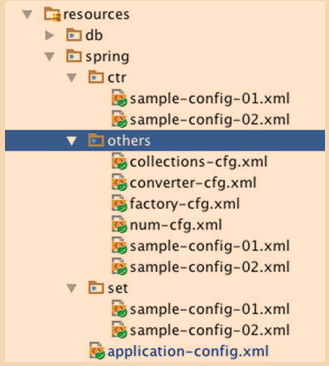
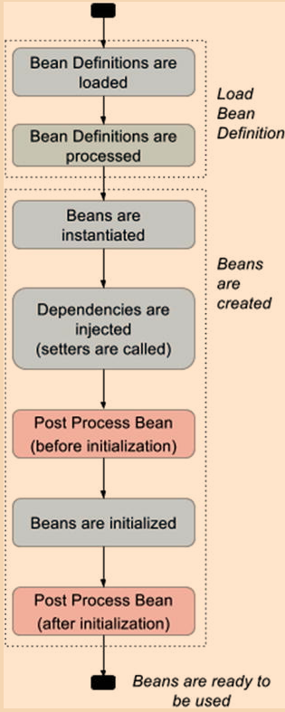

# Spring notes

### XML Spring Configuration

```
In order to tell the Spring Container to create these objects and how to link them together, a configuration must be provided. 
This configuration can be provided using XML files or XML + annotations or Java Configuration classes.
```

In Spring, there are two types of dependency injection specific to XML: via **constructor** and via **setters**

For XML, the class **org.springframework.context.support.ClassPathXmlApplicationContext** is used.

### Constructor Injection

Constructor injection can be used to define beans when the bean type is a class that has a constructor with arguments defined.

```xml
<beans>
  <bean id="complexBean" class="com.ps.beans.ctr.ComplexBeanImpl">
        <constructor-arg ref=" simpleBean"/>
  </bean>
  
  <bean id= "simpleBean" class="com.ps.beans.SimpleBeanImpl"/>
</beans>
```
==>
```java
public class ComplexBeanImpl implements ComplexBean {
    private SimpleBean simpleBean;

    public ComplexBeanImpl(SimpleBean simpleBean) {
        this.simpleBean = simpleBean;
    }

}
```

- The **<constructor-arg />** element defines the constructor argument and does so using a number of attributes, but ref is the most common, and it is used to tell the container that the value of this attribute is a reference to another bean.

```xml
<bean id="..." class="...">
        <constructor-arg ref="..."/>
</bean>
```

- Another attribute that is commonly used is **value**. This attribute is used when the value to inject is a scalar

```xml
<beans>
  <bean id="complexBean" class="com.ps.beans.ctr.ComplexBeanImpl">
        <constructor-arg ref="simpleBean"/>
        <constructor-arg value="true"/>
  </bean>
</beans>
```
==>
```java
public class ComplexBeanImpl {
      public ComplexBeanImpl(SimpleBean simpleBean, boolean complex) {
         this.simpleBean = simpleBean;
         this.complex = isComplex;
      }
}
```

- And also quite useful is the **index** attribute, which should be used when the constructor has more parameters of the same type.

```xml
<beans>
    <bean id="simpleBean0" class="com.ps.beans.SimpleBeanImpl"/>
    <bean id="simpleBean1" class="com.ps.beans.SimpleBeanImpl"/>
    
    <bean id="complexBean2" class="com.ps.beans.ctr.ComplexBean2Impl">
        <constructor-arg ref="simpleBean0" index="0"/>
        <constructor-arg ref="simpleBean1" index="1"/>
    </bean>
</beans>
```
==>
```java
public class ComplexBean2Impl {
    public ComplexBean2Impl(SimpleBean simpleBean1, SimpleBean simpleBean2) {
            this.simpleBean1 = simpleBean1;
            this.simpleBean2 = simpleBean2;
     }
 }
```

- Another way to handle constructors with more parameters of the same type is to use the **name** attribute

```xml
<beans>
    <bean id="simpleBean0" class="com.ps.beans.SimpleBeanImpl"/>
    <bean id="simpleBean1" class="com.ps.beans.SimpleBeanImpl"/>
    
    <bean id="complexBean2" class="com.ps.beans.ctr.ComplexBean2Impl">
        <constructor-arg ref="simpleBean0" name="simpleBean1"/>
        <constructor-arg ref="simpleBean1" name="simpleBean2"/>
    </bean>
</beans>
```

- If constructor-arg seems to be a long name for a configuration element, do not worry. Spring has introduced a fix for that in version 3.1 the **c-namespace** : xmlns:c="http://www.springframework.org/schema/c"

```xml
<beans>
    <bean id="simpleBean0" class="com.ps.beans.SimpleBeanImpl"/>
    <bean id="simpleBean1" class="com.ps.beans.SimpleBeanImpl"/>
    
    <!-- usage for reference to dependency -->
    <bean id="complexBean0" class="com.ps.beans.ctr.ComplexBeanImpl"
           c:simpleBean-ref="simpleBean0"/>
           
    <!-- usage for primitive type dependency -->
    <bean id="complexBean1" class="com.ps.beans.ctr.ComplexBeanImpl"
          c:simpleBean-ref="simpleBean0" c:complex="true"/>
          
    <!-- usage for index specified references -->
    <bean id="complexBean2" class="com.ps.beans.ctr.ComplexBean2Impl"
     c:_0-ref="simpleBean0" c:_1-ref="simpleBean1" />
     
</beans>
```

``` 
If you are using the name of the constructor parameter to inject the dependency, 
then the attribute definition with c: should match the pattern c:nameConstructorParameter[-ref], 
while if you are using indexes, the attribute definition should match c:_{index}[-ref].
```

### Setter Injection
      
- When creating a bean using setter injection, the bean is first instantiated by calling the constructor and then initialized by injecting the dependencies using setters.
- The **<property />** element defines the property to be set and the value to be set with and does so using a pair of attributes: **[name, ref]** or **[name,value]**.

```xml
<bean id="..." class="...">
        <property name="..." ref="..." />
</bean>
```

- The `name` attribute is mandatory, because its value is the `name of the bean property` to be set.
- The `ref` attribute is used to tell the container that the value of this attribute is a `reference to another bean`.
- The `value`, as you probably suspect, is used to tell the container `that the value is not a bean`, but a scalar value.

```xml
<beans>
    <bean id="simpleBean0" class="com.ps.beans.SimpleBeanImpl"/>
    <bean id="complexBean" class="com.ps.beans.set.ComplexBeanImpl">
         <property name="simpleBean" ref="simpleBean"/>
    </bean>
</beans>
```
==>
```java
public class ComplexBeanImpl implements ComplexBean {
    private SimpleBean simpleBean;
    
    public ComplexBeanImpl() {}
    
    public void setSimpleBean(SimpleBean simpleBean) {
        this.simpleBean = simpleBean;
    }
}
```

- Spring also has a namespace for simplifying XML definition when one is using setter injection. It is called the **p-namespace**: http://www.springframework.org/schema/p

```xml
<beans>
    <bean id="simpleBean" class="com.ps.beans.SimpleBeanImpl"/>
    <bean id="complexBean" class="com.ps.beans.set.ComplexBeanImpl"
           p:simpleBean-ref="simpleBean" p:complex="true"/>
</beans>
```

- Constructor and setter injection can be used together in creating the same bean

```xml
<beans>
    <bean id="simpleBean" class="com.ps.beans.SimpleBeanImpl"/>
    <bean id="complexBean2" class="com.ps.beans.set.ComplexBean2Impl">
        <constructor-arg ref="simpleBean"/>
        <property name="complex" value="true"/>
    </bean>
    
    <!-- configuration optimized using p-namespace and c-namespace -->
    <bean id="complexBean2" class="com.ps.beans.set.ComplexBean2Impl"
               c:simpleBean-ref="simpleBean" p:complex="true"/>
</beans>
```

### Collections

#### List

```xml
<bean id="simpleBean" class="com.ps.beans.SimpleBeanImpl"/>
<bean id="collectionHolder" class="com.ps.beans.others.CollectionHolder">
        <property name="simpleBeanList">
            <list>
                 <ref bean="simpleBean"/>
                 <bean class="com.ps.beans.SimpleBeanImpl"/>
                <null/>
            </list>
        </property>
</bean>
```

### Set

```xml
<bean id="simpleBean" class="com.ps.beans.SimpleBeanImpl"/>
<bean id="collectionHolder" class="com.ps.beans.others.CollectionHolder">
        <property name="simpleBeanSet">
            <set>
                <ref bean="simpleBean"/>
            </set>
        </property>
</bean>
```
#### Map

```xml
<bean id="simpleBean" class="com.ps.beans.SimpleBeanImpl"/>
<bean id="collectionHolder" class="com.ps.beans.others.CollectionHolder">
      <property name="simpleBeanMap">
            <map>
                 <entry key="one" value-ref="simpleBean"/>
            </map>
        </property>
 </bean>
```

#### util namespace to deal with collections

```xml
<beans>
    <bean id="simpleBean" class="com.ps.beans.SimpleBeanImpl"/>

    <util:list id=" simpleList" list-class="java.util.LinkedList">
        <ref bean="simpleBean"/>
        <bean class="com.ps.beans.SimpleBeanImpl"/>
        <null/>
    </util:list>
    
    <util:set id=" simpleSet" set-class="java.util.TreeSet">
        <ref bean="simpleBean"/>
    </util:set>
    
    <util:map id=" simpleMap" map-class="java.util.TreeMap">
        <entry key="one" value-ref="simpleBean"/>
    </util:map>

	<!--Injection collections-->
	<bean id="collectionHolder" class="com.ps.beans.others.CollectionHolder">
        <property name="simpleBeanList" ref="simpleList"/>
        <property name="simpleBeanSet" ref="simpleSet"/>
        <property name="simpleBeanMap" ref="simpleMap"/>
    </bean>
</beans>
```

### Using Bean Factories

#### factory-method

- To use a singleton class to create a bean, the factory-method attribute is used, and its value will be the static method name that returns the bean instance

```xml
<beans>
    <bean id="simpleSingleton" class="com.ps.beans.others.SimpleSingleton"
          factory-method="getInstance" />
</beans>
```
==>
```java
public class SimpleSingleton {
    private static SimpleSingleton instance = new SimpleSingleton();
    private SimpleSingleton() { }
    
    public static SimpleSingleton getInstance(){
        return instance;
    }
}
```

#### factory-bean

- To use a factory object to create a bean, the factory-bean and factory-method attributes are used.
- first one points to the object used to create the bean, and the other specifies the method name that returns the actual result 

```xml
<beans>
    <bean id=" simpleBeanFactory" class="com.ps.beans.others.SimpleFactoryBean"/>
    <bean id="simpleFB" factory-bean=" simpleBeanFactory"
          factory-method="getSimpleBean" />
</beans>
```
==> 
```java
public class SimpleFactoryBean {
	
    public SimpleBean getSimpleBean() {
        return new SimpleBeanImpl();
    }
}
```

#### FactoryBean

By implementing this interface, the factory beans will be automatically picked up by the Spring container, 
and the desired bean will be created by automatically calling the getObject method

```xml
<beans>
    <bean id="smartBean" class=" com.ps.beans.others.SpringFactoryBean"/>
</beans>
```
==> 
```java
public class SpringFactoryBean implements FactoryBean<SimpleBean> {
    
    private SimpleBean simpleBean = new SimpleBeanImpl();
    
    public SimpleBean getObject() {
        return this.simpleBean;
    }
	
    public Class<?> getObjectType() {
		return SimpleBean.class;
	}

	public boolean isSingleton() {
		return true;
	}
}    
```

### Import configuration files



```xml
<beans>
    <!-- using relative path, no prefix-->
    <import resource="ctr/sample-config-01.xml"/>
    <import resource="ctr/sample-config-02.xml"/>
    
    <!-- using classpath-->
    <import resource="classpath: spring/ctr/sample-config-01.xml"/>
    <import resource="classpath: spring/ctr/sample-config-02.xml"/>
    
    <!-- using classpath and wildcards-->
     <import resource="classpath: spring/others/sample-config-*.xml"/>
</beans>
```

### Application Context and Bean Lifecycle 



- Load Bean Definition step
	1. The XML files/Configuration classes parse
	2. The bean definitions load into the application context, indexed by ids
	3. The bean definitions process by beans called bean definition post processors 
- Bean creation step	
	1. The beans are instantiated. This basically means that the bean factory is calling the constructor of each bean
	2. The dependencies are injected. For beans that are defined having dependencies injected via setter, this stage is separate from the instantiation stage.
	3. Bean post process beans are invoked before initialization
	4. Beans are initialized
	5. Bean post process beans are invoked after initialization
	
- Ways of initializing a bean	
	- Using the attribute `init-method` on a <bean/> XML definition to define a method to be called for initialization, covered previously.
	- Implementing the `org.springframework.beans.factory.InitializingBean` interface and providing an implementation for the method `afterPropertiesSet` (not recommended, since it couples the application code with Spring infrastructure).
	- Annotating with `@PostConstruct` the method that is called right after the bean is instantiated and dependencies injected
	- The equivalent of the `init-method` attribute when using Java Configuration `@Bean(initMethod="...")`.	
	
#### Initializing beans priority	

```java
public class TriangleLifecycle implements InitializingBean {

	//  #1
	@PostConstruct
	public void postConstruct(){
		System.out.println("TriangleLifecycle postConstruct : " + toString());
	}

	// #2
	@Override
	public void afterPropertiesSet() throws Exception {
		System.out.println("TriangleLifecycle afterPropertiesSet : " + toString());
	}

	// #3
	public void initMethod(){
		System.out.println("TriangleLifecycle initMethod : " + toString());
	}

}
```

#### @PostConstruct

- The `@PostConstruct` annotation is part of the JSR 25013 and is used on a method that needs to be executed after dependency injection is done to perform initialization
- The bean that registers `@PostConstruct` is `org.springframework.context.annotation.CommonAnnotationBeanPostProcessor`
- The methods that can be annotated with `@PostConstruct` must respect the rules: 
 	- they must have no arguments 
 	- return void
 	- they can have any access right


####  context namespace

- `<context:annotation-config />` 
	- Enables scanning of all the classes in the project for annotations, so using it on large applications might make them slow
	- Activates various annotations to be detected in bean classes: Spring's @Required and
      @Autowired, as well as JSR 250's @PostConstruct, @PreDestroy and @Resource 
    - JPA's @PersistenceContext and @PersistenceUnit (if available).
- `<context:component-scan />` 
	- Scans the classpath for annotated components that will be auto-registered as Spring beans. 
    - By default, the Spring-provided @Component, @Repository, @Service, @Controller, @RestController, @ControllerAdvice, and @Configuration stereotypes  will be detected.                                                               
    - Reduce the number of classes to be scanned  

[Context name space configuration example](/IOC/src/main/resources/jb/_3_annotation_event/spring.xml)

#### Destroying beans priority

- Destroying ways
	- Set a method to be called before destruction using the `destroy-method` attribute of the <bean /> element.
	- Modify the bean to implement the `org.springframework.beans.factory.DisposableBean` interface and provide an implementation for the `destroy()` method (not recommended, since it couples the application code with Spring infrastructure).
	- Annotate a method with `@PreDestroy`, also part of JSR 250 and one of the first supported annotations in Spring.
	- The equivalent of `destroy-method` for Java Configuration `@Bean(destroyMethod="...")`.

```java
public class TriangleLifecycle implements DisposableBean {

	// #1
	@PreDestroy
	public void preDestroy(){
		System.out.println("TriangleLifecycle preDestroy : " + toString());
	}

	// #2
	@Override
	public void destroy() throws Exception {
		System.out.println("TriangleLifecycle destroy : " + toString());
	}

	// #3
	public void destroyMethod(){
		System.out.println("TriangleLifecycle destroyMethod : " + toString());
	}
	
}
```

- Destroy method's rules
	- The destroy method may be called only once during the bean lifecycle.
	- The destroy method can have any accessor; some developers even recommend to make it `private`, so that only Spring can call it via reflection.
	- The destroy method must not have any parameters.
	- The destroy method must return `void`. 
