# Spring notes

[https://docs.spring.io/spring/docs/5.0.3.RELEASE](https://docs.spring.io/spring/docs/5.0.3.RELEASE/spring-framework-reference/index.html)

## Spring Configuration


### XML Spring Configuration

```
In order to tell the Spring Container to create these objects and how to link them together, a configuration must be provided. 
This configuration can be provided using XML files or XML + annotations or Java Configuration classes.
```

In Spring, there are two types of dependency injection specific to XML: via **constructor** and via **setters**

For XML, the class **org.springframework.context.support.ClassPathXmlApplicationContext** is used.

### Constructor Injection

Constructor injection can be used to define beans when the bean type is a class that has a constructor with arguments defined.

```xml
<beans>
  <bean id="complexBean" class="com.ps.beans.ctr.ComplexBeanImpl">
        <constructor-arg ref=" simpleBean"/>
  </bean>
  
  <bean id= "simpleBean" class="com.ps.beans.SimpleBeanImpl"/>
</beans>
```

```java
public class ComplexBeanImpl implements ComplexBean {
    private SimpleBean simpleBean;

    public ComplexBeanImpl(SimpleBean simpleBean) {
        this.simpleBean = simpleBean;
    }

}
```

- `ref` is used to tell the container that the value of this attribute is a reference to another bean.

```xml
<bean id="..." class="...">
        <constructor-arg ref="..."/>
</bean>
```

- `value` is used when the value to inject is a primitive types or their wrappers

```xml
<beans>
  <bean id="complexBean" class="com.ps.beans.ctr.ComplexBeanImpl">
        <constructor-arg ref="simpleBean"/>
        <constructor-arg value="true"/>
  </bean>
</beans>
```

```java
public class ComplexBeanImpl {
      public ComplexBeanImpl(SimpleBean simpleBean, boolean complex) {
         this.simpleBean = simpleBean;
         this.complex = isComplex;
      }
}
```

- `index` attribute, which should be used when the constructor has more parameters of the same type.

```xml
<beans>
    <bean id="simpleBean0" class="com.ps.beans.SimpleBeanImpl"/>
    <bean id="simpleBean1" class="com.ps.beans.SimpleBeanImpl"/>
    
    <bean id="complexBean2" class="com.ps.beans.ctr.ComplexBean2Impl">
        <constructor-arg ref="simpleBean0" index="0"/>
        <constructor-arg ref="simpleBean1" index="1"/>
    </bean>
</beans>
```

```java
public class ComplexBean2Impl {
    public ComplexBean2Impl(SimpleBean simpleBean1, SimpleBean simpleBean2) {
            this.simpleBean1 = simpleBean1;
            this.simpleBean2 = simpleBean2;
     }
 }
```

- Another way to handle constructors with more parameters of the same type is to use the `name` attribute

```xml
<beans>
    <bean id="simpleBean0" class="com.ps.beans.SimpleBeanImpl"/>
    <bean id="simpleBean1" class="com.ps.beans.SimpleBeanImpl"/>
    
    <bean id="complexBean2" class="com.ps.beans.ctr.ComplexBean2Impl">
        <constructor-arg ref="simpleBean0" name="simpleBean1"/>
        <constructor-arg ref="simpleBean1" name="simpleBean2"/>
    </bean>
</beans>
```

- `c-namespace` for reducing parameters injection via constructors

```xml
<beans>
    <bean id="simpleBean0" class="com.ps.beans.SimpleBeanImpl"/>
    <bean id="simpleBean1" class="com.ps.beans.SimpleBeanImpl"/>
    
    <!-- usage for reference to dependency -->
    <bean id="complexBean0" class="com.ps.beans.ctr.ComplexBeanImpl"
           c:simpleBean-ref="simpleBean0"/>
           
    <!-- usage for primitive type dependency -->
    <bean id="complexBean1" class="com.ps.beans.ctr.ComplexBeanImpl"
          c:simpleBean-ref="simpleBean0" c:complex="true"/>
          
    <!-- usage for index specified references -->
    <bean id="complexBean2" class="com.ps.beans.ctr.ComplexBean2Impl"
     c:_0-ref="simpleBean0" c:_1-ref="simpleBean1" />
     
</beans>
```

``` 
If you are using the name of the constructor parameter to inject the dependency, 
then the attribute definition with c: should match the pattern c:nameConstructorParameter[-ref], 
while if you are using indexes, the attribute definition should match c:_{index}[-ref].
```

### Setter Injection
      
- When creating a bean using setter injection, the bean is first `instantiated` by calling the constructor and then `initialized` by injecting the dependencies using setters.
- `<property />` element defines the property to be set and the value to be set with and does so using a pair of attributes: **[name, ref]** or **[name,value]**.

```xml
<bean id="..." class="...">
        <property name="..." ref="..." />
</bean>
```

- The `name` is mandatory, because its value is the `name of the bean property` to be set.
- The `ref` is used to tell the container that the value of this attribute is a `reference to another bean`.
- The `value`, is used to tell the container `that the value is not a bean`, but a scalar value.

```xml
<beans>
    <bean id="simpleBean0" class="com.ps.beans.SimpleBeanImpl"/>
    <bean id="complexBean" class="com.ps.beans.set.ComplexBeanImpl">
         <property name="simpleBean" ref="simpleBean"/>
    </bean>
</beans>
```

```java
public class ComplexBeanImpl implements ComplexBean {
    private SimpleBean simpleBean;
    
    public ComplexBeanImpl() {}
    
    public void setSimpleBean(SimpleBean simpleBean) {
        this.simpleBean = simpleBean;
    }
}
```

- `p-namespace` for reducing parameters injection via setters

```xml
<beans>
    <bean id="simpleBean" class="com.ps.beans.SimpleBeanImpl"/>
    <bean id="complexBean" class="com.ps.beans.set.ComplexBeanImpl"
           p:simpleBean-ref="simpleBean" p:complex="true"/>
</beans>
```

- Constructor and setter injection can be used together in creating the same bean

```xml
<beans>
    <bean id="simpleBean" class="com.ps.beans.SimpleBeanImpl"/>
    <bean id="complexBean2" class="com.ps.beans.set.ComplexBean2Impl">
        <constructor-arg ref="simpleBean"/>
        <property name="complex" value="true"/>
    </bean>
    
    <!-- configuration optimized using p-namespace and c-namespace -->
    <bean id="complexBean2" class="com.ps.beans.set.ComplexBean2Impl"
               c:simpleBean-ref="simpleBean" p:complex="true"/>
</beans>
```

### Collections

#### List

```xml
<bean id="simpleBean" class="com.ps.beans.SimpleBeanImpl"/>
<bean id="collectionHolder" class="com.ps.beans.others.CollectionHolder">
        <property name="simpleBeanList">
            <list>
                 <ref bean="simpleBean"/>
                 <bean class="com.ps.beans.SimpleBeanImpl"/>
                <null/>
            </list>
        </property>
</bean>
```

#### Set

```xml
<bean id="simpleBean" class="com.ps.beans.SimpleBeanImpl"/>
<bean id="collectionHolder" class="com.ps.beans.others.CollectionHolder">
        <property name="simpleBeanSet">
            <set>
                <ref bean="simpleBean"/>
            </set>
        </property>
</bean>
```
#### Map

```xml
<bean id="simpleBean" class="com.ps.beans.SimpleBeanImpl"/>
<bean id="collectionHolder" class="com.ps.beans.others.CollectionHolder">
      <property name="simpleBeanMap">
            <map>
                 <entry key="one" value-ref="simpleBean"/>
            </map>
        </property>
 </bean>
```

#### util namespace to deal with collections

- util namespace for reducing code working with collections

```xml
<beans>
    <bean id="simpleBean" class="com.ps.beans.SimpleBeanImpl"/>

    <util:list id=" simpleList" list-class="java.util.LinkedList">
        <ref bean="simpleBean"/>
        <bean class="com.ps.beans.SimpleBeanImpl"/>
        <null/>
    </util:list>
    
    <util:set id=" simpleSet" set-class="java.util.TreeSet">
        <ref bean="simpleBean"/>
    </util:set>
    
    <util:map id=" simpleMap" map-class="java.util.TreeMap">
        <entry key="one" value-ref="simpleBean"/>
    </util:map>

	<!--Injection collections-->
	<bean id="collectionHolder" class="com.ps.beans.others.CollectionHolder">
        <property name="simpleBeanList" ref="simpleList"/>
        <property name="simpleBeanSet" ref="simpleSet"/>
        <property name="simpleBeanMap" ref="simpleMap"/>
    </bean>
</beans>
```

### Using Bean Factories

#### factory-method

- To use a singleton class to create a bean, the `factory-method` attribute is used, and its value will be the static method name that returns the bean instance

```xml
<beans>
    <bean id="simpleSingleton" class="com.ps.beans.others.SimpleSingleton"
          factory-method="getInstance" />
</beans>
```

```java
public class SimpleSingleton {
    private static SimpleSingleton instance = new SimpleSingleton();
    private SimpleSingleton() { }
    
    public static SimpleSingleton getInstance(){
        return instance;
    }
}
```

#### factory-bean

- To use a factory object to create a bean, the `factory-bean` and `factory-method` attributes are used.

```xml
<beans>
    <bean id=" simpleBeanFactory" class="com.ps.beans.others.SimpleFactoryBean"/>
    <bean id="simpleFB" factory-bean=" simpleBeanFactory"
          factory-method="getSimpleBean" />
</beans>
```

```java
public class SimpleFactoryBean {
	
    public SimpleBean getSimpleBean() {
        return new SimpleBeanImpl();
    }
}
```

#### FactoryBean

By implementing this interface, the factory beans will be automatically picked up by the Spring container, 
and the desired bean will be created by automatically calling the `getObject` method

```xml
<beans>
    <bean id="smartBean" class=" com.ps.beans.others.SpringFactoryBean"/>
</beans>
```

```java
public class SpringFactoryBean implements FactoryBean<SimpleBean> {
    
    private SimpleBean simpleBean = new SimpleBeanImpl();
    
    public SimpleBean getObject() {
        return this.simpleBean;
    }
	
    public Class<?> getObjectType() {
		return SimpleBean.class;
	}

	public boolean isSingleton() {
		return true;
	}
}    
```

### Import configuration files


```xml
<beans>
    <!-- using relative path, no prefix-->
    <import resource="ctr/sample-config-01.xml"/>
    <import resource="ctr/sample-config-02.xml"/>
    
    <!-- using classpath-->
    <import resource="classpath: spring/ctr/sample-config-01.xml"/>
    <import resource="classpath: spring/ctr/sample-config-02.xml"/>
    
    <!-- using classpath and wildcards-->
     <import resource="classpath: spring/others/sample-config-*.xml"/>
</beans>
```

### Application Context and Bean Lifecycle 


- Load Bean Definition step
	1. The XML files/Configuration classes parse
	2. The bean definitions load into the application context, indexed by ids
	3. The bean definitions process by beans called bean definition post processors 
- Bean creation step	
	1. The beans are instantiated. This basically means that the bean factory is calling the constructor of each bean
	2. The dependencies are injected. For beans that are defined having dependencies injected via setter, this stage is separate from the instantiation stage.
	3. Bean post process beans are invoked before initialization
	4. Beans are initialized
	5. Bean post process beans are invoked after initialization
	
	
- Ways of initializing a bean	
	- Using the attribute `init-method` on a <bean/> XML definition to define a method to be called for initialization, covered previously.
	- Implementing the `org.springframework.beans.factory.InitializingBean` interface and providing an implementation for the method `afterPropertiesSet` (not recommended, since it couples the application code with Spring infrastructure).
	- Annotating with `@PostConstruct` the method that is called right after the bean is instantiated and dependencies injected
	- The equivalent of the `init-method` attribute when using Java Configuration `@Bean(initMethod="...")`.	
	
### Initializing beans priority	

```java
public class TriangleLifecycle implements InitializingBean {

	//  Calls #1
	@PostConstruct
	public void postConstruct(){
		System.out.println("TriangleLifecycle postConstruct : " + toString());
	}

	// Calls #2
	@Override
	public void afterPropertiesSet() throws Exception {
		System.out.println("TriangleLifecycle afterPropertiesSet : " + toString());
	}

	// Calls #3
	public void initMethod(){
		System.out.println("TriangleLifecycle initMethod : " + toString());
	}

}
```

### @PostConstruct

- The `@PostConstruct` annotation is part of the JSR 25013 and is used on a method that needs to be executed after dependency injection is done to perform initialization
- The bean that registers `@PostConstruct` is `org.springframework.context.annotation.CommonAnnotationBeanPostProcessor`
- The methods that can be annotated with `@PostConstruct` must respect the rules: 
 	- they must have no arguments 
 	- return void
 	- they can have any access right

### context namespace

- `<context:annotation-config />` 
	- Enables scanning of all the classes in the project for annotations, so using it on large applications might make them slow
	- Activates various annotations to be detected in bean classes: Spring's @Required and
      @Autowired, as well as JSR 250's `@PostConstruct`, `@PreDestroy` and `@Resource`
    - JPA's `@PersistenceContext` and `@PersistenceUnit` (if available).
- `<context:component-scan />` 
	- Scans the classpath for annotated components that will be auto-registered as Spring beans. 
    - By default, the Spring-provided `@Component`, `@Repository`, `@Service`, `@Controller`, `@RestController`, `@ControllerAdvice`, and `@Configuration` stereotypes  will be detected.                                                               
    - Reduce the number of classes to be scanned  

[Context name space configuration example](/IOC/src/main/resources/jb/_3_annotation_event/spring.xml)

### Destroying beans priority

- Destroying ways
	- Set a method to be called before destruction using the `destroy-method` attribute of the <bean /> element.
	- Modify the bean to implement the `org.springframework.beans.factory.DisposableBean` interface and provide an implementation for the `destroy()` method (not recommended, since it couples the application code with Spring infrastructure).
	- Annotate a method with `@PreDestroy`, also part of JSR 250 and one of the first supported annotations in Spring.
	- The equivalent of `destroy-method` for Java Configuration `@Bean(destroyMethod="...")`.

```java
public class TriangleLifecycle implements DisposableBean {

	// Calls #1
	@PreDestroy
	public void preDestroy(){
		System.out.println("TriangleLifecycle preDestroy : " + toString());
	}

	// Calls #2
	@Override
	public void destroy() throws Exception {
		System.out.println("TriangleLifecycle destroy : " + toString());
	}

	// Calls #3
	public void destroyMethod(){
		System.out.println("TriangleLifecycle destroyMethod : " + toString());
	}
	
}
```

- Destroy method's rules
	- The destroy method may be called only once during the bean lifecycle.
	- The destroy method can have any accessor; some developers even recommend to make it `private`, so that only Spring can call it via reflection.
	- The destroy method must not have any parameters.
	- The destroy method must return `void`. 

### Bean Scopes

- Default scope for a bean is `singleton`

| Scope         | Description |
| ------------- |-------------|
| **Singleton** | The Spring IoC creates a single instance of this bean, and any request for beans with an id or ids matching this bean definition results in this instance being returned.|
| **Prototype** | Every time a request is made for this specific bean, the Spring IoC creates a new instance.      |
| **Request**   | The Spring IoC creates a bean instance for each HTTP request. Only valid in the context of a web-aware Spring ApplicationContext.     |
| **Session**   | The Spring IoC creates a bean instance for each HTTP session. Only valid in the context of a web-aware Spring ApplicationContext. |
| **global-session**| The Spring IoC creates a bean instance for each global HTTP session. Only valid in the context of a web-aware Spring ApplicationContext.|
| _Custom_      | Developers are provided the possibility to define their own scopes with their own rules.|

```xml
<bean id="complexBean" class="com.ps.sample.ComplexBean" scope="prototype"/>
```

#### Additional ways to create app context

```java
- new AnnotationConfigApplicationContext(AppConfig.class);
- new ClassPathXmlApplicationContext(“com/example/app-config.xml”);
- new FileSystemXmlApplicationContext(“C:/Users/vojtech/app-config.xml”);
- new FileSystemXmlApplicationContext(“./app-config.xml”);
```


#### Depends-on

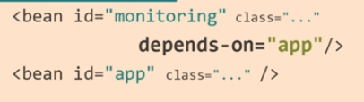

- Initialization of Bean `monitoring` will be after initialization of bean `app`

--- 

### Java Spring Configuration and Annotations

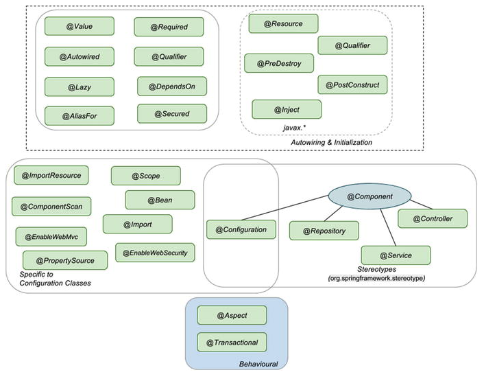

- Spring manages lifecycle of beans, each bean has its scope
- Default scope is `singleton` - one instance per application context
- Scope can be defined by `@Scope`(eg. `@Scope(BeanDefinition.SCOPE_SINGLETON)`) annotation on the class-level of bean class
- Stereotypes annotations are used to mark classes according to their purpose:
    - `@Component`: template for any Spring-managed component(bean).
    - `@Repository`: template for a component used to provide data access, specialization of the `@Component` annotation for the the `Dao layer`.
    - `@Service`: template for a component that provides service execution, specialization of the `@Component` annotation for the `Service layer`.
    - `@Controller`: template for a web component, specialization of the `@Component` annotation for the `Web layer`.
    - `@Configuration`: configuration class containing bean definitions (methods annotated with @Bean).
    
- Autowiring and initialization annotations are used to define which dependency is injected and what the bean looks like. For example:
    - `@Autowired`: core annotation for this group; is used on dependencies to instruct Spring IoC to take care of injecting them. Can be used on fields, constructors, and setters. Use with @Qualifier from Spring to specify name of the bean to inject.
    - `@Inject`: equivalent annotation to `@Autowired` from javax.inject package. Use with `@Qualifier` from javax.inject to specify name of the bean to inject.
    - `@Resource`: equivalent annotation to `@Autowired` from javax.annotation package. Provides a name attribute to specify name of the bean to inject.
    - `@Required`: Spring annotation that marks a dependency as mandatory, used on setters.
    - `@Lazy`: dependency will be injected the first time it is used.    
    
- Classes annotated with `@Configuration` contain bean definitions.    

```java
@Configuration
@PropertySource("classpath:db/datasource.properties")
@ImportResource("classpath:spring/user-repo-config.xml")
@Import({DataSourceConfig.class,  UserRepoDSConfig.class})
@ComponentScan(basePackages = "com.ps")
public class DataSourceConfig {
    
    @Value("${driverClassName}")
    private String driverClassName;
    
    @Bean
    public static PropertySourcesPlaceholderConfigurer
           propertySourcesPlaceholderConfigurer() {
        return new PropertySourcesPlaceholderConfigurer();
    }
    @Bean
    public DataSource dataSource() throws SQLException {
        DriverManagerDataSource ds = new DriverManagerDataSource();
        ds.setDriverClassName(driverClassName);
        ds.setUrl(url);
        ds.setUsername(username);
        ds.setPassword(password);
        return ds;
    }
}
```

- `@Bean` annotation is used to tell Spring that the result of the annotated method will be a bean that has to be managed by it. 
- `@Bean` annotation together with the method are treated as a `bean definition`, and the method name becomes the bean `id`.
- `@Bean ( initMethod = "init", destroyMethod = "destroy")` - for declare init and destroy methods
- `@PropertySource` annotation will be used to read property values from a property file set as argument
- `@ImportResource` for importing another configurations
- `@Import` annotation to import the bean definition in one class into the other.
- `@ComponentScan` works the same way as <context:component-scan /> for XML

### Bean Naming

- When the name is not defined for a bean declared with `@Bean`, the Spring IoC names the bean with the annotated `method name`.

```java
// bean name = dataSource
@Bean
public DataSource dataSource() throws SQLException {

}

//bean name = one
@Bean(name="one")
public DataSource dataSource() throws SQLException {

}

//bean name =  one, alias = two
@Bean(name={"one", "two"})
public DataSource dataSource() throws SQLException {

}
```
- When the name is not defined for a bean declared with Component, the Spring IoC creates the name of the bean from the name of the bean type, by lowercasing the first letter.

```java
// bean name = jdbcRequestRepo
@Repository
public class JdbcRequestRepo extends JdbcAbstractRepo<Request> implements RequestRepo{
       
}

// bean name = requestRepo@Description
@Repository("requestRepo")
public class JdbcRequestRepo extends JdbcAbstractRepo<Request> implements RequestRepo{
         
}
// or
@Repository(value="requestRepo")
public class JdbcRequestRepo extends JdbcAbstractRepo<Request> implements RequestRepo{
         
}
//  or
// bean name = requestRepo
@Component("requestRepo")
public class JdbcRequestRepo extends JdbcAbstractRepo<Request> implements RequestRepo{
         
}
```

- `@Description` annotation, which was added in Spring 4.x is used to add a description to a bean

```java
@Repository
@Description("This is not the bean you are looking for")
public class JdbcRequestRepo extends JdbcAbstractRepo<Request> implements RequestRepo {

}
```

### Field Injection

- `@Autowire` can be used on fields, constructors, setters, and even methods.
- In using `@Autowired` on constructors, it makes not sense to have more than one constructor annotated with it, and Spring will complain about it because it will not know what constructor to use to instantiate the bean.
- Out of the box, Spring will try to `autowire by type`
- If Spring cannot decide which bean to autowire based on type (because there are more beans of the same type in the application), it defaults to `autowiring by name`.
- `@Qualifier` - in case Spring finds more than candidate for autowiring to qualify which bean to inject
- `@Autowired` annotation by default requires the dependency to be mandatory, but this behavior can be changed, by setting the required attribute to true (`@Autowired(required=false)`)

```java
   @Qualifier("requestRepo")
   @Autowired
   RequestRepo reqRepo;
```
### Constructor Injection

```java
@Repository("requestRepo")
public class JdbcRequestRepo  extends JdbcAbstractRepo<Request> implements RequestRepo{
	
    @Autowired
    public JdbcRequestRepo(DataSource dataSource) {
        super(dataSource);
    }
 }
```

### Setter Injection

```java
public class JdbcUserRepo extends JdbcAbstractRepo<User> implements UserRepo {
	
	private DataSource dataSource;
    
	@Autowired
	public void setDataSource(DataSource dataSource) {
		this.dataSource = dataSource;
	}
    
    //or by name
     @Autowired
    public void setDataSource( @Qualifier("oracleDataSource") DataSource dataSource) {
        this.dataSource = dataSource;
    }
}
```

### Method Injection

```java
@Configuration
public class MethodSecurityConfig {

  @Autowired
  public void registerGlobal(AuthenticationManagerBuilder auth) {
    // some business logic 
  }

}
```

### Generic Injection

- This is useful when you have classes that are organized in a hierarchy and they all inherit a certain class that is generic, 
  like the repositories in the project attached to the book, all of which extend `JdbcAbstractRepo<T>`

```java
@ContextConfiguration(classes = {AllRepoConfig.class})
public class GenericQualifierTest {
	
    @Autowired
    JdbcAbstractRepo<Review> reviewRepo;
    
    @Autowired
    JdbcAbstractRepo<Response> responseRepo;

}
```

### @Value annotation

- `@Value` - can be used to insert scalar values or can be used together with placeholders and `SpEL` in order to provide flexibility in configuring a bean
- Is used to inject value either from system properties (using ${}) or SpEL (using #{})
- Can be on fields, constructor parameters or setter parameters
- On constructors and setters must be combined with @Autowired on method level, for fields @Value alone is enough
- Can specify default values
	- `${minAmount:100}"`
	- `#{environment['minAmount'] ?: 100}`


```java 
	 @Value("${driverClassName}") private String driverClassName;
	 @Value("${url}") private String url;
	
	 @Value("#{dbProps.driverClassName}") String driverClassName,
	 @Value("#{dbProps.url}")String url,
	 @Value("#{dbProps.username}")String username,
	 @Value("#{dbProps.password}")String password
```

### Spring Expression language
- Acronym SpEL
- can be used in @Value annotation values
- enclosed in #{}
- ${} is for properties, #{} is for SpEL
- Access property of bean #{beanName.property}
- Can reference systemProperties and systemEnvironment
- Used in other spring projects such as Security, Integration, Batch, WebFlow,...

### Bean Lifecycle 

- For a configuration using Java Configuration annotations, the classpath is scanned by a bean of type `org.springframework.context.annotation.ClassPathBeanDefinitionScanner`, and the bean definitions are registered by a bean of type `org.springframework.context.annotation.ConfigurationClassBeanDefinitionReader`.
- Java Configuration and all other annotations: a `org.springframework.beans.factory.annotation.AutowiredAnnotationBeanPostProcessor` bean is used to autowire dependencies

### @Lazy

- This annotation can be used to postpone the creation of a bean until it is first accessed, by adding this annotation to the bean definition

```java
@Component
@Lazy
public class SimpleBean { 
	
}

// or on a @Bean
@Configuration
public class RequestRepoConfig {
	
	@Lazy
	@Bean
	public RequestRepo anotherRepo(){
		return new JdbcRequestRepo();
}
}

// on injection point
@Repository
public class JdbcPetRepo extends JdbcAbstractRepo<Pet>
implements PetRepo {
    
    @Lazy
    @Autowired(required=false)
    public void setDataSource(DataSource dataSource) {
        this.dataSource = dataSource;
    }
}
```


## Testing Spring Applications

- `TDD` - This approach puts the design under question: if tests are difficult to write, the design should be reconsidered
- Trying to write at least two tests for each method: one positive and one negative, for methods that can be tested

- In order to define a test class for running in a Spring context, the following have to be done:
    - annotate the test class with `@RunWith(SpringJUnit4ClassRunner.class)`
    - annotate the class with `@ContextConfiguration` in order to tell the runner class where the bean definitions come from
    - use `@Autowired` to inject beans to be tested.
  
- Distributed as separate artifact - `spring-test.jar`
- Test class needs to be annotated with `@RunWith(SpringJUnit4ClassRunner.class)`
- Spring configuration classes to be loaded are specified in `@ContextConfiguration` annotation
  - If no value is provided `@ContextConfiguration`, config file `${classname}-context.xml` in the same package is imported
  - XML config files are loaded by providing string value to annotation - `@ContextConfiguration("classpath:com/example/test-config.xml")`
  - Java @Configuration files are loaded from classes attribute - `@ContextConfiguration(classes={TestConfig.class, OtherConfig.class})`
  
```java
@RunWith(SpringJUnit4ClassRunner.class)
@ContextConfiguration(classes={TestConfig.class, OtherConfig.class})
public final class FooTest  {
 
    @Autowired
    private MyService myService;
    
    //...
}
```

#### AnnotationConfigContextLoader

- `@Configuration` inner classes (must be static) are automatically detected and loaded in tests
  with help of `AnnotationConfigContextLoader`

```java
@RunWith(SpringJUnit4ClassRunner.class)
@ContextConfiguration(loader = AnnotationConfigContextLoader.class)
public class SpringPetServiceTest3 {

     @Configuration
     public static class TestCtxConfig {
        @Bean
        StubPetRepo petRepo(){
            return new StubPetRepo();
        }
        @Bean
        PetService simplePetService(){
            SimplePetService petService = new SimplePetService();
            petService.setRepo(petRepo());
            return petService;
        }
    }
}
```

#### Testing with spring profiles
- `@ActiveProfiles` annotation of test class activates profiles listed
- `@ActiveProfiles( { "foo", "bar" } )`

#### Inject mocks using Mockito

- The `@InjectMock` has a behavior similar to the Spring IoC, because its role is to instantiate testing object instances and 
  to try to inject fields annotated with `@Mock` or `@Spy` into private fields of the testing object.

```java
public class MockPetServiceTest {
    
    @InjectMocks
    private SimplePetService simplePetService;
    
    @Mock
    private PetRepo petRepo;
    
    @Before
    public void initMocks() {
        MockitoAnnotations.initMocks(this);
    }
}
```

- With `@RunWith(MockitoJUnitRunner.class)` no need to `MockitoAnnotations.initMocks(this)`

```java
@RunWith(MockitoJUnitRunner.class)
public class MockPetServiceTest {

    @InjectMocks
    private SimplePetService simplePetService;

    @Mock
    private PetRepo petRepo;

}
```

- `PowerMock` was born because sometimes code is not testable, perhaps because of bad design or because of some necessity. Below you can find a list of untestable elements:
    - static methods
    - classes with static initializers
    - final classes and final methods; sometimes there is need for an insurance that the code will not be misused or to make sure that an object is constructed correctly
    - private methods and fields
    
### Testing Rest with Spring boot

```java
@RunWith(SpringRunner.class)
@WebMvcTest(controllers = CustomerController.class, secure=false)
public class TestCustomerController {

	@MockBean
	private CustomerService service;

	@Autowired
	private MockMvc mockMvc;

	@Test
	public void testSuccessfulFindAllCustomers() throws Exception {
		when(service.findAllCustomers()).thenReturn(Arrays.asList(new Customer(), new Customer()));

		mockMvc.perform(get("/customers")).andExpect(status().isOk())
				.andExpect(content().contentType(MediaType.APPLICATION_JSON_UTF8))
				.andExpect(jsonPath("$", hasSize(2)));
	}
	//..
}	
```

```java
@RestController
@RequestMapping("/customers")
public class CustomerController {

	private CustomerService service;

	public CustomerController(CustomerService service) {
		this.service = service;
	}
	
	@GetMapping
	public ResponseEntity<Iterable<Customer>> findAllCustomers(){
		return ResponseEntity.ok(service.findAllCustomers());
	}
    //..
 }   
		
```
    
### Testing JPA with Spring boot    

```java
@RunWith(SpringRunner.class)
@DataJpaTest
public class TestCustomerRepo {

	@Autowired
	private TestEntityManager entityManager;

	@Autowired
	private CustomerRepo repo;
	
	private Customer bojack;

	public TestCustomerRepo() {
		bojack = new Customer.CustomerBuilder().firstName("BoJack").middleName("Horse").lastName("Horseman")
				.suffix("Sr.").build();
	}

	@Test
	public void testFindAllCustomers() {
		this.entityManager.persist(bojack);
		Iterable<Customer> customers = repo.findAll();

		int count = 0;
		for (Customer repoCustomer : customers) {
			assertEquals("BoJack", repoCustomer.getFirstName());
			assertEquals("Horseman", repoCustomer.getLastName());
			assertEquals("Horse", repoCustomer.getMiddleName());
			assertEquals("Sr.", repoCustomer.getSuffix());
			assertTrue(repoCustomer.getId() > 0L);
			assertNull(repoCustomer.getDateOfLastStay());
			count++;
		}
		assertEquals(1, count);
	}
	//..
}	
```

## Aspect Oriented Programming
    
```
AOP is a type of programming that aims to help with separation of cross-cutting concerns to increase modularity; 
it implies declaring an aspect class that will alter the behavior of base code, 
by applying advices to specific join points, specified by pointcuts.
```    

- Examples of cross-cutting concerns:
	- Caching
	- Internationalization
	- Error detection and correction
	- Memory management
	- Performance monitoring
	- Synchronization

- The original library that provided components for creating aspects is named **AspectJ.**

### AOP Terminology
    
- **Aspect** - a class containing code specific to a cross-cutting concern. 
   A class declaration is recognized in Spring as an aspect if it is annotated with the `@Aspect` annotation.
-  **Weaving** - a synonym for this word is interlacing, but in software, the synonym is linking, <br/> 
   and it refers to aspects being combined with other types of objects to create an advised object.  
- **Join point** - a point during the execution of a program. In Spring AOP, a joint point is always a method execution.   
- **Target object** - object to which the aspect applies.
- **Target method** - the advised method.
- **Advice** - action taken by an aspect at a join point. In Spring AOP there are multiple advice types:
	- **Before advice** - methods annotated with @Before that will execute before the join point
	- **After returning advice** - methods annotated with `@AfterReturning` that will execute after a join point completes normally, <br/> 
	  meaning that the target method returns normally without throwing an exception.
	- **After throwing advice** - methods annotated with `@AfterThrowing` that will execute after a join point execution ends by throwing an exception.  
	- **After (finally) advice** - methods annotated with `@After` that will execute after a join point execution, no matter how the execution ended.
	- **Around advice** - methods annotated with `@Around` intercept the target method and surround the join point. 
	  This is the most powerful type of advice, since it can perform custom behavior before and after the invocation
- **Pointcut** - a predicate used to identify join points.  Advice definitions are associated with a pointcut expression and the advice will execute on any join point matching the pointcut expression.
    Pointcut expressions can be defined as arguments for Advice annotations or as arguments for the `@Pointcut` annotation. 
- **Introduction** - declaring additional methods, fields, interfaces being implemented, annotations on behalf of another type.
- **AOP proxy** - the object created by AOP to implement the aspect contracts. In SprJdbcTemplateUserRepoing, proxy objects can be `JDK dynamic proxies` or `CGLIB proxies`    

#### Spring Proxies
- Two types of proxies
- `JDK dynamic` proxies
	- Can only proxy by interface
	- Proxied bean must implement java interface
	- Part of JDK
	- All interfaces implemented by the class are proxied
	- Based on proxy implementing interfaces
- `CGLib` proxies
	- Can create a proxy by subclassing. In this scenario the proxy becomes a subclass of the target class. No need for interfaces.
	- Is not part of JDK, included in spring
	- Used when class implements no interface
	- Cannot be applied to final classes or methods
	- Based on proxy inheriting the base class

```java
@Aspect
@Component
public class UserRepoMonitor {
    
     @Before("execution(public com.ps.repos.˙JdbcTemplateUserRepo+.findById(..))")
    public void beforeFindById(JoinPoint joinPoint) {
        String methodName = joinPoint.getSigTestJdbcTemplateUserReponature().getName();
        System.out.println(" ---> Method " + methodName + " is about to be called");
    }
}
```

- The `@Before` annotation is used with a parameter that is called a pointcut expression. <br/> 
  This is used to identify the method execution on which the behavior will be applied.
  
```java
@Configuration
@ComponentScan(basePackages = {"com.ps.repos.impl","com.ps.aspects"})
@EnableAspectJAutoProxy
public class AppConfig {
	
}
```  

- `@EnableAspectJAutoProxy`- to enable aspect support, the configuration class must be annotated, default **JDK dynamic proxy**.
- `@EnableAspectJAutoProxy(proxyTargetClass = true)` - if the **CGLIB** library is to be added to the application classpath, Spring must be told that we want subclass-based proxies by modifying the aspect enabling annotation
	- This approach is suitable when the target class does not implement any interface, so Spring will create a new class on the fly that is a subclass of the target class
	- CGLIB is suitable for that because it is a bytecode generation library.

- It is obvious that the before advice was executed, but how does it actually work? Spring IoC creates the userTemplateRepo bean. 
  Then the aspect definition with an advice that has to be executed before the findById method tells Spring that this bean has to be wrapped up in a proxy object that will add additional behavior, 
  and this object will be injected instead of the original everywhere needed. 
  And because we are using JDK dynamic proxies, the proxy will implement the UserRepo interface


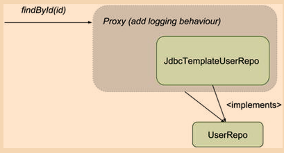

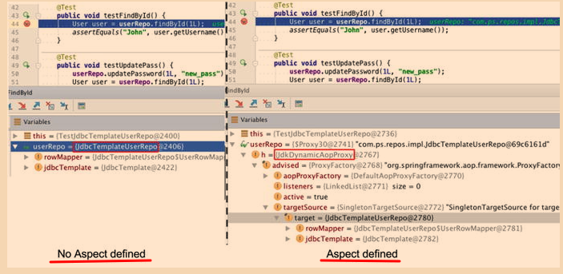

- In order to use aspects in a Spring application you need the following:
	- spring-aop as a dependency
	- declare an `@Aspect` class and declare it as a bean as well (using `@Component` or `@Bean` or XML typical bean declaration element)
	- declare an advice method annotated with a typical advice annotation (`@Before`, `@After`, etc.) and associate it to a pointcut expression
	- enable aspects support by annotating a configuration class with `@EnableAspectJAutoProxy`
	- (optional) add CGLIB as a dependency and enable aspects support using subclassed proxies by annotating a configuration class with `@EnableAspectJAutoProxy(proxyTargetClass = true)`
	
### Defining Pointcuts	

- The template that a pointcut expression follows can be defined as follows:

```java
execution( [Modifiers] [ReturnType] [FullClassName].[MethodName] ([Arguments]) throws [ExceptionType])
```  

- The expression can contain wildcards like + and * and can be made of multiple expressions concatenated by boolean operators such as &&, ||, etc. 
	- The * wildcard replaces any group of characters
	- The + wildcard is used to specify that the method to advise can also be found in subclasses identified by [FullClassName] criteria. 

- There is also a list of designators that can be used to define the reach of the pointcut; for example, the `within(...)` designator can be used to limit the pointcut to a package	

```java
public * com.ps.repos.*.JdbcTemplateUserRepo+.findById(..)) && +underlinewithin(com.ps.*)
```

- Pointcut expression can identify only methods defined in a class annotated with a specific annotation:

```java
execution(@org.springframework.transaction.annotation.Transactional
    public * com.ps.repos.*.*Repo+.findById(..)))
```

- Pointcut expression can even identify methods that return values with a specific annotation:
	
```java
execution(public (@org.springframework.stereotype.Service *) *(..)) 
```

- by using the `@annotation()` designator, only methods annotated with a specific annotation can be taken into consideration:

```java
execution(public (public * com.ps.service.*.*Service+.*(..)
      && @annotation(org.springframework.security.access.annotation.Secured))
```

### Implementing Advice

#### Before

```java
@Before("com.ps.aspects.PointcutContainer.serviceUpdate(id, pass)")
   public void beforeServiceUpdate (Long id, String pass) throws Throwable {
	//..
   }
```

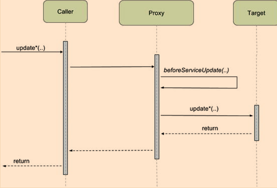

1. The proxy object receives the call destined for the target bean and calls first the advice method
2. If the advice method returns successfully, it then forwards the initial call to the target bean and forwards the result back to the caller.
3. If the advice method throws an exception, the exception gets propagated to the caller, and the target method is no longer executed

#### After Returning

This type of advice is executed only if the target method executed successfully and does not end by throwing an exception.

```java
@AfterReturning(value="execution (* com.ps.services.*Service+.update*(..))",
      returning = "result")
public void afterServiceUpdate(JoinPoint joinPoint, int result) throws Throwable {
	//..
}
```

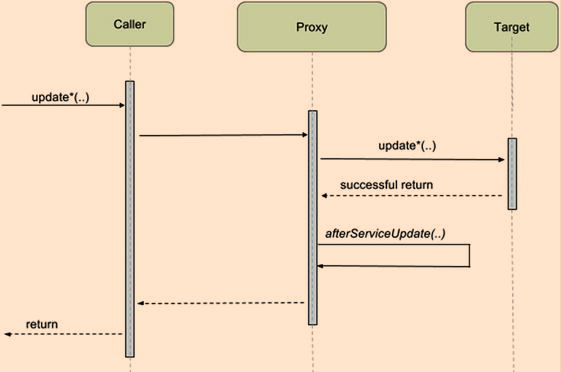


#### After Throwing

The after throwing advice is similar to the after returning. The only difference is that its criterion of execution is exactly the opposite. </br> 
That is, this advice is executed only when when the target method ends by throwing an exception

```java
@AfterThrowing(value="execution
      (* com.ps.services.*Service+.updateUsername(..))", throwing = "e")
public void afterBadUpdate(JoinPoint joinPoint, Exception e) throws Throwable {
	//..
}
```

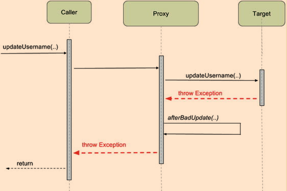

#### After

The after advice is executed after the target method regardless of how its execution ended, whether successfully or with an exception, and because of this, </br> 
it is most suitable to use for auditing or logging.

```java
 	@After("execution(public * com.ps.repos.*.JdbcTemplateUserRepo+.updateUsername(..))")
    public void afterFindById(JoinPoint joinPoint) throws Throwable {
		//..
    }
```


#### Around

- The around advice is the most powerful type of advice, because it encapsulates the target method and has control over its execution, </br>
meaning that the advice decides whether the target method is called, and if so, when.
- The type `ProceedingJoinPoint` inherits from JoinPoint and adds the `proceed()` method that is used to call the target method

```java
@Around("execution(public * com.ps.repos.*.*Repo+.find*(..))")
    public Object monitorFind( ProceedingJoinPoint joinPoint) throws Throwable {
        long t1 = System.currentTimeMillis();
		Thread.sleep(1000L);
		return joinPoint.proceed();
		long t2 = System.currentTimeMillis();
		logger.info(" ---> Execution of " + methodName + " took: "   + (t2 - t1) / 1000 + " ms.");
}
```

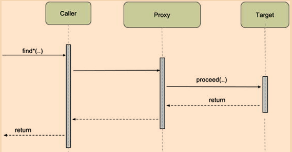


### Advices 

**Aspect** = **PointCut**(Where the Aspect is applied) + **Advice**(What code is executed)

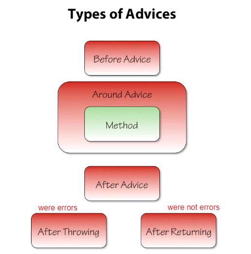

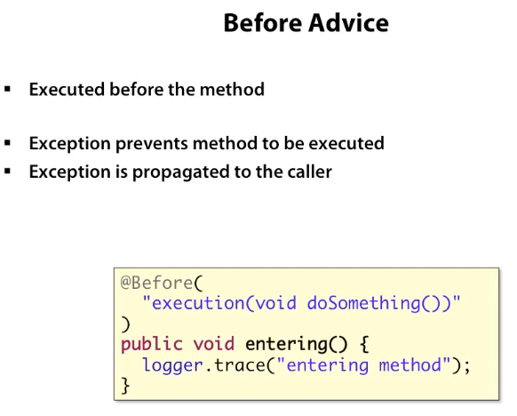

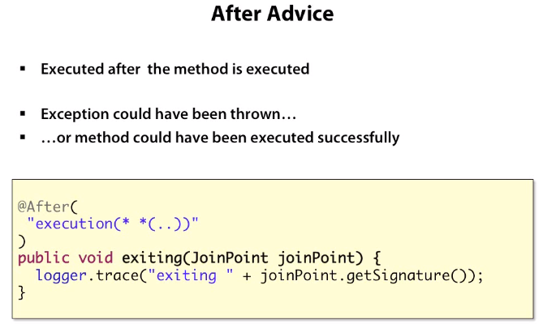

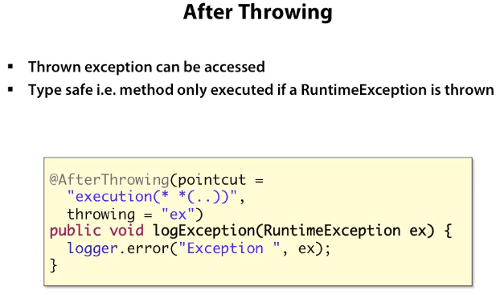

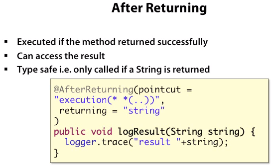

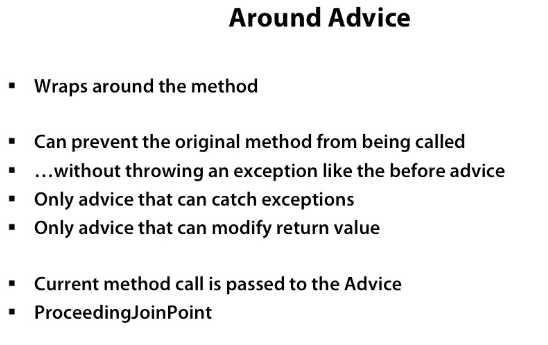

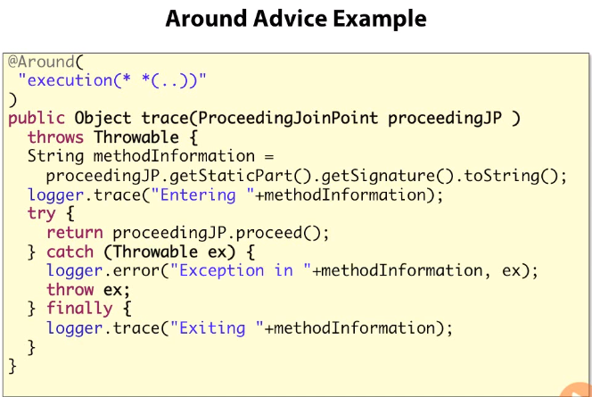


### PointCuts 

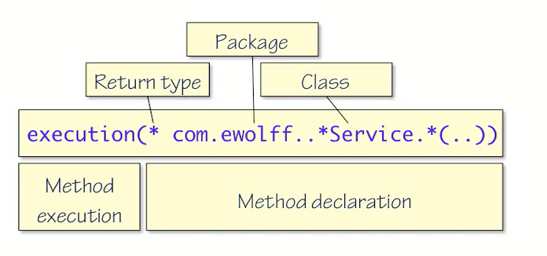

#### Wildcards

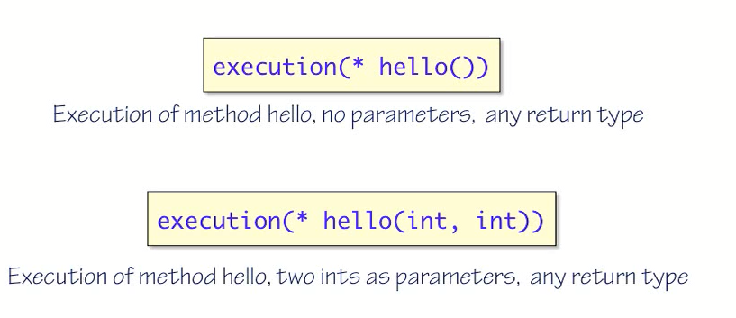

#### Parameter Wildcards


#### Packages and Classes

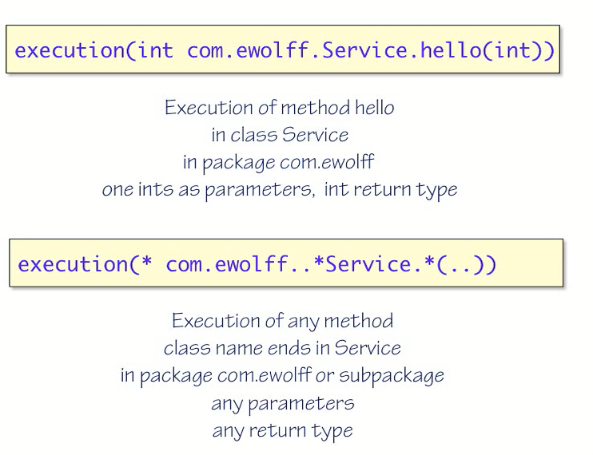

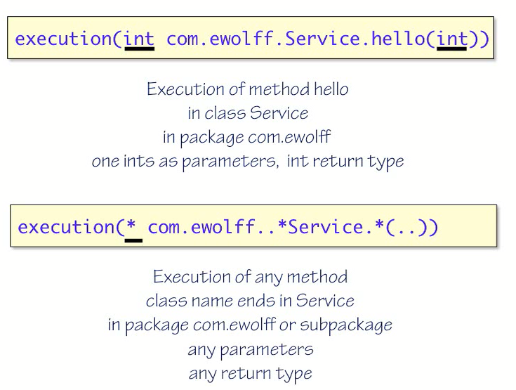

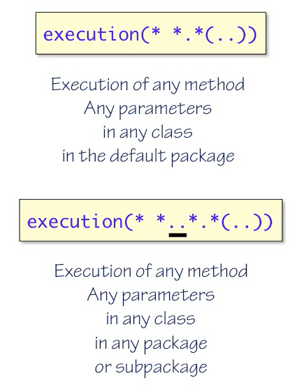

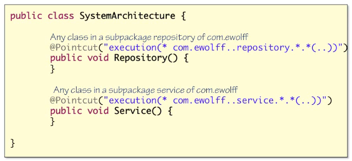

#### Annotation

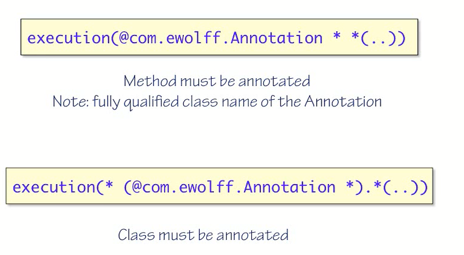

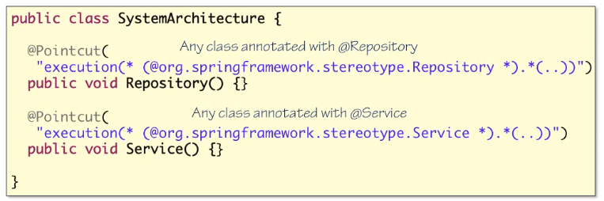

#### Spring beans names as PointCut

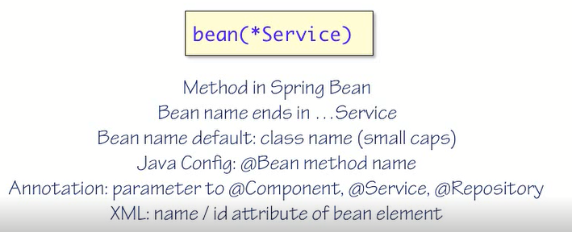

#### Boolean expressions in PointCut

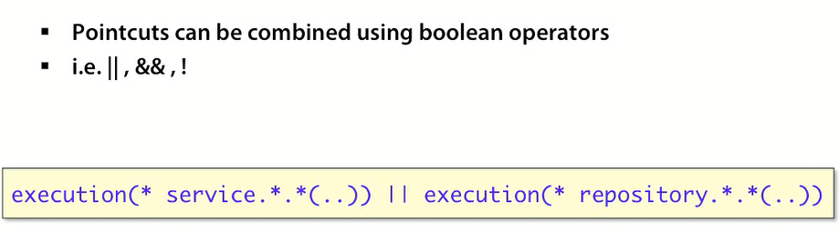

### @PointCut

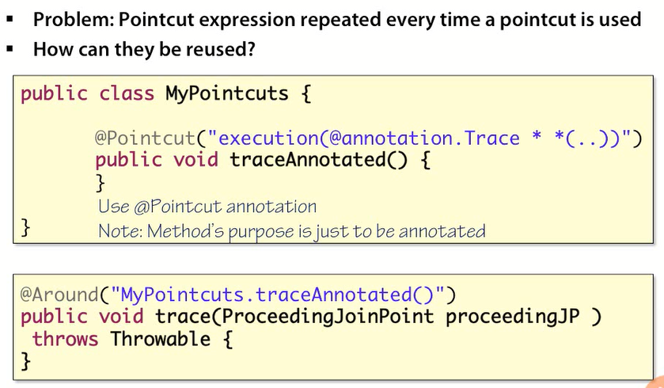

#### PointCuts XML

```xml
<aop:config>
    <aop:pointcut id="pointcut" expression="execution(void set*(*))"/> 
    
    <aop:aspect ref="myAspect">
        <aop:after-returning pointcut-ref="pointcut" method="logChange"/> 
    </aop:aspect> 
    
    <bean id="myAspect" class="com.example.MyAspect" />
</aop:config>
```

#### PointCuts Java

```java
//Pointcut is referenced here by its ID
@Before("setters()") 
public void logChange() {
    //...
}

//Method name is pointcut id, it is not executed
@Pointcut("execution(void set*(*))") 
public void setters() {
    //...
}
```

### Data Access

 - **DML** stands for `Data Manipulation Language`, and the database operations presented so far are part of it, 
    the commands `SELECT`, `INSERT`, `UPDATE`, and `DELETE` are database statements used to create, update, or delete data from existing tables.
    
 - **DDL** stands for `Data Definition Language`, and database operations that are part of it are used to manipulate database objects: 
    tables, views, cursors, etc. The commands `CREATE`, `ALTER`, `DROP`


### Java Config of DataSource and populating db

```java
@Configuration
@Profile("dev")
@PropertySource("classpath:db/db.properties")
public class TestDataConfig {
	
    @Value("${driverClassName}")
    private String driverClassName;
    
    @Value("${url}")
    private String url;
    
    @Value("${username}")
    private String username;
    
    @Value("${password}")
    private String password;
    
    @Value("classpath:db/schema.sql")
	private Resource schemaScript;
    
	@Value("classpath:db/test-data.sql")
	private Resource dataScript;
        
    @Bean
    public static PropertySourcesPlaceholderConfigurer
        propertySourcesPlaceholderConfigurer() {
      return new PropertySourcesPlaceholderConfigurer();
    }
    
    @Lazy
    @Bean
    public DataSource dataSource() {
        try {
            SimpleDriverDataSource dataSource = new SimpleDriverDataSource();
            Class<? extends Driver> driver = (Class<? extends Driver>) Class.forName(driverClassName);
            dataSource.setDriverClass(driver);
            dataSource.setUrl(url);
            dataSource.setUsername(username);
            dataSource.setPassword(password);
            DatabasePopulatorUtils.execute(databasePopulator(), dataSource);
            return dataSource;
        } catch (Exception e) {
            return null;
        }
    }
    
    @Bean
    public DataSourceInitializer dataSourceInitializer
              (final DataSource dataSource) {
        final DataSourceInitializer initializer = new DataSourceInitializer();
        initializer.setDataSource(dataSource);
        initializer.setDatabasePopulator(databasePopulator());
        return initializer;
    }
    
    private DatabasePopulator databasePopulator() {
        final ResourceDatabasePopulator populator = new ResourceDatabasePopulator();
        populator.addScript(schemaScript);
        populator.addScript(dataScript);
        return populator;
    }
    
    @Bean
    public JdbcTemplate userJdbcTemplate() {
        return new JdbcTemplate(dataSource());
    }
}
```

#### Embedded DataSource Java Configuration

```java

@Configuration
@Profile("dev")
public class TestDataConfig {

    @Bean
    public DataSource dataSource() {
        return new EmbeddedDatabaseBuilder()
                .setType(EmbeddedDatabaseType.H2)
                .addScript("classpath:db/schema.sql")
                .addScript("classpath:db/test-data.sql")
                .build();
    }

}
```

#### Embedded DataSource XML Configuration

```xml
<jdbc:embedded-database id="dataSource">
	 <jdbc:script location="classpath:db/schema.sql"/>
	 <jdbc:script location="classpath:db/test-data.sql"/>
</jdbc:embedded-database>
```

#### ACID

- **Atomicity** is the main attribute of a transaction and is the characteristic mentioned earlier, that if an operation in a transaction fails, the entire transaction fails, and the database is left unchanged. When all operations in a transaction succeed, all changes are saved into the database when the transaction is committed. Basically it is “all or nothing.”
- **Consistency** implies that every transaction should bring the database from one valid state to another.
- **Isolation** implies that when multiple transactions are executed in parallel, they won’t hinder one another or affect each other in any way. The state of the database after a group of transactions is executed in parallel should be the same as if the transactions in the group had been executed sequentially.
- **Durability** is the property of a transaction that should persist even in cases of power off, crashes, and other errors on the underlying system


#### Transactional Environment

- In a transactional environment, transactions have to be managed. 
  In Spring, this is done by an infrastructure bean called the `transaction manager`.
  
- Configuring transactional behavior is done declaratively by annotating methods with `@Transactional` 
- It is mandatory to use `@Transactional`  on repository classes, too, in order to ensure transactional behavior
- Methods that need to be executed in a transactional context are annotated with `@Transactional` Spring annotation
- This annotation must be used only on public methods; otherwise, the transactional proxy won’t be able to apply the transactional behavior

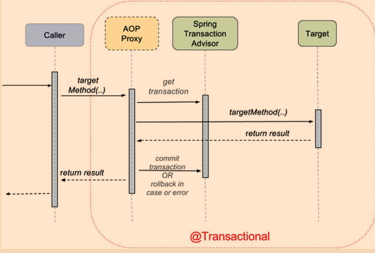

### Configure Transactions Support

- Configure transaction management support
	- add a declaration of a bean of type `org.springframework.jdbc.datasource.DataSourceTransactionManager`
	- `<tx:annotation-driven ../>`

```xml
<bean id="transactionManager"
         class="org.springframework.jdbc.datasource.DataSourceTransactionManager">
         <property name="dataSource" ref="dataSource"/>
</bean>

<tx:annotation-driven transaction-manager="transactionManager"/>
```

```java
public class TestDataConfig {

    @Bean
    public PlatformTransactionManager txManager(){
        return new DataSourceTransactionManager(dataSource());
    }
}
```

```java
@Configuration
@EnableTransactionManagement
@ComponentScan(basePackages = {"com.ps.repos.impl", "com.ps.services.impl"})
public class AppConfig {
}

```

- Declare transactional methods
	- Method that is to be executed in a transaction must be annotated with the Spring `@Transaction` annotation.

```java
	@Transactional
	@Override
	public User findById(Long id) {
		return userRepo.findById(id);
	}
```

- The `@Transactional` annotation can be used at the class level too. 
  In this case, all the methods in the class become transactional, and all properties defined for the transaction are inherited from the @Transactional class level definition,

```
Both @EnableTransactionManagement and <tx:annotation-driven ../> enable all infrastructure beans necessary for supporting transactional execution. 
But there is a minor difference between them. The XML configuration element can be used like this: <tx:annotation-driven /> without the transaction-manager attribute. 
In this case, Spring will look for a bean named transactionManager by default, and if it is not found, the application won’t start. 
The @EnableTransactionManagement is more flexible; it looks for a bean of any type that implements the org.springframework.transaction.PlatformTransactionManager, so the name is not important.
```

### @Transactional
- `transactionManager` - the transaction manager used to manage the transaction in the context of which the annotated method is executed.
- `readOnly` - should be used for transactions that involve operations that do not modify the database (example: searching, counting records)
- `propagation` - org.springframework.transaction.annotation.Propagation
- `isolation` - org.springframework.transaction.annotation.Isolation
- `timeout` - value represents the number of milliseconds after which a transaction is considered failed,
- `rollbackFor` - when this type of exception is thrown during the execution of a transactional method, the transaction is rolled back

### org.springframework.transaction.annotation.Propagation

- **REQUIRED**: an existing transaction will be used or a new one will be created to execute the method annotated with `@Transactional(propagation = Propagation.REQUIRED)`.
- **REQUIRES_NEW**: a new transaction is created to execute the method annotated with `@Transactional(propagation = Propagation.REQUIRES_NEW)`. If a current transaction exists, it will be suspended.
- **NESTED**: an existing nested transaction will be used to execute the method annotated with `@Transactional(propagation = Propagation.NESTED)`. If no such transaction exists, it will be created.
- **MANDATORY**: an existing transaction must be used to execute the method annotated with `@Transactional(propagation = MANDATORY)`. If there is no transaction to be used, an exception will be thrown.
- **NEVER**: methods annotated with `@Transactional(propagation = Propagation.NEVER)` must not be executed within a transaction. If a transaction exists, an exception will be thrown.
- **NOT_SUPPORTED**: no transaction is used to execute the method annotated with `@Transactional(propagation = Propagation.NOT_SUPPORTED)`. If a transaction exists, it will be suspended.
- **SUPPORTS**: an existing transaction will be used to execute the method annotated with `@Transactional(propagation = Propagation.SUPPORTS)`. If no transaction exists, the method will be executed anyway, without a transactional context.

#### Transaction Propagation

 - Happens when code from one transaction calls another transaction
 - Transaction propagation says whether everything should be run in single transaction or nested transactions should be used
 - There are 7 levels of propagation
 - 2 Basic ones - REQUIRED and REQUIRES_NEW

### org.springframework.transaction.annotation.Isolation

- **DEFAULT**: the default isolation level of the DBMS.
- **READ_UNCOMMITED**: data changed by a transaction can be read by a different transaction while the first one is not yet committed, also known as dirty reads.
- **READ_COMMITTED**: dirty reads are not possible when a transaction is used with this isolation level. This is the default strategy for most databases. But a different phenomenon could happen here: repeatable read: when the same query is executed multiple times, different results might be obtained. (Example: a user is extracted repeatedly within the same transaction. In parallel, a different transaction edits the user and commits. If the first transaction has this isolation level, it will return the user with the new properties after the second transaction is committed.)
- **REPEATABLE_READ**: this level of isolation does not allow dirty reads, and repeatedly querying a table row in the same transaction will always return the same result, even if a different transaction has changed the data while the reading is being done. The process of reading the same row multiple times in the context of a transaction and always getting the same result is called repeatable read.
- **SERIALIZABLE**: this is the most restrictive isolation level, since transaction are executed in a serialized way. So no dirty reads, no repeatable reads, and no phantom reads are possible. A phantom read happens when in the course of a transaction, execution of identical queries can lead to different result sets being returned.

### Isolation Levels

- 4 isolation levels available (from least strict to the most strict)
	- READ_UNCOMMITTED
	- READ_COMMITTED
	- REPEATABLE_READ
	- SERIALIZABLE
- Not all isolation levels may be supported in all databases
- Different databases may implement isolation is slightly different ways

#### READ_UNCOMMITTED
 - `@Transactional (isolation=Isolation.READ_UNCOMMITTED)`
 - The lowest isolation level
 - Dirty reads can occur - one transaction may be able to see uncommitted data of other transaction
 - May be viable for large transactions or frequently changing data

#### READ_COMMITTED
 - `@Transactional (isolation=Isolation.READ_COMMITTED)`
 - Default isolation strategy for many databases
 - Other transactions can see data only after it is properly committed
 - Prevents dirty reads

#### REPEATABLE_READ
 - `@Transactional (isolation=Isolation.REPEATABLE_READ)`
 - Prevents non-repeatable reads - when a row is read multiple times in a single transaction, its value is guaranteed to be the same

#### SERIALIZABLE
 - `@Transactional (isolation=Isolation.SERIALIZABLE)`
 - Prevents phantom reads

### Testing transactional methods

- The `@Sql` annotation can be used to specify SQL scripts to be executed against a given database during integration tests.
- The `@SqlGroup` annotation can be used on classes and methods to group together `@Sql` annotations.
- The `@SqlConfig` is used to specify the configuration of the SQL script.

```java
@Test
@Sql(statements = {"drop table NEW_P_USER if exists;"})
 public void testCreateTable(){
	 int result = userRepo.createTable("new_p_user");
	 assertEquals(0, result);
 }
```

```java
@Test
@SqlGroup({
		@Sql(
				value = "classpath:db/extra-data.sql",
				config = @SqlConfig(encoding = "utf-8", separator = ";", commentPrefix = "--")
		),
		@Sql(
				scripts = "classpath:db/delete-test-data.sql",
				config = @SqlConfig(transactionMode = SqlConfig.TransactionMode.ISOLATED),
				executionPhase = Sql.ExecutionPhase.AFTER_TEST_METHOD
		)
})
public void testCount() {
	int count = userService.countUsers();
	assertEquals(8, count);
}   
```

### jdbcTemplate

- `jdbcTemplate.update` uses for `insert` `update` `delete`

- Declare in spring-context.xml

```xml
	<bean id="dataSource" class="org.springframework.jdbc.datasource.DriverManagerDataSource"
		  p:driverClassName="${driverClassName}"
		  p:url="${url}"
		  p:username="${username}"
		  p:password="${password}"
	/>

	<bean id="jdbcTemplate" class="org.springframework.jdbc.core.JdbcTemplate" p:dataSource-ref="dataSource"/>
```

- Inject into repository

```java
@Autowired
private JdbcTemplate jdbcTemplate;

```

- Select

```java
jdbcTemplate.query("SELECT * FROM MY_TABLE", new RowMapper());

jdbcTemplate.queryForObject("SELECT * FROM MY_TABLE WHERE ID = id", new RowMapper());
```

- Insert

```java
jdbcTemplate.update(
			"insert INTO MY_TABLE(NAME, DURATION) values (?, ?)",
			obj.getName(), obj.getDuration());
```

- Update

```java
jdbcTemplate.update("UPDATE MY_TABLE set NAME = ?, DURATION = ? where id = ?",
			obj.getName(), obj.getDuration(), obj.getId());
```

- Delete

```java
jdbcTemplate.update("delete from MY_TABLE where id = ?", id);
```

#### Query for domain object

- May consider ORM for this
- Must implement `RowMapper` interface, which maps row of ResultSet to a domain object

```java
public interface RowMapper<T> {
    T mapRow(ResultSet resultSet, int rowNum) throws SQLException; 
}
```

### In-Memory Database

```java
@Bean
public DataSource dataSource() {
    EmbeddedDatabaseBuilder builder = new EmbeddedDatabaseBuilder();
    builder.setName("inmemorydb")
           .setType(EmbeddedDatabaseType.HSQL) 
           .addScript("classpath:/inmemorydb/schema.db") 
           .addScript("classpath:/inmemorydb/data.db");
    
           return builder.build();
}
```

The same in XML

```xml
<jdbc:embedded-database id="dataSource" type="HSQL"> 
    <jdbc:script location="classpath:schema.sql" /> 
    <jdbc:script location="classpath:data.sql" />
</jdbc:embedded-database>
```

Initialise db

```xml
<jdbc:initialize-database data-source="dataSource"> 
    <jdbc:script location="classpath:schema.sql" /> 
    <jdbc:script location="classpath:data.sql" />
</jdbc:initialize-database>
```

### Spring and Hibernate

- `org.springframework.orm.hibernate5.LocalSessionFactoryBuilder`
- `org.hibernate.SessionFactory`
- `org.hibernate.Session`
- `org.springframework.orm.hibernate4.HibernateTransactionManager`

### Hibernate proper

- `hibernate.dialect` - the value is a dialect class matching the database used in the application
- `hibernate.hbm2ddl.auto` - the value represents what Hibernate should do when the application starts
- `hibernate.format_sql` - the generated SQL statements are printed to the console in a pretty and readable way.
- `hibernate.show_sql` - if true, all the generated SQL statements are printed to the console.
- `hibernate.use_sql_comments` - if true, Hibernate will put a comment inside the SQL statement to tell the developer what that statement is trying to do.

### Spring + Hibernate Java configuration

- Inject database params and use them when create beans

```java
@Value("${driverClassName}")
private String driverClassName;
@Value("${url}")
private String url;
@Value("${login}")
private String username;
@Value("${password}")
private String password;
```

- Create `dataSource`

```java
@Bean
public DataSource dataSource() {
	final DriverManagerDataSource dataSource = new DriverManagerDataSource();
	dataSource.setDriverClassName(driverClassName);
	dataSource.setUrl(url);
	dataSource.setUsername(username);
	dataSource.setPassword(password);
	return dataSource;
}
```

- Create `sessionFactory`

```java
@Bean
public Properties hibernateProperties() {
	final Properties hibernateProp = new Properties();
	hibernateProp.put("hibernate.dialect", "org.hibernate.dialect.H2Dialect");
	hibernateProp.put("hibernate.hbm2ddl.auto", "create-drop");
	hibernateProp.put("hibernate.format_sql", true);
	hibernateProp.put("hibernate.use_sql_comments", true);
	hibernateProp.put("hibernate.show_sql", true);
	return hibernateProp;
}

@Bean
public SessionFactory sessionFactory() {
	return new LocalSessionFactoryBuilder(dataSource())
			.scanPackages("com.ps.ents")
			.addProperties(hibernateProperties())
			.buildSessionFactory();
}
```

- Create `transactionManager`

```java
@Bean
public PlatformTransactionManager transactionManager() {
	return new HibernateTransactionManager(sessionFactory());
}
```

- Create `@Repository` bean

```java
@Repository
@Transactional
public class HibernateUserRepo implements UserRepo {
	
}
```

- Inject `sessionFactory` into `@Repository` beans and use session to deal with database

```java
@Repository
@Transactional
public class HibernateUserRepo implements UserRepo {

	@Autowired
	private SessionFactory sessionFactory;
	
	public Session session() {
		return sessionFactory.getCurrentSession();
	}
}
```

### Spring + Hibernate XML configuration

- Create `dataSource`

```xml
<bean id="dataSource" class="org.springframework.jdbc.datasource.DriverManagerDataSource">
	<property name="driverClassName" value="${driverClassName}" />
	<property name="url" value="${url}" />
	<property name="username" value="${login}" />
	<property name="password" value="${password}" />
</bean>
```
- Create `sessionFactory`

```xml
<bean id="sessionFactory" class="org.springframework.orm.hibernate5.LocalSessionFactoryBean">
	<property name="dataSource" ref="dataSource" />
	<property name="packagesToScan" value="com.ps" />
	<property name="hibernateProperties">
		<props>
			<prop key="hibernate.hbm2ddl.auto">create-drop</prop>
			<prop key="hibernate.dialect">org.hibernate.dialect.H2Dialect</prop>
		</props>
	</property>
</bean>
```

- Create `transactionManager`

```xml
<bean id="transactionManager" class="org.springframework.orm.hibernate5.HibernateTransactionManager">
	<property name="sessionFactory" ref="sessionFactory" />
</bean>
```

- Create `@Repository` bean

```java
@Repository
@Transactional
public class HibernateUserRepo implements UserRepo {
	
}
```

- Inject `sessionFactory` into `@Repository` beans and use session to deal with database

```java
@Repository
@Transactional
public class HibernateUserRepo implements UserRepo {

	@Autowired
	private SessionFactory sessionFactory;
	
	public Session session() {
		return sessionFactory.getCurrentSession();
	}
}
```

### Spring + JPA Java configuration

- Create `dataSource`

```java
@Bean
public DataSource dataSource() {
	final DriverManagerDataSource dataSource = new DriverManagerDataSource();
	dataSource.setDriverClassName(driverClassName);
	dataSource.setUrl(url);
	dataSource.setUsername(username);
	dataSource.setPassword(password);

	return dataSource;
}
```

- Create `hibernateProperties`

```java
@Bean
public Properties hibernateProperties() {
	final Properties hibernateProp = new Properties();
	hibernateProp.put("hibernate.dialect", "org.hibernate.dialect.H2Dialect");
	hibernateProp.put("hibernate.hbm2ddl.auto", "create-drop");
	hibernateProp.put("hibernate.format_sql", true);
	hibernateProp.put("hibernate.use_sql_comments", true);
	hibernateProp.put("hibernate.show_sql", true);
	return hibernateProp;
}
```

- Create `entityManagerFactory`

```java
@Bean
public EntityManagerFactory entityManagerFactory() {
	final LocalContainerEntityManagerFactoryBean factoryBean = new LocalContainerEntityManagerFactoryBean();
	factoryBean.setPackagesToScan("com.ps.ents");
	factoryBean.setDataSource(dataSource());
	factoryBean.setJpaVendorAdapter(new HibernateJpaVendorAdapter());
	factoryBean.setJpaProperties(hibernateProperties());
	factoryBean.afterPropertiesSet();
	return factoryBean.getNativeEntityManagerFactory();
}
```

- Create `transactionManager`

```java
@Bean
public PlatformTransactionManager transactionManager() {
	return new JpaTransactionManager(entityManagerFactory());
}
```

- Create `@Repository` Bean

```java
@Repository("userJpaRepo")
public class JpaUserRepo implements UserRepo {
	
}
```

- Inject `entityManager` into `@Repository` beans and use session to deal with database

```java
@PersistenceContext
private EntityManager entityManager;
```

### Spring + JPA XML configuration

- Add transaction management

```xml
<tx:annotation-driven />

<bean id="transactionManager" class="org.springframework.orm.jpa.JpaTransactionManager">
		<property name="entityManagerFactory" ref="entityManagerFactory" />
</bean>
```

- Add `dataSource` bean

```xml
<bean id="dataSource" class="org.springframework.jdbc.datasource.DriverManagerDataSource">
	<property name="driverClassName" value="${driverClassName}" />
	<property name="url" value="${url}" />
	<property name="username" value="${username}" />
	<property name="password" value="${password}" />
</bean>
```

- Add `entityManagerFactory` bean

```xml
<bean id="entityManagerFactory"
	  class="org.springframework.orm.jpa.LocalContainerEntityManagerFactoryBean">
	<property name="dataSource" ref="dataSource" />
	<property name="packagesToScan" value="com.ps" />
	<property name="jpaVendorAdapter">
		<bean class="org.springframework.orm.jpa.vendor.HibernateJpaVendorAdapter" />
	</property>
	<property name="jpaProperties">
		<props>
			<prop key="hibernate.hbm2ddl.auto">create-drop</prop>
			<prop key="hibernate.dialect">org.hibernate.dialect.MySQL5Dialect</prop>
		</props>
	</property>
</bean>
```

- Create `@Repository` Bean

```java
@Repository("userJpaRepo")
public class JpaUserRepo implements UserRepo {
	
}
```

- Inject `entityManager` into `@Repository` beans and use session to deal with database

```java
@PersistenceContext
private EntityManager entityManager;
```

### Spring Data JPA

- Simplifies data access by reducing boilerplate code
- The central interface of Spring Data is `Repository< T, ID extends Serializable>`
- Create a domain object class that will be mapped to a MongoDB object. The class must have an identified field that will be annotated with the Spring Data special annotation `@Id` from the package `org.springframework.data.annotation`
- Create a new Repo interface that will extend the Spring Data MongoDB-specialized interface `MongoRepository<T,ID extends Serializable>`.
- Create a configuration class and annotate it with `@EnableMongoRepositories` to enable creation of MongoDB repository instances.

#### Spring data Repositories

 - Spring searches for all interfaces extending `Repository<DomainObjectType, DomainObjectIdType>`
 - Repository is just marker interface and has no method on its own
 - Can annotate methods in the interface with `@Query("Select p from person p where ...")`
 - Can extend CrudRepository instead of Repository - added methods for CRUD
	 - Method names generated automatically based on naming convention
	 - findBy + Field (+ Operation)
	 - FindByFirstName(String name), findByDateOfBirthGt(Date date), ...
	 - Operations - Gt, Lt, Ne, Like, Between, ...
 - Can extend PagingAndSortingRepository - added sorting and paging
 - Most Spring data sub-projects have their own variations of Repository
 	- JpaRepository for JPA
 - Repositories can be injected by type of their interface
 
```java
public interface PersonRepository extends Repository<Person, Long> {}
    
@Service    
public class PersonService {

    @Autowired
    private PersonRepository personRepository;
           
}  
````

- Locations, where spring should look for Repository interfaces need to be explicitly defined

```java
@Configuration 
@EnableJpaRepositories(basePackages="com.example.**.repository") 
public class JpaConfig {...}

@Configuration 
@EnableGemfireRepositories(basePackages="com.example.**.repository")
public class GemfireConfig {...}
  
@Configuration 
@EnableMongoRepositories(basePackages="com.example.**.repository") 
public class MongoDbConfig {...}
```
### Spring Data Configuration

- For Java configuration `@EnableJpaRepositories(basePackages="com.example.**.repository")` - Annotation to enable JPA repositories.
- For XML configuration `<jpa:repositories base-package=""com.example.**.repository""/>` - Annotation to enable JPA repositories.

---

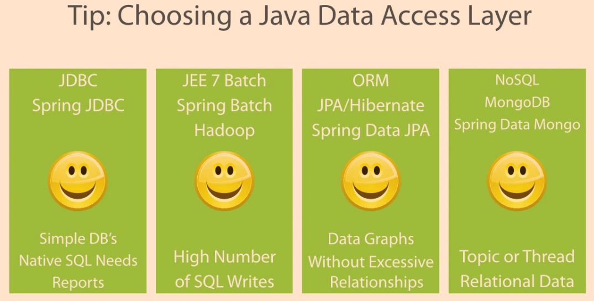

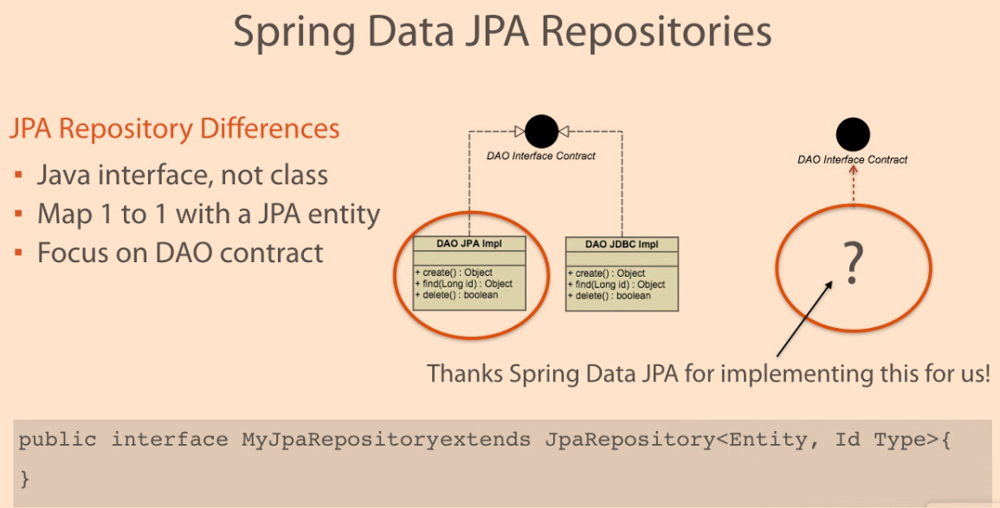

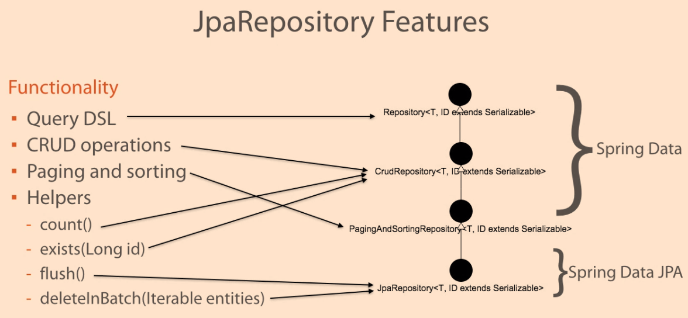

### Query DSL 

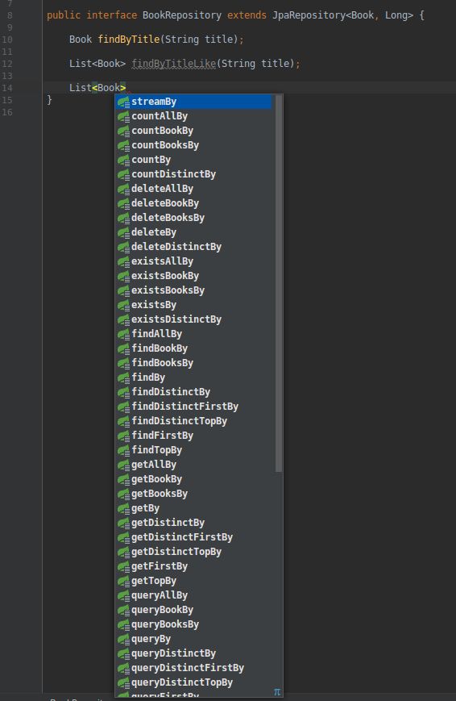

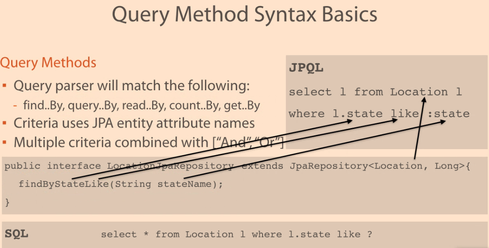

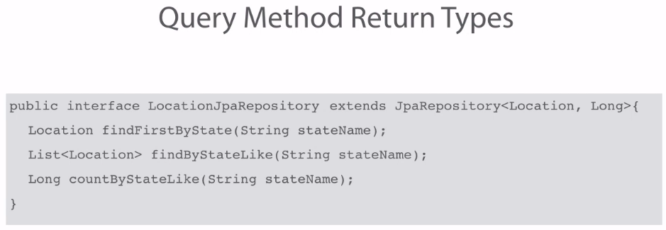

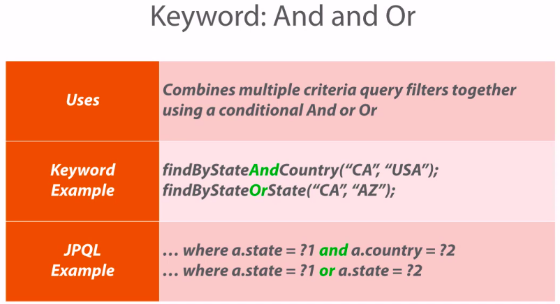

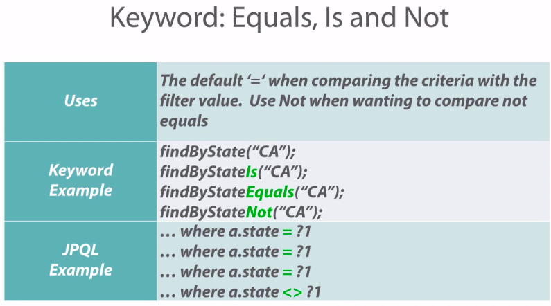

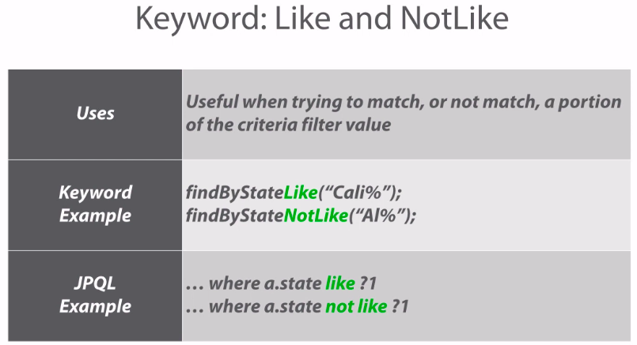

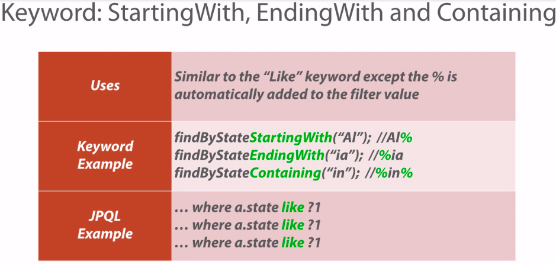

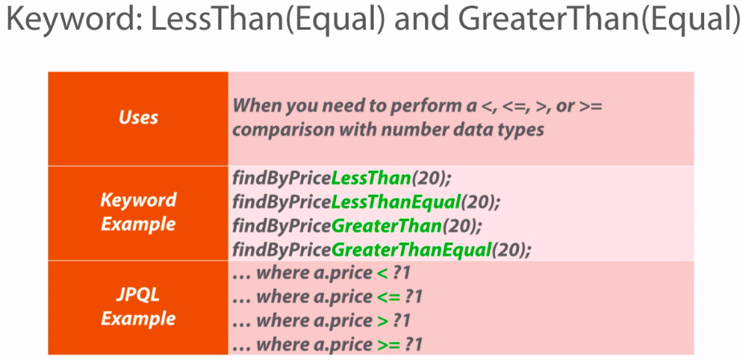

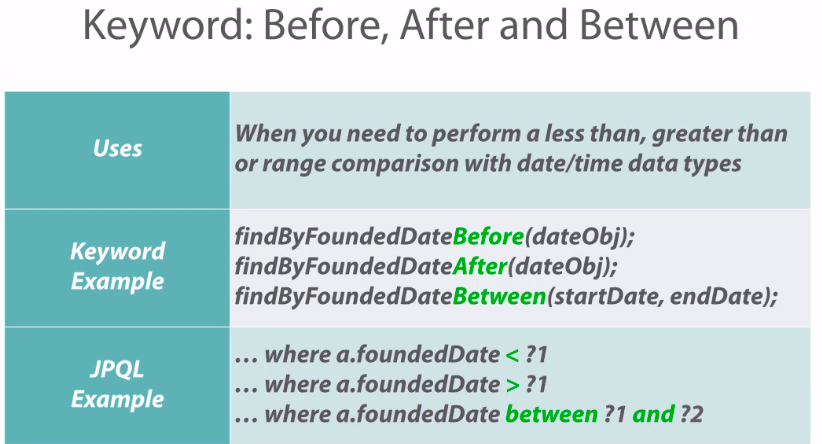

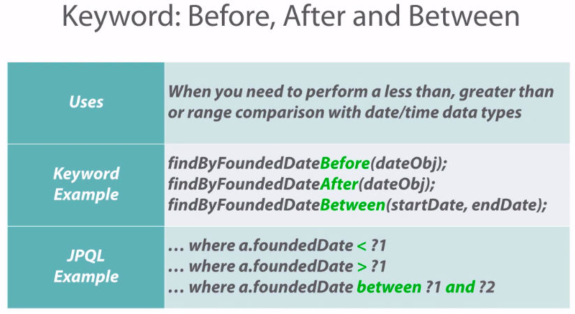

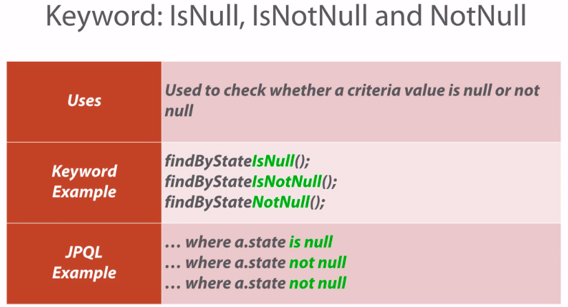

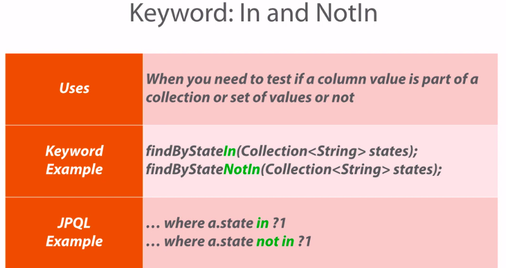

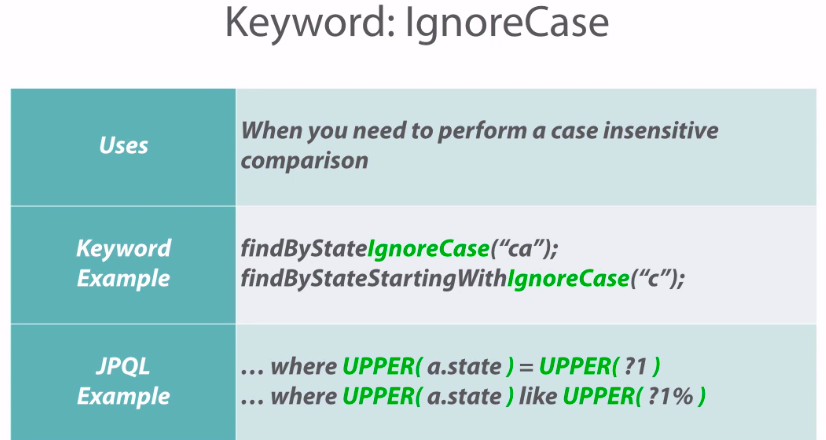

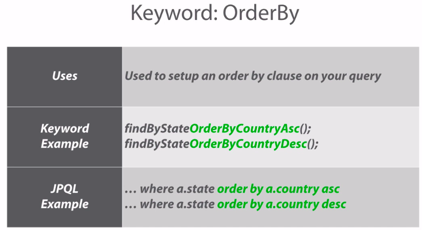

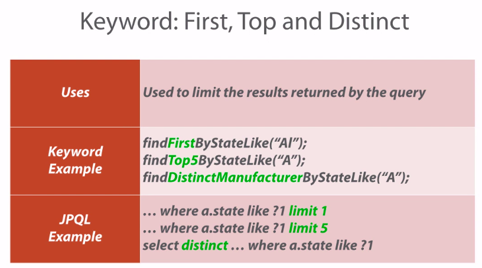

### Query Annotation

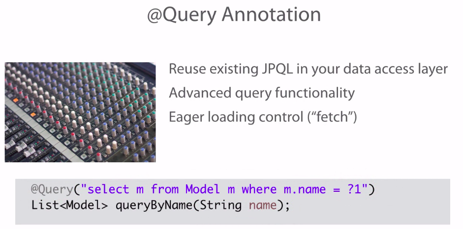

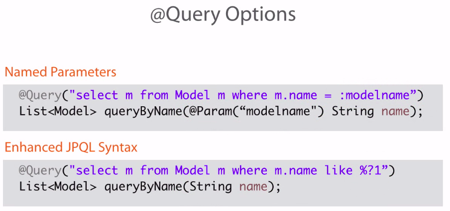

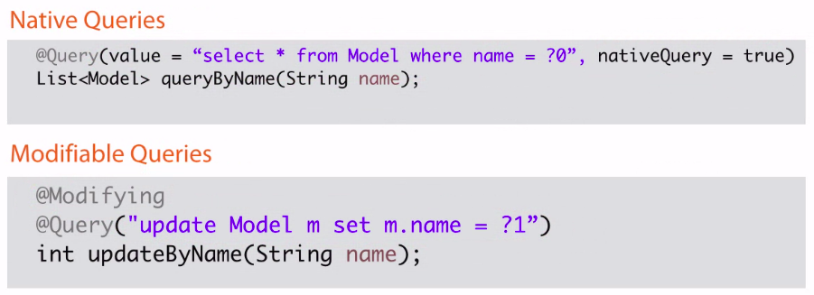

### Named Query

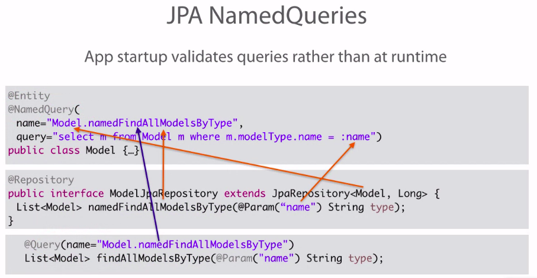

### Native Query

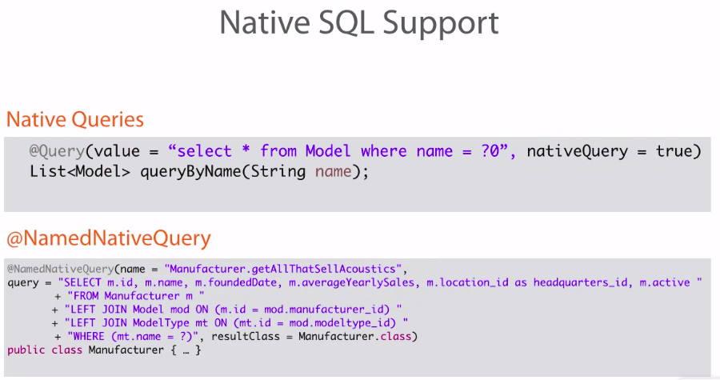

### Query Precedence


### Paging and Sorting


```java
@Test
public void testQueryByPriceRangeAndWoodTypePaging_SpringData() {
    final Pageable pageable = new PageRequest(0, 2);

    Page<Model> page = modelDataJPARepository
            .queryByPriceRangeAndWoodTypePaging(
                    BigDecimal.valueOf(1000L), BigDecimal.valueOf(2000L), "%Maple%", pageable);
    /* select name from Model m where m.price>=? and m.price<=? and (m.woodType like ?) limit ? */
    
    Iterator<Model> iterator = page.iterator();
    while (iterator.hasNext()){
        System.out.println(iterator.next());
    }
    // American Stratocaster
    // Les Paul

    page = modelDataJPARepository
            .queryByPriceRangeAndWoodTypePaging(
                    BigDecimal.valueOf(1000L), BigDecimal.valueOf(2000L), "%Maple%", page.nextPageable());

    /* select name from Model m where m.price>=? and m.price<=? and (m.woodType like ?) limit ? offset ?*/
    iterator = page.iterator();
    while (iterator.hasNext()){
        System.out.println(iterator.next());
    }
    // SG
}
```
### Custom Repositories


### Auditing


### Locking


### Spring data for updating data

```java
@Transactional
@Modifying
@Query("update Book b set b.pageCount = ?1 where b.title like ?2")
int setPageCount(int pageCount, String title);
```

## Spring MVC

- A typical Java Web application architecture


#### DispatcherServlet

  - The central piece of Spring Web MVC is the `DispatcherServlet` class, which is the entry point for every Spring Web application.
  - The `DispatcherServlet` converts HTTP requests into commands for controller components and manages rendered data as well.
  - In a Spring Web application, all HTTP requests first reach the `DispatcherServlet`
  - The `DispatcherServlet` must be defined in `web.xml` when the application is configured using the old-style XML configuration
  - The `DispatcherServlet` must be defined in `web.xml` when the application is configured using the old-style XML configuration.
  - When using a configuration without `web.xml`, a configuration class that extends `AbstractDispatcherServletInitializer` or `AbstractAnnotationConfigDispatcherServletInitializer` must be declared
 
```
The DispatcherServlet creates a separate “servlet” application context containing all specific web beans (controller, views, view resolvers). 
This context is also called the web context or the DispatcherServletContext.

The application context is also called RootApplicationContext. It contains all non-web beans and is instantiated using a bean of type org.springframework.web.context.ContextLoaderListener. 
The relationship between the two contexts is a parent–child relationship, with the application context being the parent. 
Thus, beans in the web context can access the beans in the parent context, but not conversely
```  

#### XML Configuration

```xml
<!-- web.xml -->
<web-app>
    <!-- The front controller, the entry point for all requests -->
    <servlet>
        <servlet-name>pet-dispatcher</servlet-name>
        <servlet-class>
           org.springframework.web.servlet.DispatcherServlet
        </servlet-class>
        <init-param>
        	<!--mvc-config.xml contains the Spring configuration for the front end (controllers and MVC infrastructure beans), the file is loaded by the DispatcherServlet-->
            <param-name>contextConfigLocation</param-name>
            <param-value>
                /WEB-INF/spring/mvc-config.xml
            </param-value>
        </init-param>
        <load-on-startup>1</load-on-startup>
    </servlet>
    <!-- Map all requests to the DispatcherServlet for handling -->
    <servlet-mapping>
        <servlet-name>pet-dispatcher</servlet-name>
        <url-pattern>/</url-pattern>
    </servlet-mapping>
    ...
</web-app>

``` 

#### Java Configuration

- To tell the `DispatcherServlet` that the configuration will be provided by a configuration java class(`WebConfig`) instead of a file, the following changes have to be made in `web.xml`
- Need use `AnnotationConfigWebApplicationContext` for `contextClass` param
- Also need to provide Java configuration class (`com.ps.config.WebConfig`) for `contextConfigLocation` param

```xml
<web-app>
    <!-- The front controller, the entry point for all requests -->
   <servlet>
       <servlet-name>pet-dispatcher</servlet-name>
       <servlet-class>
           org.springframework.web.servlet.DispatcherServlet
       </servlet-class>
       <init-param>
           <param-name>contextClass</param-name>
           <param-value>
               org.springframework.web.context.support.AnnotationConfigWebApplicationContext
           </param-value>
       </init-param>
       <init-param>
           <param-name>contextConfigLocation</param-name>
           <param-value>
               com.ps.config.WebConfig
           </param-value>
       </init-param>
       <load-on-startup>1</load-on-startup>
   </servlet>
</web-app>
```

#### @Controller annotation

- Controllers are classes that define methods used to handle HTTP request

```java
@Controller
@RequestMapping("/users")
public class UserController {
	
}
```

#### @RequestMapping annotation

- Can specify URL, which annotated method should handle - @RequestMapping("/foo")
    - => server-url/app-context-root/servlet-mapping/request-mapping
    - can use wildcards @RequestMapping("/foo/*")
- Can specify HTTP method, which annotated method should handle

```java
@RequestMapping(value = "/list", method = RequestMethod.GET)
public String list(Model model) { 

}
```  

#### @RequestParam annotation

- Url `http://localhost:8080/mvc-basic/showUser?userId=105`
handled by a method that has a parameter annotated with `@RequestParam` because the request is parametrized.
- Can specify parameter from http request to be injected as method parameter


```java
@RequestMapping(value = "/showUser", method = RequestMethod.GET)
public String show(@RequestParam("userId") Long id, Model model) {

}
```

#### @PathVariable annotation

- Url `http://localhost:8080/mvc-basic/users/105`
handled by a method that has a parameter annotated with `@PathVariable` because the request URI contains a piece that is variable.
- Can extract value as a method parameter from the url requested

```java
@RequestMapping(value = "/{userId}", method = RequestMethod.GET)
public String show(@PathVariable("userId") Long id, Model model) {

}
```

### Views and Models

- A handler method typically returns a string value representing a logical view name, and the view is populated with values in the Model object.
- The model contains the data that will be used to populate a view
- Need to provide view resolver e.g. `InternalResourceViewResolver`

```xml
<bean class="org.springframework.web.servlet.view.InternalResourceViewResolver">
    <property name="prefix" value="/WEB-INF/"/>
    <property name="suffix" value=".jsp"/>
</bean>
```

**Model**

- The model can supply attributes used for rendering views.

```java
@GetMapping("/showViewPage")
public String passParametersWithModel(Model model) {
    final Map<String, String> map = new HashMap<>();
    map.put("spring", "mvc");
    
    model.addAttribute("message", "Baeldung");
    model.mergeAttributes(map);
    return "viewPage";
}
```

**ModelMap**

- Just like the `Model` interface above, `ModelMap` is also used to pass values to render a view.
- The advantage of `ModelMap` is it gives us the ability to pass a collection of values and treat these values as if they were within a Map:

```java
@GetMapping("/printViewPage")
public String passParametersWithModelMap(ModelMap map) {
    map.addAttribute("welcomeMessage", "welcome");
    map.addAttribute("message", "Baeldung");
    return "viewPage";
}
```

**ModelAndView**

- This interface allows us to pass all the information required by Spring MVC in one return:

```java
@GetMapping("/goToViewPage")
public ModelAndView passParametersWithModelAndView() {
    final ModelAndView modelAndView = new ModelAndView("viewPage");
    modelAndView.addObject("message", "Baeldung");
    return modelAndView;
}
```

### Spring MVC 

#### Spring MVC XML Configuration

- The main component of an SpringMVC XML configuration is the `<mvc:annotation-driven/>` which registers all necessary default infrastructure beans for a web application to work: handler mapping, validation, conversion beans
- `<mvc:default-servlet-handler/>` - default servlet mapping "/" is mapped to the DispatcherServlet

```xml
<beans ...>
                
	<!-- Defines basic MVC defaults (handler mapping, date formatting, etc) -->
   <mvc:annotation-driven/>
   
   <!-- Configures a handler for serving static resources by forwarding to the
      Servlet container’s default Servlet.-->
   <mvc:default-servlet-handler/>
   
   <mvc:resources mapping="pdfs" location="/pdfs/**"/>
   
   	<!-- Views -->
   	<bean class="org.springframework.web.servlet.view.InternalResourceViewResolver">
   		<property name="prefix" value="/WEB-INF/jsp/"/>
   		<property name="suffix" value=".jsp"/>
   		<property name="order" value="2"/>
   	</bean>
   
</beans>
```

#### Spring MVC Java Configuration

- `@EnableWebMvc` -  is the equivalent of `<mvc:annotation-driven/>`
- The configuration class has to be
	- annotated with the `@Configuration` annotation 
	- annotated with the  `@EnableWebMvc` annotation 
	- implement `WebMvcConfigurer` 
	- or extend an implementation of this interface `WebMvcConfigurerAdapter`

- `@EnableWebMvc` —  To enable auto-detection of such `@Controller` beans, you can add component scanning
	
```java
@Configuration
@EnableWebMvc // <=><mvc:annotation-driven/>
@ComponentScan(basePackages = {"com.ps.web"})// <=> <context:component-scan base-package="com.ps.web"/>
public class WebConfig extends WebMvcConfigurerAdapter {
	
    // <=> <mvc:default-servlet-handler/>
    @Override
    public void configureDefaultServletHandling(
             DefaultServletHandlerConfigurer configurer) {
        configurer.enable();
    }
    
    @Bean
    public InternalResourceViewResolver getViewResolver(){
        final InternalResourceViewResolver resolver = new InternalResourceViewResolver();
        resolver.setPrefix("/WEB-INF/");
        resolver.setSuffix(".jsp" );
        resolver.setRequestContextAttribute("requestContext");
        return resolver;
    }
   // other beans and method implementations that are not in scope
}
```

#### Get rid of web.xml     

- Starting with Servlet 3.0+, the `web.xml` file is no longer necessary to configure a web application. 
It can be replaced with a class implementing the `WebApplicationInitializer` interface

- This can be done by implementing `WebApplicationInitializer`, used for servlet engine

```java
public class WebInitializer implements WebApplicationInitializer {
 
    @Override
    public void onStartup(ServletContext servletContext) throws ServletException {
      ServletRegistration.Dynamic registration =
      servletContext.addServlet("dispatcher", new DispatcherServlet());
      registration.setLoadOnStartup(1);
      registration.addMapping("/");
      registration.setInitParameter("contextConfigLocation",
            "com.ps.config.WebConfig");
      registration.setInitParameter("contextClass",
           "o.s.w.c.s.AnnotationConfigWebApplicationContext");
    }
}
```

- Another way extending the `AbstractAnnotationConfigDispatcherServletInitializer`

```java
public class WebInitializer extends AbstractAnnotationConfigDispatcherServletInitializer {
    
     @Override
     protected Class<?> getRootConfigClasses() {
         return new Class<?>{
                 ServiceConfig.class
         };
     }
     
     @Override
     protected Class<?> getServletConfigClasses() {
         return new Class<?>{
                 WebConfig.class
         };
     }
     
     @Override
     protected String getServletMappings() {
         return new String{"/"};
     }
     
     @Override
     protected Filter getServletFilters() {
         CharacterEncodingFilter cef = new CharacterEncodingFilter();
         cef.setEncoding("UTF-8");
         cef.setForceEncoding(true);
         return new Filter{new HiddenHttpMethodFilter(), cef};
     }
}
```

- For Java configuration need also to extends `WebMvcConfigurerAdapter`

```java
@Configuration
@EnableWebMvc
@ComponentScan(basePackages = {"com.ps.web"})
public class WebConfig extends WebMvcConfigurerAdapter {

    @Override
    public void addResourceHandlers(ResourceHandlerRegistry registry) {
        registry.addResourceHandler("/images/**").addResourceLocations("/images/").setCachePeriod(31556926);
        registry.addResourceHandler("/styles/**").addResourceLocations("/styles/").setCachePeriod(31556926);
    }

    @Override
    public void configureDefaultServletHandling(DefaultServletHandlerConfigurer configurer) {
        configurer.enable();
    }

    @Override
    public void addViewControllers(ViewControllerRegistry registry) {
        registry.addViewController("/").setViewName("home");
        registry.addViewController("/home").setViewName("home");
    }

}
```

#### Spring MVC Quick Start
1 Register Dispatcher servlet (web.xml or in Java)
2Implement Controllers
3 Register Controllers with Dispatcher Servlet
   - Can be discovered using component-scan
4 Implement Views
   - eg. write JSP pages
5 Register View resolver or use the default one
   - Need to set prefix (eg. /WEB-INF/views/) and suffix (eg. .jsp)
6 Deploy


#### Spring Rest 

- `Uniform Resource Identifier (URI)` is a string of characters designed for unambiguous identification of resources and extensibility via the URI scheme.
- HTTP methods (GET, POST, PUT, DELETE) are actions performed on resource (like CRUD)
- `@RestController` - this is `@Controller` + `@ResponseBody` and not need to configure `ContentNegotiationViewResolver`
- `@ResponseStatus` can set HTTP response status code
   - If used, void return type means no View (empty response body) and not default view!
   - 2** - success (201 Created, 204 No Content,...)
   - 3** - redirect
   - 4** - client error (404 Not found, 405 Method Not Allowed, 409 Conflict,...)
   - 5** - server error

- `@ResponseBody` before controller method return type means that the response should be directly rendered to client and not evaluated as a logical view name
    - public void updatePerson(@RequestBody Person person, @PathVariable("id") int personId)
- `@RequestHeader` can inject value from HTTP request header as a method parameter
- `@ExceptionHandler({MyException.class})` - Controller methods annotated with it are called when declared exceptions are thrown


   
### Spring Security   

- Concepts
	- `Principal` is the term that signifies a user, device, or system that could perform an action within the application.
	- `Credentials` are identification keys that a principal uses to confirm its identity.
	- `Authentication` is the process of verifying the validity of the principal’s credentials.
	- `Authorization` is the process of making a decision whether an authenticated user is allowed to perform a certain action within the application
	- `Secured` item is the term used to describe any resource that is being secured.

- Common user roles 
	- `ADMIN` is a role used for full power
	- `MEMBER` is used for limited power
	- `GUEST` is used for restricted use of the application
	
	

1. A user tries to access the application by making a request. The application requires the user to provide the credentials so it can be logged in.
2. The credentials are verified by the `Authenticaltion Manager` and the user is granted access to the application. The authorization rights for this user are loaded into the Spring Security context.
3. The user makes a resource request (view, edit, insert, or delete information) and the Security Interceptor intercepts the request before the user accesses a protected/secured resource.
4. The `Security Interceptor` extracts the user authorization data from the security context and…
5. … delegates the decision to the Access `Decision Manager`.
6. The `Access Decision Manager` polls a list of voters to return a decision regarding the rights of the authenticated user to system resources.
7. Access is granted or denied to the resource based on the user rights and the resource attributes.
	
- To configure Spring Security, the `web.xml` must be modified to include the security filter	

```xml
<filter>
    <filter-name>springSecurityFilterChain</filter-name>
    <filter-class>
         org.springframework.web.filter.DelegatingFilterProxy
    </filter-class>
</filter>
<filter-mapping>
    <filter-name>springSecurityFilterChain</filter-name>
    <url-pattern>/*</url-pattern>
</filter-mapping>   
```

- `<form-login ../>` - configuration element is used to define the request URL for the login form where the user can provide its credentials.
- `<logout ../> ` - configuration element is used to define the request URL for the logout form.
- `<intercept-url …/>` - The paths defined as values for the pattern attribute are pieces of URLs defined 
```xml
<beans:beans  ...>
        <http>
              <intercept-url pattern="/users/edit"
                   access="ROLE_ADMIN"/>
              <intercept-url pattern="/users/list"
                   access="ROLE_USER"/>
              <intercept-url pattern="/users/**"
                   access="IS_AUTHENTICATED_FULLY"/>
        </http>
</beans:beans> 
```
- ` <csrf disabled="true"/>` - using CSFR tokens in Spring forms to prevent cross-site request forgery
- `authentication-failure-url` - is used to define where the user should be redirected when there is an authentication failure
- `default-target-url` -  is used to define where the user will be redirected after a successful authentication
- Configuring authentication for UserDetailsService 
```xml
<authentication-manager>
        <authentication-provider>
            <user-service>
                <user name="john" password="doe"  authorities="ROLE_USER"/>
                <user name="jane" password="doe" authorities="ROLE_USER,ROLE_ADMIN"/>
                <user name="admin" password="admin" authorities="ROLE_ADMIN"/>
            </user-service>
        </authentication-provider>
</authentication-manager>
```

#### Spring XML Configuration without web.xml

- The security filter gets transformed into a class extending a Spring specialized class: `org.springframework.security.web.context.AbstractSecurityWebApplicationInitializer`
- The class that matches the DispatcherServlet declaration must be made to extend the `org.springframework.web.servlet.support.AbstractDispatcherServletInitializer` so the root context can be set to be the security context

```java
public class SecurityInitializer extends AbstractSecurityWebApplicationInitializer {
    // Empty class needed to register the springSecurityFilterChain bean
}

public class WebInitializer extends AbstractDispatcherServletInitializer {
	
    @Override
	protected WebApplicationContext createRootApplicationContext() {
		final XmlWebApplicationContext ctx = new XmlWebApplicationContext();
		ctx.setConfigLocation("/WEB-INF/spring/security-config.xml");
		return ctx;
    }
    
    @Override
    protected WebApplicationContext createServletApplicationContext() {
        final XmlWebApplicationContext ctx = new XmlWebApplicationContext();
        ctx.setConfigLocations(
            // MVC configuration
            "/WEB-INF/spring/mvc-config.xml",
            // Service configuration
            "/WEB-INF/spring/app-config.xml");
        return ctx;
    }
}
```

#### Java Configuration

- Annotate your `@Configuration` with `@EnableWebSecurity`
- Your `@Configuration` should extend `WebSecurityConfigurerAdapter`
- Register your SecurityConfig class with `AbstractSecurityWebApplicationInitializer`

```java
public class SecurityWebAppInitializer extends AbstractSecurityWebApplicationInitializer {
 
    public SecurityWebAppInitializer() {
        super(SecurityConfig.class);
    }
 
}

@Configuration
@EnableWebSecurity
public class SecurityConfig extends WebSecurityConfigurerAdapter {
    
    @Override
    public void configure(WebSecurity web) {
        web.ignoring().antMatchers("/resources/**","/images/**","/styles/**");
    }
    
    @Override
    protected void configure(HttpSecurity http) {
        http
                .authorizeRequests()
                .antMatchers("/user/edit").hasRole("ADMIN")
                .antMatchers("/**").hasAnyRole("ADMIN","USER")
                .anyRequest()
                .authenticated()
                .and()
            .formLogin()
                .usernameParameter("username")  //  customizable
                .passwordParameter("password") // customizable
                .loginProcessingUrl("/login") // customizable
                .loginPage("/auth")
                .failureUrl("/auth?auth_error=1")
                .defaultSuccessUrl("/home")
                .permitAll()
                .and()
            .logout()
                .logoutUrl("/logout")
                .logoutSuccessUrl("/")
            .and()
            .csrf().disable();
    }
}
```

#### Authorization

- Process of checking a principal has privileges to perform requested action
- Specific urls can have specific Role or authentication requirements
- Can be configured using HttpSecurity.authorizeRequests().*

```java
@Configuration
@EnableWebSecurity
public class HelloWebSecurityConfiguration extends WebSecurityConfigurerAdapter {

  @Override
  protected void configure(HttpSecurity httpSecurity) throws Exception {
      httpSecurity.authorizeRequests().antMatchers("/css/**","/img/**","/js/**").permitAll()
                                      .antMatchers("/admin/**").hasRole("ADMIN")
                                      .antMatchers("/user/profile").hasAnyRole("USER","ADMIN")
                                      .antMatchers("/user/**").authenticated()
                                      .antMatchers("/user/private/**").fullyAuthenticated()
                                      .antMatchers("/public/**").anonymous();
  }
}
```

- Rules are evaluated in the order listed
- Should be from the most specific to the least specific
- Options
    - `hasRole()` - has specific role
    - `hasAnyRole()` - multiple roles with OR
    - `hasRole(FOO)` AND `hasRole(BAR)` - having multiple roles
    - `isAnonymous()` - unauthenticated
    - `isAuthenticated()` - not anonymous

- The `antMatcher(…)` method is the equivalent of the `<intercept-url.../>` element from XML,
- To enable `CSRF` usage, the configuration above must also define a CSRF provider bean

#### Authentication

- In-memory Authentication provider

```java
@Configuration
@EnableWebSecurity
public class HelloWebSecurityConfiguration extends WebSecurityConfigurerAdapter {

  @Override
  public void configureGlobal(AuthenticationManagerBuilder authManagerBuilder) throws Exception  {
      authManagerBuilder.inMemoryAuthentication().withUser("alice").password("letmein").roles("USER").and()
                                                 .withUser("bob").password("12345").roles("ADMIN").and();
  }
}
```

- JDBC Authentication provider
    - Authenticates against DB
    - Can customize queries using .usersByUsernameQuery(), .authoritiesByUsernameQuery(), groupAuthoritiesByUsername()
    - Otherwise default queries will be used
```java
@Configuration
@EnableWebSecurity
public class HelloWebSecurityConfiguration extends WebSecurityConfigurerAdapter {
  
  @Autowired
  private DataSource dataSource;  
    
  @Override
  public void configureGlobal(AuthenticationManagerBuilder authManagerBuilder) throws Exception {
      authManagerBuilder.jdbcAuthentication().dataSource(dataSource)
                                             .usersByUsernameQuery(...)
                                             .authoritiesByUsernameQuery(...)
                                             .groupAuthoritiesByUsername(...);
  }
}
```

```java
@Bean
public CsrfTokenRepository repo() {
   HttpSessionCsrfTokenRepository repo = new HttpSessionCsrfTokenRepository();
   repo.setParameterName("_csrf");
   repo.setHeaderName("X-CSRF-TOKEN");
   return repo;
}
```

#### Password Encoding

- Supports passwords hashing (md5, sha, ...)

```java
@Configuration
@EnableWebSecurity
public class HelloWebSecurityConfiguration extends WebSecurityConfigurerAdapter {
  
  @Autowired
  private DataSource dataSource;  
    
  @Override
  public void configureGlobal(AuthenticationManagerBuilder authManagerBuilder) throws Exception {
      authManagerBuilder.jdbcAuthentication().dataSource(dataSource)
                                             .passwordEncoder(new StandardPasswordEncoder("this is salt"));
  }
}
```

#### Login and Logout

```java
@Configuration
@EnableWebSecurity
public class HelloWebSecurityConfiguration extends WebSecurityConfigurerAdapter {

  @Override
  protected void configure(HttpSecurity httpSecurity) throws Exception {
      httpSecurity.authorizeRequests().formLogin().loginPage("/login.jsp") .permitAll()
                                      .and()
                                      .logout().permitAll();
  }
}
```

#### Method Security

##### XML

```xml
<global-method-security secured-annotations="enabled" />
	<protect-pointcut expression="execution(* com.ps.*.*Service.findById(*))"
			access="hasRole(’ADMIN’)" />
</global-method-security>
```

##### Java 

- Configuration class annotate with `@EnableGlobalMethodSecurity(securedEnabled  =  true)`
- Methods annotate with annotation `@Secured`
	
```java
@Configuration
@EnableWebSecurity
@EnableGlobalMethodSecurity(securedEnabled = true)
public class SecurityConfig extends WebSecurityConfigurerAdapter {

}

@Service
@Transactional(readOnly = true, propagation = Propagation.REQUIRED)
public class UserServiceImpl implements UserService {
    
	@Secured("ROLE_ADMIN")
    public User findById(Long id) {
        return userRepo.findOne(id);
    }
    
}
```
     
- Configuration class annotate with `@EnableGlobalMethodSecurity(jsr250Enabled  =  true)`

```java
@Configuration
@EnableWebSecurity
@EnableGlobalMethodSecurity(jsr250Enabled = true)
public class SecurityConfig extends WebSecurityConfigurerAdapter {

}

@Service
@Transactional(readOnly = true, propagation = Propagation.REQUIRED)
public class UserServiceImpl implements UserService {
    @RolesAllowed("ROLE_ADMIN")
    public User findById(Long id) {
        return userRepo.findOne(id);
    }
  
}
```

#### Support expression attributes

- @PreAuthorize
- @PreFilter
- @PostAuthorize
- @PostFilter

```java
@Service
@Transactional(readOnly = true, propagation = Propagation.REQUIRED)
public class UserServiceImpl implements UserService { 
    
    @PreAuthorize("hasRole(’USER’)")
    public void create(User user){
    
    }
       
    @PreAuthorize("hasPermission(#user, ’admin’)")
    public void delete(User user, Sid recipient, Permission permission){
    
    }
    
    @PreAuthorize("#user.username == authentication.name")
    public void modifyProfile(User user){
    
    }
}
```

	

	

	

	

	

- `CSRF` - Cross-Site Request Forgery protection is enabled by default in the Java configuration

	

	

### Spring Security Tag Libraries

- Add taglib to JSP

```jsp
 <%@ taglib prefix="security" uri="http://www.springframework.org/security/tags" %>
```

- Facelet fags for JSF also available
- Displaying properties of Authentication object - `<security:authentication property=“principal.username”/>`
- Display content only if principal has certain role

```xml
<security:authorize access="hasRole('ADMIN')"> 
    <p>Admin only content</p>
</security:authorize>
```

- Or inherit the role required from specific url (roles required for specific urls are centralized in config and not across many JSPs)

```xml
<security:authorize url="/admin"> 
    <p>Admin only content</p>
</security:authorize>
```

## Spring Boot

Start collect the project by [https://start.spring.io/](https://start.spring.io/)	

```
Spring Boot is a set of preconfigured frameworks/technologies designed to reduce boilerplate configuration(infrastructure) and provide a quick way to have a Spring web application up and running
It’s goal is to allow developers to focus on implementation of the actual required functionality instead of how to configure an application, by providing out of the box ready-to-use infrastructure beans
```


- project must have as a parent the `spring-boot-starter-parent`

	

- `main` method is the entry point of the application and it follows the Java convention for an application entry point
- `main` method calls the static run method from the `org.springframework.boot.SpringApplication` class that will bootstrap the application and start the Spring IoC container, 
which will start the configured embedded web server.

```java
@SpringBootApplication(scanBasePackages = {"com.ps.start"})
public class Application {

    public static void main(String... args) {
        SpringApplication.run(Application.class, args);
        System.out.println("Started ...");
    }

}
```

- If the `war` we want to produce a deployable web archive that can be deployed on any application server and since the project does not contain a `web.xml` file, 
it is mandatory to define a class extending `SpringBootServletInitializer` and override its `configure` method.

@RestController
@SpringBootApplication(scanBasePackages = {"com.ps.start"})
public class Application extends SpringBootServletInitializer {

    private final AppSettings appSettings;

    @Autowired
    public Application(AppSettings appSettings) {
        this.appSettings = appSettings;
    }

    @Override
    protected SpringApplicationBuilder configure(SpringApplicationBuilder application) {
        return application.sources(Application.class);
    }

    public static void main(String... args) {
        SpringApplication.run(Application.class, args);
        System.out.println("Started ...");
    }

}

	

#### Configuration Using YAML

```
YAML is a superset of JSON and has a very convenient syntax for storing external properties in a hierarchical format
```

	

	

	

	

```yaml
app:
     name: ps-boot
datasource:
    driverClassName:  org.h2.Driver
    url: jdbc:h2:sample;DB_CLOSE_ON_EXIT=TRUE
    username: sample
    password: sample
Server:
    port: 9000
    context:  /ps-boot
```

#### @ConfigurationProperties

- To use YAML, the `application.properties` must be replaced with `application.yml` file`
- To get YAML data need to use `@ConfigurationProperties` with defined prefix for the properties (see above)
- Class is annotated with `@ConfigurationProperties(prefix= "com.example")`
- Fields of the class are automatically injected with values from properties
- `@ConfigurationProperties(prefix= "com.example")` + com.example.foo → foo field injected
- Needs to be enabled on `@Configuration` class - `@EnableConfigurationProperties(MyProperties.class)`

	

	

	

	

	

```java
@ConfigurationProperties(prefix = "app")
public class AppSettings {

    @NotNull
    private Integer port;

    @NotNull
    private Integer sessionTimeout;

    @NotNull
    private String context;

    @PostConstruct
    public void check() {
        log.info("Initialized [{}] [{}] [{}]", port, context, sessionTimeout);
    }
}
```

- `@EnableConfigurationProperties` - enable support for beans annotated with `@ConfigurationProperties` (see above)

```java
@SpringBootApplication(scanBasePackages = {"com.ps.start"})
@EnableConfigurationProperties(AppSettings.class)
public class Application extends SpringBootServletInitializer {
   ...
}
```

- YAML files can not be loaded via the `@PropertySource` annotation. This annotation is specific to properties files.

#### Testing with Spring Boot

- `@SpringBootTest` - this annotation should be used on a test class that runs Spring Boot-based tests
    - If no `@ContextConfiguration`, it uses `org.springframework.boot.test.context.SpringBootContextLoader` by default.
    - Automated search for a Spring Boot configuration when nested `@Configuration` classes are used.
    - Loading environment-specific properties via the `properties` attribute. This attribute allows for specification of properties (key=value pairs) as values for the attribute.
    - Defining different web environment modes and starting a fully running container on a random port, using the `webEnvironment` attribute
    - Registering a `org.springframework.boot.test.web.client.TestRestTemplate` bean for use in web tests that use a fully running container.
- The `SpringRunner` is an alias for `SpringJUnit4ClassRunner`
    
```java
@RunWith(SpringRunner.class)
@SpringBootTest(webEnvironment = SpringBootTest.WebEnvironment.RANDOM_PORT,
    properties = {"app.port=9090"})
public class CtxControllerTest {
...
}
```

- `@SpringApplicationConfiguration(classes= MyApplication.class)`
- For testing web app - `@WebAppConfiguration`

```java
@RunWith(SpringJUnit4ClassRunner.class)
@SpringApplicationConfiguration(classes=MyApplication.class) 
public class FooServiceTest {
    ...
}
```

#### Monitoring


#### Logging

- By default Logback over SLF4J
- By default logs to console, but can define log file

```properties
#Logging through SLF4J
logging.level.org.springframework=DEBUG
logging.level.com.example=INFO

logging.file=logfile.log
#OR spring.log file in to configured path
logging.path=/log
```

#### DataSource

- either include spring-boot-starter-jdbc or spring-boot-starter- data-jpa
- JDBC driver required on classpath, datasource will be created automatically
- Tomcat JDBC as default pool, other connection pools can be used if present - eg.HikariCP

```properties
#Connection
spring.datasource.url=             
spring.datasource.username=
spring.datasource.password=
spring.datasource.driver-class-name=

#Scripts to be executed
spring.datasource.schema=
spring.datasource.data=

#Connection pool
spring.datasource.initial-size=
spring.datasource.max-active=
spring.datasource.max-idle=
spring.datasource.min-idle=
```

#### Container

```properties
server.port=
server.address=
server.session-timeout=
server.context-path=
server.servlet-path=
```

- Web container can be configured in Java dynamically by implementing `EmbeddedServletContainerCustomizer` interface and registering resulting class as a @Component
- if needed more fine-grained configuration - declare bean of type `EmbeddedServletContainerFactory`

```java
@Override
public void customize(ConfigurableEmbeddedServletContainer container) {
  container.setPort(8081);
  container.setContextPath("/foo");
}
```

### @Conditional

- Enables bean instantiatiation only when specific condition is met
- Core concept of spring boot
- Only when specific bean found - `@ConditionalOnBean(type={DataSource.class})`
- Only when specific bean is not found - `@ConditionalOnMissingBean`
- Only when specific class is on classpath - `@ConditionalOnClass`
- Only When specific class is not present on classpath - `@ConditionalOnMissingClass`
- Only when system property has certain value - `@ConditionalOnProperty(name="server.host", havingValue="localhost")`
- `@Profile` is a special case of conditional
- org.springframework.boot.autoconfigure contains a lot of conditionals for auto-configuration
	- eg. `@ConditionalOnMissingBean(DataSource.class)` → Created embedded data source
	- Specifically declared beans usually disable automatically created ones
	- If needed, specific autoconfiguration classes can be excluded explicitly
	- `@EnableAutoConfiguration(exclude=DataSourceAutoConfiguration.class)`
	
## Integration

- Remoting and Web Services are ways of communicating between applications
- The communication is done using a binary, XML, or JSON format

***Web Services*** constitute a cross-platform interprocess communication method using common standards and able to work through firewalls. 
They work with messages, not objects. So the client basically sends a message, and a reply is returned. 
Web services work in a stateless environment whereby each message results in a new object created to service the request. 
Web services support interoperability across platforms and are good for heterogeneous environments. 
They expose their own arbitrary sets of operations such as via WSDL (Web Services Description Language) and SOAP (Simple Object Access Protocol).

***REST***, or representational state transfer, also called RESTful web services, is currently the most popular way applications communicate with each other. 
REST services allow access and manipulation of textual representations of web resources using a uniform and predefined set of stateless operations. 
The most common protocol used with REST services is HTTP, so the HTTP methods map on REST operations such as GET, POST, PUT, DELETE. 
Initially, web resources were documents or files accessed using a URL (Uniform Resource Locator, also known as a web address), but recently, 
a web resource became able to be anything (object, entity) that can be accessed via the web and is identified by a URI (Uniform Resource Identifier).

- There are three types of middleware:
	- Remote Procedure Call, or RPC, which allows one application to call procedures from another application remotely as if they were local calls.
	- Object Request Broker, or ORB-based, which enables an application’s objects to be distributed and shared across heterogeneous networks. (Remoting falls in this category.)
	- Message Oriented Middleware or MOM-based middleware, which allows distributed applications to communicate and exchange data by sending and receiving messages.
	
- Spring provides support for the `JMS (Java Messaging Service)` API, which is an abstraction written in Java for accessing MOM middleware.	
	- An application produces messages, and a client application consumes them asynchronously.
	- The application sending the messages has no knowledge of its client (or clients)
	- Messaging is a form of loosely coupled distributed communication.
- `JMX (Java Management Extensions)` is a Java technology that supplies tools for managing and monitoring applications, system objects, devices (such as printers) and service-oriented networks
	- Those resources are represented by objects called `MBeans` (Managed Bean)
	
### Spring Remoting

### Java Remote Method Invocation 

- `Java Remote Invocation` allows for an object running in one JVM to invoke methods on an object running in another JVM.
- `RMI` (Remote Method Invocation) is Java’s version of `RPC` (Remote Procedure Call).


- RMI applications often consist of two processes: a server and a client.
- The server creates the objects that will be accessed remotely, and it will expose a skeleton (the interface of the remote object).
- The client invokes methods on a stub (proxy object).
- Objects transferred using RMI must therefore be serializable and they must implement `java.io.Serializable`
	


### Spring Remote Method Invocation 

- The abstract schema of client and server applications remoting using Spring


### Spring Remote Configuration

- Configure a bean extending `org.springframework.remoting.rmi.RmiServiceExporter`

```java
@Configuration
public class RmiServerConfig {
	
    @Autowired
    @Qualifier("userServiceImpl")
    UserService userService;
    
    @Bean
    public RmiServiceExporter userService() {
        RmiServiceExporter exporter = new RmiServiceExporter();
        exporter.setRegistryPort(1099);
        exporter.setAlwaysCreateRegistry(true);
        exporter.setServiceName("userService");
        exporter.setServiceInterface(UserService.class);
        exporter.setService(userService);
        return exporter;
    }
}
```

- Create a server application that will contain the remote exported bean and the application beans that need to be accessed remotely.

```java
public class RmiExporterBootstrap {
    
       public static void main(String args) throws Exception {
               ClassPathXmlApplicationContext ctx =
                   new ClassPathXmlApplicationContext(
                       "spring/rmi-server-config.xml",
                       "spring/app-config.xml");
               System.out.println("RMI server started.");
               System.in.read();
               ctx.close();
       }
}
```
The `RmiExporterBootstrap` contains all the service and repository beans needed to be executed on the remote server.
      
```java
public class RmiExporterBootstrap {
	
  public static void main(String args) throws Exception {
      AnnotationConfigApplicationContext ctx = new AnnotationConfigApplicationContext(
              RmiServerConfig.class, ServiceConfig.class);
      System.out.println("RMI reward network server started.");
      System.in.read();
      ctx.close();
   }
}
```

- Configure a bean of type `org.springframework.remoting.rmi.RmiProxyFactoryBean` that will take care of creating the proxy objects needed on the client side to access the RMI service

```java
@Configuration
public class RmiClientConfig {
	
    @Bean
    public UserService userService() {
        RmiProxyFactoryBean factoryBean = new RmiProxyFactoryBean();
        factoryBean.setServiceInterface(UserService.class);
        factoryBean.setServiceUrl("rmi://localhost:1099/userService");
        factoryBean.afterPropertiesSet();
        return (UserService) factoryBean.getObject();
    }
}
```

- Create a client application that will use the client factory bean

```java
@ContextConfiguration(locations = {"classpath:spring/rmi-client-config.xml"})
@RunWith(SpringJUnit4ClassRunner.class)
public class RmiTests {
	
    @Autowired
    private UserService userService;
    
    public void setUp() {
        assertNotNull(userService);
    }
    
    @Test
    public void testRmiAll() {
        List<User> users = userService.findAll();
        assertEquals(5, users.size());
    }
    
    @Test
    public void testRmiJohn() {
        User user = userService.findByEmail("john.cusack@pet.com");
       assertNotNull(user);
    }
}
```

### Spring RMI services over HTTP

- Spring provides classes that allow exposing RMI services over HTTP, using a lightweight binary HTTP-based protocol.
	- The classes to use are `HttpInvokerProxyFactoryBean` and `HttpInvokerServiceExporter`
	- RMI methods will be converted to HTTP methods: GET and POST
	- Spring’s HttpInvoker is another Java-to-Java binary remoting protocol; it requires that Spring be used on both the server and the client.
- The properties for the Spring Http Invoker classes have the same meaning as for the RMI Spring classes; the only difference is that they apply to the HTTP protocol	
      


- On the server side, a bean of type `HttpInvokerServiceExporter` must be configured.

```java
@Configuration
public class HttpInvokerConfig {
    
    @Autowired
    @Qualifier("userServiceImpl")
    UserService userService;
    
    @Bean(name = "/httpInvoker/userService")
    HttpInvokerServiceExporter httpInvokerServiceExporter(){
        HttpInvokerServiceExporter invokerService = new HttpInvokerServiceExporter();
        invokerService.setService(userService);
        invokerService.setServiceInterface(UserService.class);
        return invokerService;
    }
}
```

- On the client side, a bean of type `HttpInvokerProxyFactoryBean` must be configured.

```java
 @Configuration
public class HttpInvokerClientConfig {
    
    @Bean
    public UserService userService() {
        HttpInvokerProxyFactoryBean factoryBean = new HttpInvokerProxyFactoryBean();
        factoryBean.setServiceInterface(UserService.class);
        factoryBean.setServiceUrl
             ("http://localhost:8080/invoker/httpInvoker/userService");
        factoryBean.afterPropertiesSet();
        return (UserService) factoryBean.getObject();
    }
}
```

- Provide configuration via `web.xml` or via `implements WebApplicationInitializer`

## Spring JMS

The basic building blocks of a JMS applications are:
- messages
- message producers (publisher)
- messages consumers (subscriber)
- connections
- sessions
- connection factories
- destinations

### JMS Messages


- The message has a standard structure, being composed of a header and a body
    - The header contains system-level information common to all messages, such as the destination and the time it was sent and application-specific information, stored as keyword/value properties
    - The body contains the effective application data, and JMS defines five distinct message body types represented as Java interfaces extending `javax.jms.Message`
    


### JMS Destinations

- The `javax.jms.Destination` interface is implemented on the client side and is used to specify the target of the messages produced by the client and the source of messages the client consumes
- Depending on the messaging domain, the implementation differs:
    - a queue in `point-to-point` domains, where each message has one producer and one consumer.
    - a topic in `publisher/subscriber` domains, where each message that is published is consumed by multiple subscribers.
    
    

```java
//Java Configuration standalone Queue
@Bean
public Queue userQueue(){
     return new ActiveMQQueue("queues.users");
}
```

## Spring Web Services

- `SOAP` is an acronym for Simple Object Access Protocol. It is a protocol specification for exchanging structured information in the implementation of web services in computer networks

- Here are the 3 steps of designing a Contract-first:
- create sample messages. A simple service user message could look like this:
```xml
<userMessage   xmlns="http://ws-boot.com/schemas/um" active="true">
    <email>John.Cusack@pet.com</email>
    <rating>5.0</rating>
</userMessage>
```
- define the XSD schema the service message must comply to
```xml
<xs:schema xmlns:xs="http://www.w3.org/2001/XMLSchema"
           elementFormDefault="qualified"
           targetNamespace="http://ws-boot.com/schemas/um">
    <xs:complexType name="userMessage">
        <xs:sequence>
            <xs:element name="email" type="xs:string"/>
            <xs:element name="rating" type="xs:double"/>
        </xs:sequence>
        <xs:attribute name="active" type="xs:boolean"/>
    </xs:complexType>
</xs:schema>
```
- restrict types and values, by enriching the XSD schema. In the next code snippet, a regular expression pattern is specify to validate the value of the email address.
```xml
<xs:element name="email">
    <xs:simpleType>
        <xs:restriction  base="xs:string">
           <xs:pattern  value="[^@]+@[^\.]+\..+"/>
         </xs:restriction>
   </xs:simpleType>
</xs:element>
```

### SOAP Messages

- SOAP messages have a structure similar to JMS Messages: they have a header and a body that are enclosed in a special SOAP envelope that identifies the XML document as a SOAP message. 
- SOAP message containing user information looks like the following XML snippet.

```xml
<soapenv:Envelope
     xmlns:soapenv="http://schemas.xmlsoap.org/soap/envelope/"
                  xmlns:um="http://ws-boot.com/schemas/um">
<soapenv:Header/>
<soapenv:Body>
    <um:getUserRequest>
        <um:email>John.Cusack@pet.com</um:email>
    </um:getUserRequest>
</soapenv:Body>
</soapenv:Envelope>
```

- The XSD schema defines the web service domain and the operations that can be performed using web services
- WSDL defines a network interface that consists of endpoints that get messages and then sometimes reply with messages. 
- WSDL describes the endpoints, and the request and reply messages

  

- Generating Java Code with XJC
	- The JDK comes with a utility executable called `xjc`
		- `xjc -d src/main/jaxb -p com.ps.ws src/main/resources/sample/userMessage.xsd`	
	- Intellij IDEA have the capability of generating JAVA code from a built-in XSD schema
		- select the `userMessages.xsd` file and right click
		- on the menu that appears, there is a `WebServices` option
		- click on it, and it will expand. In the submenu there is a `Generate Java Code from XML Schema using JAXB`

  
		
- The main disadvantage of SOAP is only the use of XML, which is verbose and takes a lot of time to be parsed		

